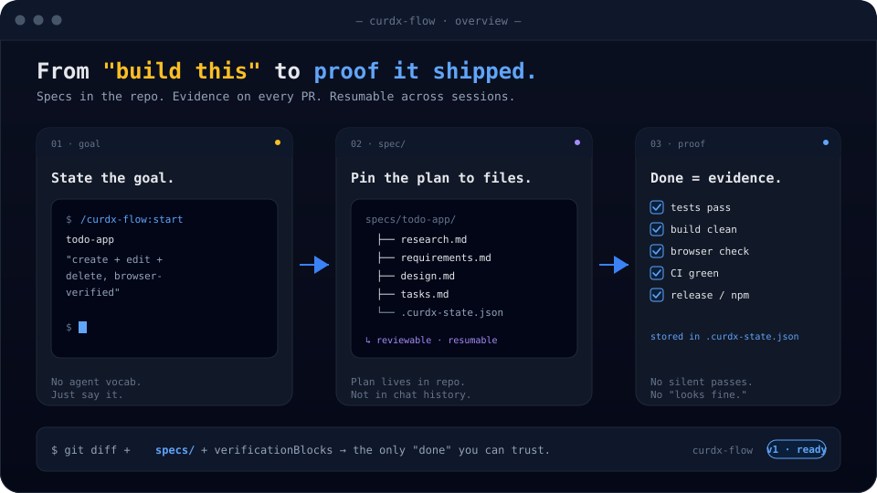
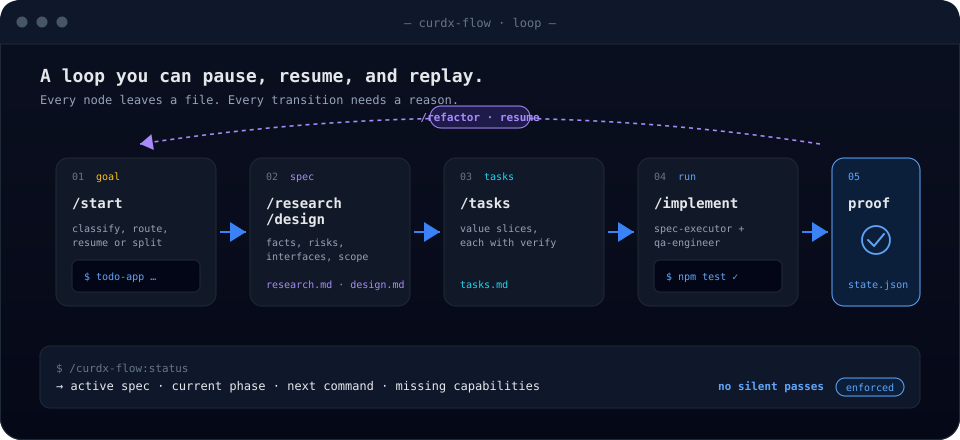

<div align="center">

# curdx-flow

**Spec-driven delivery for Claude Code — turn a single prompt into a reviewable, resumable, verifiable delivery record.**

[](https://www.npmjs.com/package/@curdx/flow)
[](https://github.com/curdx/curdx-flow/releases)
[](LICENSE)
[](https://docs.claude.com/en/docs/claude-code/plugins)

**English** · [简体中文](README.zh-CN.md)



`/curdx-flow:start` reads your repo and your goal, then auto-routes: handle directly · light spec · full spec · resume work · or triage one big ask into linked specs.

</div>

---

## Why it exists

Claude Code can write code. Real feature work exposes three failure modes the moment it gets serious:

| Without curdx-flow | With curdx-flow |
| --- | --- |
| **Context rot** — chats grow long, the model forgets the original ask | Goal is pinned to `requirements.md`. Survives every restart. |
| **Completion hallucination** — "it's done" with no command, browser, or CI output | Completion requires `verificationBlocks`. No silent passes. |
| **Process mismatch** — small edits crushed by ceremony, big features rushed in one shot | `/start` routes: direct · light · full · resume · triage |

It isn't another project management system. It's an **execution discipline layer** for Claude Code.

## 30-second install

The recommended path — the npm installer first asks for your language (中文 / English), then opens an interactive picker so you can choose the main plugin, companion plugins, and MCP servers yourself; it also syncs the marketplace entry and the managed block in `~/.claude/CLAUDE.md`:

```bash
npx @curdx/flow install
```

CI / scripted environments? Skip prompts and install everything:

```bash
npx @curdx/flow install --all --yes --lang en
```

Inside Claude Code:

```text
/curdx-flow:help
/curdx-flow:start todo-app build a todo app with create/edit/complete/delete, browser-verified
```

You can also install via Claude Code's native commands:

```bash
claude plugin marketplace add curdx/curdx-flow
claude plugin install curdx-flow@curdx
```

> Prefer the `@curdx/flow` installer — it keeps companion plugins and capability descriptors in sync. The native `claude plugin install` is better for debugging the marketplace or pointing at a local plugin directory.

## Workflow



The typical path:

1. **Start** — identify repo, goal, risk, and any existing specs.
2. **Research** — gather code facts, official docs, prior context.
3. **Requirements** — turn the goal into acceptance criteria and boundaries.
4. **Design** — capture approach, risks, interfaces, verification strategy.
5. **Tasks** — slice into value-bearing tasks, each with a verify command.
6. **Implement** — execute task-by-task via native `/goal` plus specialist agents.
7. **Verify** — record command / browser / CI / release / npm evidence into `verificationBlocks`.

## Common commands

| Command | Purpose |
| --- | --- |
| `/curdx-flow:start [name] [goal]` | Recommended entry. Auto-routes, creates, or resumes a spec. |
| `/curdx-flow:new <name> [goal]` | Force-create a new spec (no auto-resume). |
| `/curdx-flow:requirements` | Generate requirements + acceptance criteria from research/goal. |
| `/curdx-flow:design` | Generate technical design from requirements. |
| `/curdx-flow:tasks` | Generate executable tasks from design. |
| `/curdx-flow:implement` | Run the task loop with verification. |
| `/curdx-flow:status` | Current spec, progress, health, next command. |
| `/curdx-flow:triage [epic] [goal]` | Decompose a large goal into linked specs with explicit dependencies. |
| `/curdx-flow:prompt-optimize [draft]` | Refine a prompt + routing suggestion without executing. |
| `/curdx-flow:cancel [name]` | Stop execution or delete spec state (with confirmation). |

## Capabilities it coordinates

curdx-flow is a Claude Code plugin, but it also explicitly detects and uses these:

| Capability | Type | How curdx-flow uses it |
| --- | --- | --- |
| `pua` | Claude Code plugin | Recovery after repeated failure, parallel planning, Chinese-language skills. |
| `claude-mem` | Claude Code plugin | Search prior decisions, similar tasks, recurring failure modes. |
| `chrome-devtools-mcp` | Claude Code plugin | Real Chrome: DOM, console, network, screenshot evidence. |
| `ui-ux-pro-max` | Claude Code plugin | Design judgment and quality checks for visible UI/UX. |
| `context7` | External MCP | Current library / framework docs — detected, not bundled. |
| `sequential-thinking` | External MCP | Explicit hypothesis decomposition for high-risk tasks — detected, not bundled. |

When one is missing, `curdx-flow doctor` reports the degraded state and the fix — it won't silently skip critical evidence.

## CLI

`@curdx/flow` ships both an installer and a diagnostic tool:

```bash
# Show install state
npx @curdx/flow status

# Install or update plugins / MCP capabilities
npx @curdx/flow install --all --yes
npx @curdx/flow update

# Analyze Claude Code session logs
npx @curdx/flow analyze

# Validate verificationBlocks for the current spec
npx @curdx/flow check
```

The plugin also exposes a runtime `curdx-flow` CLI for skills and hooks:

```bash
curdx-flow doctor
curdx-flow route --compile --goal "release a Claude Code plugin"
curdx-flow dev detect
curdx-flow dev up
curdx-flow dev health
curdx-flow dev verify
curdx-flow dev down
```

## When to use it

Use it for:

- Claude Code plugins, CLIs, full-stack apps, frontend pages, backend services, release flows.
- Work where research → requirements → design → tasks → execution → verification all need to be traceable.
- Release-grade tasks that need browser, CI, npm / GitHub Release evidence.
- Tasks that have failed several times and need a recoverable failure trail.

Skip it for:

- One-off "what does this snippet mean?" questions.
- Requests where you explicitly want answers without file edits.
- Zero-risk one-line tweaks — `/curdx-flow:start` will route those to direct execution or a light spec anyway.

## What a spec looks like

By default, specs land under `specs/<name>/`:

```text
specs/
└── todo-app/
    ├── research.md
    ├── requirements.md
    ├── design.md
    ├── tasks.md
    ├── .curdx-state.json
    └── .progress.md
```

Ground rules:

- `research.md` / `requirements.md` / `design.md` / `tasks.md` are committable context assets.
- `.curdx-state.json` is execution state: phase, task index, verificationBlocks, recovery info.
- `.progress.md` is runtime progress + learning — usually `.gitignore`-d.
- Completion claims must trace back to `verificationBlocks` — not just to model prose.

## Repo structure

```text
src/                       # TypeScript CLI, registry, hooks source
plugins/curdx-flow/        # The Claude Code plugin itself
  .claude-plugin/           # plugin.json
  skills/                   # /curdx-flow:* slash skills
  agents/                   # executor, reviewer, QA, architect, PM, …
  hooks/                    # Claude Code hook configs + generators
  schemas/                  # state, evidence, report schemas
scripts/                   # build, version bump, validation, Claude Code smoke
tests/                     # Vitest tests
_bmad-output/              # committed planning + implementation baselines
```

## Local development

```bash
npm ci
npm run build
npm run build:hooks
npm run typecheck
npm run test:hooks
```

Release-grade validation:

```bash
npm run verify
claude plugin validate ./plugins/curdx-flow
CURDX_FLOW_CLAUDE_BIN=claude npm run test:claudecc
```

After editing anything under `src/hooks/**` you must run:

```bash
npm run build:hooks
npm run check:hooks-fresh
npm run test:hooks
```

## Release rules

Bump version through the script — never by hand:

```bash
node scripts/bump-version.mjs patch
```

A release requires two tags pushed together:

```bash
git tag -a vX.Y.Z -m "@curdx/flow X.Y.Z"
git tag -a curdx-flow--vX.Y.Z -m "curdx-flow X.Y.Z"
git push origin main vX.Y.Z curdx-flow--vX.Y.Z
```

- `vX.Y.Z` — triggers the npm publish.
- `curdx-flow--vX.Y.Z` — the plugin tag Claude Code's marketplace resolves.
- Don't push tags until `npm run verify`, `claude plugin validate`, and `test:claudecc` all pass.

## Troubleshooting

| Symptom | Fix |
| --- | --- |
| `/curdx-flow:*` not visible | Run `claude plugin list`; confirm `curdx-flow@curdx` is installed and enabled. |
| Plugin dependency missing | Re-sync via `npx @curdx/flow install curdx-flow --yes`. |
| Chrome DevTools MCP unavailable | Confirm `chrome-devtools-mcp@chrome-devtools-plugins` is installed and local Chrome is present. |
| Spec stuck mid-execution | `/curdx-flow:status` for the current phase, then resume as advised or `/curdx-flow:cancel`. |
| Unsure if release is safe | `npm run verify && claude plugin validate ./plugins/curdx-flow && CURDX_FLOW_CLAUDE_BIN=claude npm run test:claudecc`. |

## References

- Claude Code Plugins: <https://docs.claude.com/en/docs/claude-code/plugins>
- Claude Code Hooks: <https://docs.claude.com/en/docs/claude-code/hooks>
- npm package: <https://www.npmjs.com/package/@curdx/flow>
- Releases: <https://github.com/curdx/curdx-flow/releases>

## License

MIT
