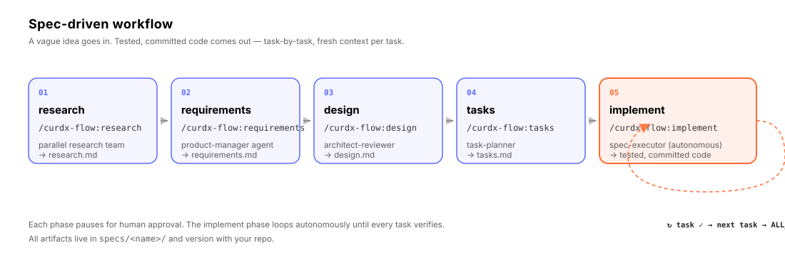
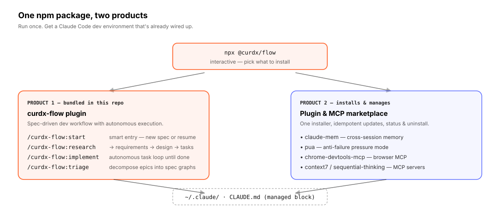

<div align="center">

**English** · [中文](./README.zh-CN.md)

# `@curdx/flow`

### *Spec-driven development for Claude Code, with autonomous task execution.*

A complete development workflow that turns a vague feature request into structured specifications, then executes them task-by-task in fresh contexts. Bundles a curated marketplace of complementary plugins and MCP servers — installed, updated, and uninstalled with one command.

[](https://www.npmjs.com/package/@curdx/flow)
[](https://opensource.org/licenses/MIT)
[](https://claude.ai/code)
[](https://nodejs.org)

[Installation](#-installation) · [Quick start](#-quick-start) · [How it works](#-how-it-works) · [Concepts](#-core-concepts) · [Commands](#%EF%B8%8F-commands) · [Configuration](#%EF%B8%8F-configuration) · [FAQ](#-faq)

```bash
npx @curdx/flow
```

</div>

---

## Table of contents

- [What is `@curdx/flow`](#-what-is-curdxflow)
- [Who it is for](#-who-it-is-for)
- [How it works](#-how-it-works)
- [Installation](#-installation)
- [Quick start](#-quick-start)
- [Walkthrough — your first spec](#-walkthrough--your-first-spec)
- [Core concepts](#-core-concepts)
- [Commands](#%EF%B8%8F-commands)
- [Subagents](#-subagents)
- [The marketplace](#-the-marketplace)
- [Configuration](#%EF%B8%8F-configuration)
- [Project layout](#-project-layout)
- [Why it exists](#-why-it-exists)
- [FAQ](#-faq)
- [Requirements](#-requirements)
- [License](#-license)

---

## 🚀 What is `@curdx/flow`

`@curdx/flow` is **a single npm package that delivers two products** built around Claude Code:

1. **A spec-driven development plugin.** Provides the `/curdx-flow:*` slash commands. Turns an unstructured feature request into a research report, requirements document, technical design, and a task list — then executes the task list autonomously in fresh contexts, one task at a time, with verification gates between every task.

2. **A curated plugin & MCP marketplace.** A single interactive installer that picks, installs, updates, and uninstalls a set of complementary tools for Claude Code (cross-session memory, browser automation, live documentation lookup, etc.) — keeping a managed manifest in `~/.claude/CLAUDE.md` so Claude knows what is available.

The plugin and the installer ship in the same npm package and share a single version number. Run `npx @curdx/flow` once and you have a fully wired Claude Code environment.

```text
You:    /curdx-flow:start "Add OAuth login with token refresh"
flow:   ✓ Interview: 3 clarifying questions answered (60s)
flow:   ✓ Parallel research team dispatched (3 specialist agents)
        → research.md  (148 lines, 9 references, 4 risks identified)
You:    review · approve  →  /curdx-flow:requirements
flow:   ✓ product-manager agent
        → requirements.md  (US-1..US-9, FR-1..FR-23, NFR-1..NFR-12)
You:    review · approve  →  /curdx-flow:design
flow:   ✓ architect-reviewer
        → design.md  (9 decisions, 7 risks, component diagram)
You:    review · approve  →  /curdx-flow:tasks
flow:   ✓ task-planner
        → tasks.md  (12 tasks across 4 phases, with VERIFY gates)
You:    review · approve  →  /curdx-flow:implement
flow:   ⟳ task 1.1 → verify → commit ✓
        ⟳ task 1.2 → verify → commit ✓
        …
        ✓ ALL_TASKS_COMPLETE  (12/12 tasks, 47 commits, all green)
You:    review the diff. open the PR. ship.
```

---

## 🎯 Who it is for

`@curdx/flow` is built for developers who use Claude Code on real projects — not throwaway prototypes. It pays off most when:

- **You ship code others will read.** Specs become a paper trail your reviewers and future self can audit.
- **Your codebase has conventions and constraints.** The research and design phases force these to be surfaced before code is written, not discovered after.
- **You context-switch.** Every task starts with a clean context window, so you do not have to manually re-explain the project after a long pause or a rate-limit reset.
- **You delegate, then come back.** The autonomous loop runs unattended; you review the diff when it finishes.

It is less useful when you only want a one-off script or a five-line tweak. For those, plain Claude Code is faster.

---

## 🧭 How it works

<div align="center">
  
</div>

The workflow has **five phases**. Each phase is owned by a specialist subagent, produces exactly one Markdown artifact, and **pauses for human approval** before the next phase begins. The final phase, `implement`, runs an autonomous loop — execute task, verify, commit, advance — until every task in `tasks.md` is checked off.

| Phase | Command | Subagent | Output |
| --- | --- | --- | --- |
| Research | `/curdx-flow:research` | research-analyst (parallel team) | `research.md` |
| Requirements | `/curdx-flow:requirements` | product-manager | `requirements.md` |
| Design | `/curdx-flow:design` | architect-reviewer | `design.md` |
| Tasks | `/curdx-flow:tasks` | task-planner | `tasks.md` |
| Implement | `/curdx-flow:implement` | spec-executor (autonomous loop) | code, tests, commits |

All artifacts live under `specs/<spec-name>/` in your repository. They are plain Markdown, version-controlled, and survive across sessions.

<div align="center">
  
</div>

The same npm package delivers both products. The installer reads its descriptor catalog, executes `claude plugin install` / `claude mcp add` on your behalf, and writes a managed block to `~/.claude/CLAUDE.md` so Claude Code knows what is installed. Everything is idempotent — run the installer again any time to reconcile drift.

---

## 📥 Installation

### Prerequisites

- **Node.js** ≥ 20.12 ([download](https://nodejs.org))
- **Claude Code CLI** installed and on `PATH` ([install instructions](https://docs.anthropic.com/en/docs/claude-code))
- *(Optional)* **Bun** ≥ 1.0 — auto-detected; the installer offers to install it for the default `claude-mem` companion

### Install

```bash
npx @curdx/flow
```

On first run, you pick a language (中文 / English). The full curdx-flow bundle is installed by default: `curdx-flow`, `pua`, `claude-mem`, `chrome-devtools-mcp`, `frontend-design`, `sequential-thinking`, and `context7`. If a companion has a local prerequisite that is missing, the installer reports the skip reason and continues so the core workflow remains usable.

That language choice also controls the managed `~/.claude/CLAUDE.md` block that flow writes. The block is rendered in the selected language, and when you choose `zh` it additionally injects a language policy telling Claude to keep tool/model interaction in English while replying to the user in Simplified Chinese.

### Common workflows

```bash
# Interactive menu — install / update / uninstall / status
npx @curdx/flow

# Non-interactive: install everything available
npx @curdx/flow install --all --yes

# Check what is installed and whether anything is stale
npx @curdx/flow status
npx @curdx/flow status --json   # machine-readable

# Update everything to the latest version
npx @curdx/flow update

# Uninstall everything cleanly (also removes the managed CLAUDE.md block)
npx @curdx/flow uninstall

# Override the language for a single invocation
npx @curdx/flow --lang en
```

### Verifying the install

```bash
claude plugin list                    # should show curdx-flow@curdx
claude mcp list                       # any MCP servers you opted in to
npx @curdx/flow status                # green checkmarks for installed items
```

In Claude Code, type `/curdx-flow:` and you should see autocomplete for all commands.

---

## ⚡ Quick start

After install, in any project:

```bash
cd ~/projects/my-app
claude                                # start Claude Code
```

Then in the Claude Code prompt:

```text
/curdx-flow:start
> I want to add a rate-limited /api/upload endpoint with S3 multipart support.
```

flow runs a brief interview, dispatches the research team, writes `specs/upload-api/research.md`, and pauses for your approval. From there, advance through the phases (`requirements` → `design` → `tasks` → `implement`) by approving each artifact.

---

## 🎬 Walkthrough — your first spec

A concrete end-to-end example, with what flow does at each step.

#### 1. `/curdx-flow:start`

```text
> I want to add a rate-limited /api/upload endpoint with S3 multipart support.
```

flow:

- creates `specs/upload-api/` and a `.curdx-state.json` execution-state file
- runs a 60-second interview (≈3 clarifying questions tuned to the goal)
- detects relevant skills from your installed plugins and pre-loads them
- dispatches a parallel research team — one agent investigates S3 multipart, one investigates rate-limiting strategies, one surveys your codebase for existing upload patterns
- merges results into `specs/upload-api/research.md`
- pauses for approval

#### 2. `/curdx-flow:requirements`

The product-manager subagent translates the goal + research into structured requirements: user stories (`US-1`, `US-2`, …), functional requirements (`FR-*`), non-functional requirements (`NFR-*`, e.g. latency, durability, security), and acceptance criteria (`AC-*`). Saved to `requirements.md`.

#### 3. `/curdx-flow:design`

The architect-reviewer turns requirements into a technical design: components, data flow, API contracts, key decisions (`D-1`..`D-N`), known risks (`R-1`..`R-N`), and a file-level change manifest. Saved to `design.md`.

#### 4. `/curdx-flow:tasks`

The task-planner breaks the design into a checked task list — typically grouped into phases, with `[VERIFY]` gates that run real verification commands (typecheck, tests, smoke tests). Saved to `tasks.md`.

#### 5. `/curdx-flow:implement`

The spec-executor begins the autonomous loop:

```
loop:
  pick next unchecked task from tasks.md
  open fresh context with task description, design.md excerpt, relevant files
  implement → run verification command → commit on success
  mark task [x] in tasks.md
  if verification fails → retry up to N times → if still failing, halt and surface
  repeat until ALL_TASKS_COMPLETE
```

You can step away. When you come back, `tasks.md` is fully checked off and the diff is in your branch.

---

## 🧱 Core concepts

#### Spec

A directory under `specs/` containing the four canonical artifacts (`research.md`, `requirements.md`, `design.md`, `tasks.md`) plus an execution-state file. Specs are first-class citizens — they version with your repo and act as the contract for what is being built and why.

#### Phase

One of the five steps in the workflow (research, requirements, design, tasks, implement). Each phase has exactly one owner subagent and exactly one output artifact. Phases are sequential by design — skipping or reordering them is not supported.

#### Subagent

A specialist agent invoked by the coordinator for a specific phase. Each subagent runs in its own context window and is given only the inputs it needs (goal, prior artifacts, relevant skills). This keeps every phase reasoning fresh and prevents prompt bloat.

#### Skill

A reusable capability scanned at the start of each spec. flow looks at all installed Claude Code skills, semantically matches them to the goal, and loads the relevant ones into the active context. You can install your own skills under `.claude/skills/` or `.agents/skills/`.

#### Hook

A script that runs at lifecycle events (`SessionStart`, `Stop`, `PreToolUse`, `UserPromptSubmit`). flow ships with four hooks that maintain the spec index, enforce quick-mode guardrails, and watch for stop-loop completion. Hooks are TypeScript sources bundled to `.mjs` at build time.

#### Autonomous loop

The behaviour of `/curdx-flow:implement`. After a human approves `tasks.md`, the executor takes over and runs through every task without further human input — provided each verification gate passes. If verification fails repeatedly, the loop halts and surfaces the failure so a human can intervene.

#### Epic

A collection of related specs with declared dependencies. Created with `/curdx-flow:triage`. Useful when a single feature decomposes into multiple specs that must be built in a specific order.

---

## 🛠️ Commands

The bundled plugin exposes these slash commands inside Claude Code:

| Command | Description |
| --- | --- |
| `/curdx-flow:start` | Smart entry point. Detects whether to create a new spec or resume an existing one. Runs the interview, sets up state, dispatches the research phase. |
| `/curdx-flow:new` | Force-create a new spec, skipping resume detection. Useful when the smart entry point would otherwise resume something you no longer want. |
| `/curdx-flow:research` | Run or re-run the research phase for the active spec. Dispatches the parallel research team. |
| `/curdx-flow:requirements` | Generate `requirements.md` from goal + research, via the product-manager subagent. |
| `/curdx-flow:design` | Generate `design.md` from requirements, via the architect-reviewer subagent. |
| `/curdx-flow:tasks` | Break the design into a checked task list (`tasks.md`), via the task-planner subagent. |
| `/curdx-flow:implement` | Begin the autonomous execution loop. Runs every unchecked task in `tasks.md` until completion or unrecoverable failure. |
| `/curdx-flow:triage` | Decompose a large feature into multiple dependency-aware specs (an epic). Produces `specs/_epics/<name>/epic.md` and a per-spec graph. |
| `/curdx-flow:status` | Show all specs, their phase, and progress. |
| `/curdx-flow:switch` | Switch the active spec for resume / continuation. |
| `/curdx-flow:refactor` | Methodically update spec files (requirements → design → tasks) after execution has revealed they need revision. |
| `/curdx-flow:cancel` | Cancel the active execution loop, clean up state, and (optionally) remove the spec. |
| `/curdx-flow:index` | Index the codebase and external resources into searchable spec metadata. |
| `/curdx-flow:help` | Show plugin help and a workflow overview. |
| `/curdx-flow:feedback` | Submit feedback or report a plugin issue. |

---

## 🤖 Subagents

flow ships with nine specialist subagents, each with a narrow responsibility. They are invoked automatically by the coordinator commands above; you do not call them directly.

| Subagent | Role |
| --- | --- |
| `research-analyst` | Investigates the goal via web search, documentation, and codebase exploration. Multiple instances run in parallel during the research phase. |
| `product-manager` | Translates research into structured requirements (user stories, functional and non-functional requirements, acceptance criteria). |
| `architect-reviewer` | Designs scalable, maintainable systems. Produces `design.md` with components, decisions, risks, and file-change manifest. |
| `task-planner` | Breaks a design into a sequenced, checkable task list with verification gates. Supports `fine` and `coarse` granularity modes. |
| `spec-executor` | The autonomous executor. Implements one task end-to-end per invocation, verifies, commits, and signals completion to the loop. |
| `spec-reviewer` | Read-only reviewer that validates artifacts against type-specific rubrics. Outputs `REVIEW_PASS` or `REVIEW_FAIL`. |
| `qa-engineer` | Runs verification commands at quality gates. Outputs `VERIFICATION_PASS` or `VERIFICATION_FAIL`. |
| `refactor-specialist` | Updates spec files section-by-section after execution surfaces design drift. |
| `triage-analyst` | Decomposes a large feature into multiple dependency-aware specs (epic graph). |

---

## 📦 The marketplace

The installer ships with a curated set of plugins and MCP servers. You opt in per item.

| ID | Type | Source | Purpose |
| --- | --- | --- | --- |
| **`curdx-flow`** | plugin | bundled in this repo | Spec-driven dev workflow. **Always installed.** |
| `claude-mem` | plugin | `thedotmack/claude-mem` | Cross-session memory. Stores observations and recalls them at the start of subsequent sessions. |
| `pua` | plugin | `tanweai/pua` | "Anti-failure" pressure mode. Auto-fires on 2+ consecutive failures or detected user frustration; pushes the agent to switch approaches. |
| `chrome-devtools-mcp` | plugin | `ChromeDevTools/chrome-devtools-mcp` | Drive a real Chrome via MCP — performance traces, network inspection, console, screenshots, accessibility audits. |
| `frontend-design` | plugin | `claude-plugins-official` | Distinctive, production-grade frontend output. Avoids generic AI aesthetics. |
| `sequential-thinking` | mcp | `@modelcontextprotocol/server-sequential-thinking` | Step-by-step reasoning MCP server. |
| `context7` | mcp | `https://mcp.context7.com/mcp` | Live library documentation over MCP. Beats stale training-data answers for recent SDK changes. |

Run `npx @curdx/flow status` to see what is installed on your machine.

---

## ⚙️ Configuration

### Flags

| Flag | Effect |
| --- | --- |
| `--all` | Apply to every available item (with `install` or `update`). |
| `--yes` | Skip all confirmations (non-interactive). |
| `--lang en` / `--lang zh` | Override the language for the current invocation, including the language used when rendering the managed `CLAUDE.md` block. |
| `--no-claude-md` | Do not write the managed block to `~/.claude/CLAUDE.md`. |
| `--json` | Output machine-readable JSON (with `status`). |
| `--quick` | (Plugin) Run all phases of a spec sequentially without pausing for approval. Use with caution. |
| `--commit-spec` / `--no-commit-spec` | (Plugin) Commit spec artifacts after each phase. Default: `true`. |
| `--specs-dir <path>` | (Plugin) Write specs to a non-default directory (e.g. `packages/api/specs/`). |
| `--tasks-size fine` / `--tasks-size coarse` | (Plugin) Granularity of `tasks.md` decomposition. |

### Environment variables

| Variable | Effect |
| --- | --- |
| `CURDX_FLOW_NO_CLAUDE_MD=1` | Equivalent to `--no-claude-md`. |
| `CURDX_FLOW_LANG=en` / `=zh` | Default language for the installer and for managed `CLAUDE.md` block rendering. |
| `CONTEXT7_API_KEY` | Optional API key for the context7 MCP server. |

### Per-project overrides

Project-specific settings live in `.claude/settings.json` (Claude Code's own config). flow does not write to this file by default; it only manages its block in `~/.claude/CLAUDE.md`.

---

## 📁 Project layout

After install, here is what is on your machine:

```
~/.claude/
├── plugins/cache/curdx/curdx-flow/<version>/   # the bundled plugin
│   ├── commands/         # /curdx-flow:* slash commands
│   ├── agents/           # subagent definitions
│   ├── skills/           # bundled skills
│   ├── hooks/scripts/    # built hook bundles (.mjs)
│   └── schemas/          # JSON schemas
├── plugins/cache/<other-plugins>/              # plugins you opted into
└── CLAUDE.md                                   # global; contains <!-- BEGIN @curdx/flow v1 --> block
```

Inside any project that uses flow:

```
<your-project>/
└── specs/
    ├── .current-spec               # active spec name (or path)
    ├── .current-epic               # active epic, if any
    ├── .index/                     # spec index for search/triage
    └── <spec-name>/
        ├── research.md
        ├── requirements.md
        ├── design.md
        ├── tasks.md
        ├── .curdx-state.json       # execution state (gitignored)
        └── .progress.md            # phase notes (gitignored)
```

The four canonical artifacts (`research.md` … `tasks.md`) are committed with your code. State and progress files are gitignored.

The `<!-- BEGIN @curdx/flow v1 -->` block in `~/.claude/CLAUDE.md` tells Claude what is installed and how to invoke it. flow only ever rewrites this block — content outside the markers is preserved verbatim. The block is language-aware: `--lang en` renders the guidance in English, `--lang zh` renders it in Chinese, and the `zh` variant also injects a language policy requiring English for tool/model interaction and Simplified Chinese for user-facing replies. Pass `--no-claude-md` (or set `CURDX_FLOW_NO_CLAUDE_MD=1`) to opt out of the managed block.

---

## 💡 Why it exists

Claude Code is fast, but on real projects it has predictable failure modes:

- **It skips tests** unless you keep telling it to write them.
- **It loses context** between sessions, between rate-limit resets, and inside very long sessions.
- **It produces inconsistent output** across runs of the same task.
- **It does not push back** on under-specified requirements — it just guesses, and you discover the mismatch in code review.

Most workflow frameworks address this by adding more agents, more orchestration, more prompt files. The result is more tokens spent, longer wait times, and a harder-to-audit pipeline. The output rarely improves.

`@curdx/flow` makes a different bet:

1. **Specs are the contract, not the prompt.** Every change has `research.md` → `requirements.md` → `design.md` → `tasks.md` written before any implementation begins. They live in your repo. Reviewers can read them. Future-you can read them.
2. **Subagents are specialized, not stacked.** One agent per phase. Each gets a fresh context window. No multi-agent orchestration salad.
3. **The loop runs itself.** Once `tasks.md` is approved, `/curdx-flow:implement` executes the entire task list autonomously, with verification gates between every task. You walk away. You come back. You read the diff.
4. **Installer and plugin in one package.** No separate marketplace registration, no scaffolding, no per-project config. `npx @curdx/flow` once.

> Claude Code is the engine. `curdx-flow` is the chassis.

---

## ❓ FAQ

#### Does this replace Claude Code?

No. flow runs **inside** Claude Code as a plugin. You still use the Claude Code CLI / IDE extension to chat; flow adds the `/curdx-flow:*` commands, subagents, hooks, and the bundled marketplace.

#### Can I use flow without the companion capabilities?

The default installer treats the companion capabilities as required because routing depends on them for memory, current docs, frontend design, browser verification, structured reasoning, and retry/parallel recovery. If a local prerequisite is missing, that item may be skipped with a visible reason, but the next `npx @curdx/flow install` run will try to restore it.

#### Do I need to commit the spec files?

You should commit the four canonical artifacts (`research.md`, `requirements.md`, `design.md`, `tasks.md`). The state and progress files (`.curdx-state.json`, `.progress.md`) should be gitignored — flow's default `.gitignore` entries handle this.

#### What happens if a task fails verification mid-loop?

The executor retries up to a configurable number of times (default 5). If it still fails, the loop halts, the task remains unchecked, and the failure is surfaced for human intervention. Resume with `/curdx-flow:implement` after the underlying issue is fixed.

#### Can I run multiple specs in parallel?

Specs are scoped per-project, but only one is active at a time. Use `/curdx-flow:switch` to change the active spec. For genuinely parallel work, use separate git worktrees or branches.

#### Is there a "quick mode" that skips approvals?

Yes — pass `--quick` to `/curdx-flow:start` (or set it in your spec config). This runs all phases sequentially without pausing. Recommended only for low-risk specs you have confidence in.

#### Does flow modify my code outside of `/curdx-flow:implement`?

No. The first four phases (`research` → `tasks`) only write to `specs/<spec>/`. Code changes happen exclusively in the `implement` phase, and every change is committed.

#### How does flow compare to GitHub's Spec Kit?

Spec Kit and flow share the spec-driven philosophy but differ in scope. Spec Kit is multi-agent-host (Claude Code, Copilot, Cursor, Codex, …) and CLI-driven (`specify init`). flow is Claude-Code-only, slash-command-driven, ships an autonomous execution loop, and bundles a marketplace. Pick flow if you live in Claude Code; pick Spec Kit if you need agent-host portability.

#### Where do I report bugs?

Run `/curdx-flow:feedback` inside Claude Code, or open an issue at <https://github.com/curdx/curdx-flow/issues>.

---

## 🧱 Requirements

- **Node.js** ≥ 20.12
- **Claude Code** CLI on `PATH` (the installer shells out to `claude plugin` and `claude mcp`)
- *(Optional)* **Bun** ≥ 1.0 — auto-detected and offered if you install `claude-mem`

Tested on macOS, Linux, and Windows (WSL2 recommended on Windows).

---

## 📜 License

MIT. Fork it. Ship it. Make it yours.

> Want to contribute? See [`CLAUDE.md`](./CLAUDE.md) for local dev setup and release SOP.

---

## 🔭 Plugin Observability (`analyze` CLI)

`npx @curdx/flow analyze` parses Claude Code session jsonl (`~/.claude/projects/<encoded-cwd>/<sessionId>.jsonl`) merged with curdx-flow `~/.claude/curdx-flow/errors.jsonl` and outputs a 7-section markdown report:

- **Hook Failures** — Top-N hook entries by `exitCode ≠ 0` count
- **Slash Commands** — `/curdx-flow:*` invocation frequency (attribution + `<command-name>` XML fallback)
- **Subagents** — `Task` / `Agent` dispatch heat
- **Spec Funnel** — research → requirements → design → tasks → execution completion ratios
- **Hook Duration** — P50 / P95 / P99 latency per hook
- **Schema Drift** — unknown event types + parse errors
- **Parent UUID Chain** — `parentUuid` chain integrity rate (`withParent / total`)

### Privacy (redact-by-default)

By default the report does **NOT** contain prompt full text, full file paths, or `file-history-snapshot` contents. Use `--include-prompts` to opt in (local debugging only).

### Platform support

Verified on **macOS** and **Linux**. Windows is **declared supported but not tested** — `~/.claude/curdx-flow/errors.jsonl` write atomicity on NTFS is not guaranteed (POSIX `PIPE_BUF` 4 KB only applies to POSIX). Please report issues.

### Configuration

Set `errorLogEnabled: false` in `~/.claude/settings.json` to disable hook error logging. The schema map at `plugins/curdx-flow/schemas/transcript-events.json` is auto-resolved post-bundle; if missing, the parser falls back to a builtin minimal whitelist with a stderr warning.

---

## 💰 Pricing Refresh Workflow

`npx @curdx/flow analyze --cost-summary` computes USD cost using a hardcoded pricing table at `src/analyze/pricing.ts` (zero npm runtime deps — no pricing-API call, no phone-home). Anthropic publishes occasional price changes, so the table needs a **quarterly self-check** (≤ 90 days since `LAST_UPDATED`).

When the self-check fires (or whenever Anthropic announces new pricing), follow the **3-step refresh** below:

1. **WebFetch official pricing.** Fetch <https://www.anthropic.com/pricing> (or the model-specific docs page) via WebFetch. Capture the per-1M-token rates for every model row currently in `pricing.ts` — `input`, `output`, `cache_creation`, `cache_read`. Cross-check against `https://docs.anthropic.com/en/docs/about-claude/pricing` for any model that has a docs page.
2. **Diff `PRICING` table.** Open `src/analyze/pricing.ts` and reconcile each row against the WebFetched figures. Add new model rows for any newly-released model the spec funnel might encounter (Opus, Sonnet, Haiku across versions). Remove rows only if Anthropic has formally retired a model — keep historical rows otherwise so retro `analyze` runs on old transcripts still produce correct cost.
3. **Bump `LAST_UPDATED` + add CHANGELOG entry.** Update the `LAST_UPDATED` constant at the top of `pricing.ts` to today's `YYYY-MM-DD`. Add a `Changed` line to `CHANGELOG.md` referencing the diff (e.g. `pricing: refresh 2026-08-07 — Opus 4.7 input $15→$18, cache_read unchanged`). Commit as `chore(pricing): refresh table to YYYY-MM-DD`.

> **Quarterly self-check:** the `--cost-summary` command emits a stderr warning when `today - LAST_UPDATED > 90 days`. Treat that warning as a blocking todo — stale pricing makes every cost figure in the report directionally wrong.
