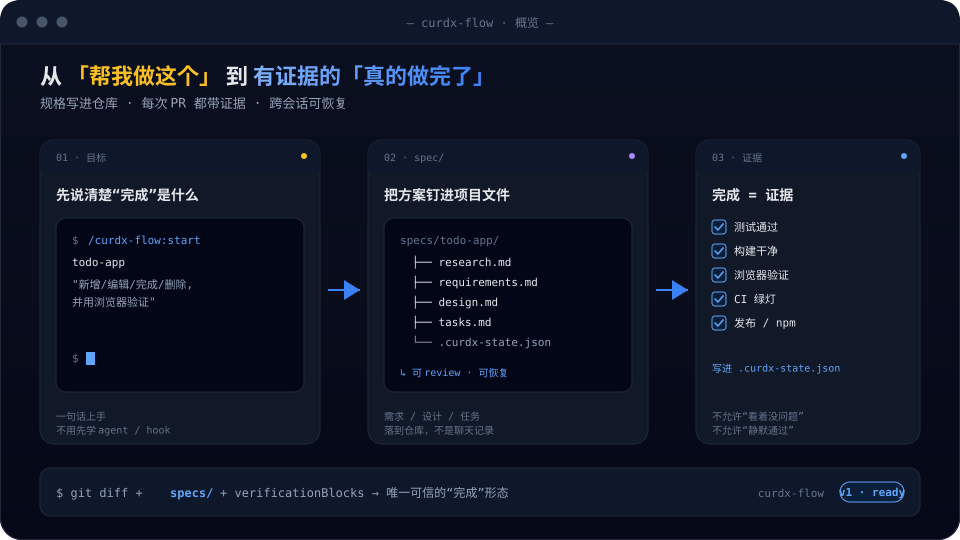
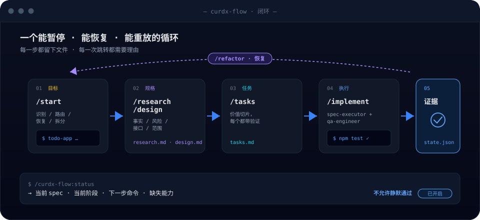

<div align="center">

# curdx-flow

**Claude Code 的规格驱动交付层 —— 把一句需求变成可审查、可恢复、可验证的交付记录。**

[](https://www.npmjs.com/package/@curdx/flow)
[](https://github.com/mugsun/curdx-flow/releases)
[](LICENSE)
[](https://docs.claude.com/en/docs/claude-code/plugins)

[**English**](README.md) · 简体中文



`/curdx-flow:start` 会自动判断当前仓库和目标：直接处理 · 轻量规格 · 完整规格 · 恢复未完成任务 · 或者把大需求拆成多个可执行 spec。

</div>

---

## 为什么需要它

Claude Code 能写代码，但真实任务上会暴露三种典型失败：

| 没有 curdx-flow | 有了 curdx-flow |
| --- | --- |
| **上下文腐烂**：越聊越长，模型忘掉原始约束 | 目标钉进 `requirements.md`，跨会话都不会丢 |
| **完成幻觉**：模型说"完成了"，没有命令 / 浏览器 / CI 证据 | 完成必须有 `verificationBlocks`，不允许静默通过 |
| **流程错配**：小任务被压垮，大需求又被一口气做完 | `/start` 路由：直接处理 / 轻量 / 完整 / 恢复 / triage |

它不是又一层项目管理系统，而是 **给 Claude Code 加一层执行纪律**。

## 30 秒安装

需要 Claude Code **v2.1.154 或更新版本**（用 `claude --version` 查看；`curdx-flow doctor` 会以 `platformFloor` 暴露这个最低底线）。

首选用 Claude Code 原生 marketplace 命令安装：

```bash
claude plugin marketplace add curdx/curdx-flow
claude plugin install curdx-flow@curdx
```

在 Claude Code 里：

```text
/curdx-flow:help
/curdx-flow:start todo-app 做一个可以增删改查的 Todo 前端，并用浏览器验证
```

可选：`@curdx/flow` npm 安装器是一个便捷 bootstrap —— 先让你选界面语言（中文 / English），再进入交互式多选勾选可选的 companion plugins 和 MCP servers，并写入 `~/.claude/CLAUDE.md` 管理块。companion plugins 是**运行时软探测、并非硬依赖** —— 没有它们 curdx-flow 也能安装运行（降级，并由 `doctor` 给出提示）：

```bash
npx @curdx/flow install
```

CI / 脚本环境想跳过交互一次性全装：`npx @curdx/flow install --all --yes --lang zh`。

## 工作流



典型路径：

1. **Start** —— 识别仓库、目标、风险和已有 spec。
2. **Research** —— 收集代码事实、官方文档、历史上下文。
3. **Requirements** —— 把目标变成验收条件和边界。
4. **Design** —— 沉淀方案、风险、接口、验证策略。
5. **Tasks** —— 切成价值切片，每个任务都有验证命令。
6. **Implement** —— 通过 `/goal` 和专用代理逐项执行。
7. **Verify** —— 把命令、浏览器、CI、release、npm 等证据写入 `verificationBlocks`。

## 常用命令

| 命令 | 用途 |
| --- | --- |
| `/curdx-flow:start [name] [goal]` | 推荐入口。自动路由、创建或恢复 spec。 |
| `/curdx-flow:new <name> [goal]` | 明确创建新 spec，不自动恢复。 |
| `/curdx-flow:requirements` | 基于 research / 目标生成需求和验收标准。 |
| `/curdx-flow:design` | 基于需求生成技术设计。 |
| `/curdx-flow:tasks` | 基于设计生成可执行任务。 |
| `/curdx-flow:implement` | 进入任务执行循环并验证。 |
| `/curdx-flow:status` | 查看当前 spec、进度、健康状态和下一步。 |
| `/curdx-flow:triage [epic] [goal]` | 把大型需求拆成多个依赖明确的 spec。 |
| `/curdx-flow:prompt-optimize [draft]` | 只优化提示词和路由建议，不执行。 |
| `/curdx-flow:cancel [name]` | 取消执行或删除 spec 状态（需确认）。 |

## 它会协调的能力

curdx-flow 是 Claude Code 插件。下列 companion 都是**运行时软探测** —— manifest 里没有任何硬依赖，缺了它们 curdx-flow 也能安装运行：

| 能力 | 类型 | curdx-flow 怎么用 |
| --- | --- | --- |
| `pua` | Claude Code 插件 | 多次失败后的恢复、并行规划、中文技能。 |
| `claude-mem` | Claude Code 插件 | 检索历史决策、相似任务、重复失败。 |
| `chrome-devtools-mcp` | Claude Code 插件 | 真实 Chrome：DOM、console、network、截图证据。 |
| `ui-ux-pro-max` | Claude Code 插件 | 可见 UI/UX 的设计判断和质量检查。 |
| `context7` | 外部 MCP | 最新库 / 框架文档查询 —— 只检测、不内置。 |
| `sequential-thinking` | 外部 MCP | 高风险任务的显式假设拆解 —— 只检测、不内置。 |

缺哪个能力，`curdx-flow doctor` 会给出降级状态和修复建议 —— 不会静默跳过关键证据。

## CLI

`@curdx/flow` 同时提供命令行安装器和诊断工具：

```bash
# 查看安装状态
npx @curdx/flow status

# 安装或更新插件 / MCP 能力
npx @curdx/flow install --all --yes
npx @curdx/flow update

# 分析 Claude Code 会话日志
npx @curdx/flow analyze

# 校验当前 spec 的 verificationBlocks
npx @curdx/flow check
```

插件内部也暴露 `curdx-flow` runtime CLI，供 skills 和 hooks 使用：

```bash
curdx-flow doctor
curdx-flow route --compile --goal "发布 Claude Code 插件"
curdx-flow dev detect
curdx-flow dev up
curdx-flow dev health
curdx-flow dev verify
curdx-flow dev down
```

## 什么时候用

适合：

- Claude Code 插件、CLI、全栈应用、前端页面、后端服务、发布流程。
- 需要研究 → 需求 → 设计 → 任务 → 执行 → 验证都可追踪的工作。
- 需要浏览器、CI、npm / GitHub Release 证据的发布级任务。
- 已经尝试多次失败，需要保存失败谱系和恢复路径的任务。

不适合：

- 只问一个代码片段的含义。
- 明确说"不要改文件，只回答"的请求。
- 零风险的一行小改 —— `/curdx-flow:start` 也会倾向直接处理或轻量 spec。

## 规格文件长什么样

默认在项目的 `specs/<name>/` 下生成：

```text
specs/
└── todo-app/
    ├── research.md
    ├── requirements.md
    ├── design.md
    ├── tasks.md
    ├── .curdx-state.json
    └── .progress.md
```

核心规则：

- `research.md` / `requirements.md` / `design.md` / `tasks.md` 是可提交的上下文资产。
- `.curdx-state.json` 是执行状态：phase、任务索引、验证块、恢复信息。
- `.progress.md` 是运行期进度和学习记录，通常不提交。
- 完成声明必须能追溯到 `verificationBlocks`，不能只看模型文字。

## 仓库结构

```text
src/
  core/                     # 差异化核心：capabilities、contracts、evidence、verdict
  hooks/                    # Claude Code hook 源码 + 共享运行时库（hooks/lib）
  flows/                    # 可选 npm bootstrap（companion 选择器 + CLAUDE.md 同步）+ analyze
  registry/                 # 遗留的 companion 安装层（原生 `claude plugin` 为主）
  i18n/ runner/ ui/         # 可选 bootstrap 的 CLI 基础设施
plugins/curdx-flow/         # Claude Code 插件主体
  .claude-plugin/           # plugin.json（含 $schema）
  skills/                   # /curdx-flow:* slash skills
  agents/                   # 执行、评审、QA、架构、PM 等代理
  hooks/                    # Claude Code hook 配置与已提交脚本 bundle
  schemas/                  # 状态、证据、报告契约 schema
scripts/                   # 构建、版本、校验、Claude Code smoke
tests/                     # Vitest 测试
```

## 本地开发

```bash
npm ci
npm run build
npm run build:hooks
npm run typecheck
npm run test:hooks
```

发布级验证：

```bash
npm run verify
claude plugin validate ./plugins/curdx-flow
CURDX_FLOW_CLAUDE_BIN=claude npm run test:claudecc
```

修改 `src/hooks/**` 后必须执行：

```bash
npm run build:hooks
npm run check:hooks-fresh
npm run test:hooks
```

## 发布规则

版本必须通过脚本统一更新：

```bash
node scripts/bump-version.mjs patch
```

发布需要两个 tag 一起 push：

```bash
git tag -a vX.Y.Z -m "@curdx/flow X.Y.Z"
git tag -a curdx-flow--vX.Y.Z -m "curdx-flow X.Y.Z"
git push origin main vX.Y.Z curdx-flow--vX.Y.Z
```

- `vX.Y.Z` —— 触发 npm 发布。
- `curdx-flow--vX.Y.Z` —— Claude Code 插件 marketplace 解析需要的插件 tag。
- 在 `npm run verify` / `claude plugin validate` / `test:claudecc` 全部通过前，不要打 tag。

## 故障排查

| 现象 | 处理 |
| --- | --- |
| 看不到 `/curdx-flow:*` | 跑 `claude plugin list`，确认 `curdx-flow@curdx` 已安装并启用。 |
| 插件依赖缺失 | `npx @curdx/flow install curdx-flow --yes` 重新同步。 |
| Chrome DevTools MCP 不可用 | 确认装了 `chrome-devtools-mcp@chrome-devtools-plugins` 且本机有 Chrome。 |
| spec 卡在执行中 | `/curdx-flow:status` 看当前 phase，按建议恢复或 `/curdx-flow:cancel`。 |
| 发布前不确定是否安全 | `npm run verify && claude plugin validate ./plugins/curdx-flow && CURDX_FLOW_CLAUDE_BIN=claude npm run test:claudecc`。 |

## 参考

- Claude Code Plugins: <https://docs.claude.com/en/docs/claude-code/plugins>
- Claude Code Hooks: <https://docs.claude.com/en/docs/claude-code/hooks>
- npm package: <https://www.npmjs.com/package/@curdx/flow>
- Releases: <https://github.com/mugsun/curdx-flow/releases>

## License

MIT
