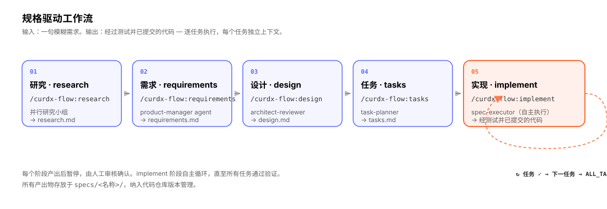
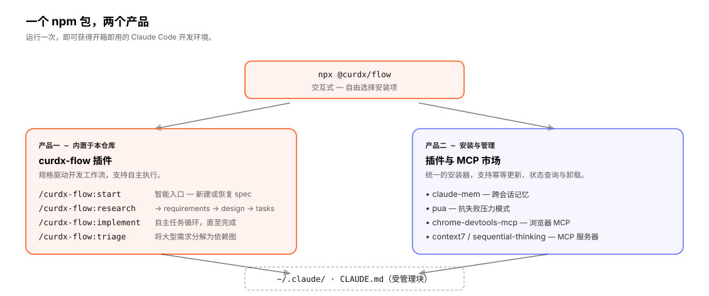

<div align="center">

[English](./README.md) · **中文**

# `@curdx/flow`

### *面向 Claude Code 的规格驱动开发流程，支持自主任务执行。*

一套完整的开发工作流：将模糊的功能构思转化为结构化的规格说明，并以独立上下文逐任务执行。同时内置一个精选的插件与 MCP 服务器市场，通过单条命令完成安装、更新与卸载。

[](https://www.npmjs.com/package/@curdx/flow)
[](https://opensource.org/licenses/MIT)
[](https://claude.ai/code)
[](https://nodejs.org)

[安装](#-安装) · [快速开始](#-快速开始) · [工作原理](#-工作原理) · [核心概念](#-核心概念) · [命令参考](#%EF%B8%8F-命令参考) · [配置](#%EF%B8%8F-配置) · [常见问题](#-常见问题)

```bash
npx @curdx/flow
```

</div>

---

## 目录

- [`@curdx/flow` 是什么](#-curdxflow-是什么)
- [适用场景](#-适用场景)
- [工作原理](#-工作原理)
- [安装](#-安装)
- [快速开始](#-快速开始)
- [完整示例：第一个 spec](#-完整示例第一个-spec)
- [核心概念](#-核心概念)
- [命令参考](#%EF%B8%8F-命令参考)
- [子 agent 列表](#-子-agent-列表)
- [插件市场](#-插件市场)
- [配置](#%EF%B8%8F-配置)
- [文件结构](#-文件结构)
- [项目动机](#-项目动机)
- [常见问题](#-常见问题)
- [环境要求](#-环境要求)
- [许可证](#-许可证)

---

## 🚀 `@curdx/flow` 是什么

`@curdx/flow` 是**一个 npm 包，围绕 Claude Code 提供两个产品**：

1. **规格驱动开发插件。** 提供 `/curdx-flow:*` 系列斜杠命令。将非结构化的功能描述依次转化为研究报告、需求文档、技术设计与任务列表，随后在独立上下文中自主执行任务列表，逐任务推进，每两个任务之间设有验证关卡。

2. **精选的插件与 MCP 服务器市场。** 一个交互式安装器，统一负责一组围绕 Claude Code 的工具（跨会话记忆、浏览器自动化、实时文档查询等）的安装、更新与卸载，并维护 `~/.claude/CLAUDE.md` 中的清单块，使 Claude 知晓当前可用的能力。

插件与安装器同源于一个 npm 包，共享同一版本号。运行一次 `npx @curdx/flow`，即可获得一个完整就绪的 Claude Code 开发环境。

```text
你：    /curdx-flow:start "增加带 token 刷新的 OAuth 登录"
flow：  ✓ 访谈：60 秒，3 个澄清问题已确认
flow：  ✓ 并行研究小组已派发（3 个专项 agent）
        → research.md（148 行，9 处引用，识别出 4 项风险）
你：    审阅 · 确认  →  /curdx-flow:requirements
flow：  ✓ product-manager agent
        → requirements.md（US-1..US-9，FR-1..FR-23，NFR-1..NFR-12）
你：    审阅 · 确认  →  /curdx-flow:design
flow：  ✓ architect-reviewer
        → design.md（9 项决策，7 项风险，组件图）
你：    审阅 · 确认  →  /curdx-flow:tasks
flow：  ✓ task-planner
        → tasks.md（4 个阶段、12 个任务，含 VERIFY 关卡）
你：    审阅 · 确认  →  /curdx-flow:implement
flow：  ⟳ 任务 1.1 → 验证 → 提交 ✓
        ⟳ 任务 1.2 → 验证 → 提交 ✓
        ……
        ✓ ALL_TASKS_COMPLETE（12/12 任务，47 次提交，全部通过）
你：    审阅 diff，发起 PR，发布。
```

---

## 🎯 适用场景

`@curdx/flow` 面向需要在真实项目中使用 Claude Code 的开发者，而非一次性原型。在以下情形下收益最显著：

- **需要交付他人 review 的代码。** 规格文档为审阅者与未来的自己提供完整的可追溯记录。
- **代码库存在既有约定与约束。** 研究与设计阶段会迫使这些信息在编码前被显式提出，而不是在事后被动暴露。
- **存在频繁的上下文切换。** 每个任务以全新的上下文窗口启动，长时间中断或速率限制重置之后无需再次手动陈述项目背景。
- **采用"委派—回看"的工作模式。** 自主执行循环可在无人值守下运行；完成后审阅 diff 即可。

不太适合的场景：一次性脚本、五行级别的小修改。这类需求直接用 Claude Code 更快。

---

## 🧭 工作原理

<div align="center">
  
</div>

工作流共五个阶段。每个阶段由一名专项子 agent 负责，产出一份 Markdown 文档，并**暂停以等待人工确认**后进入下一阶段。最后一个 `implement` 阶段进入自主循环——执行任务、验证、提交、推进——直至 `tasks.md` 中所有任务全部完成。

| 阶段 | 命令 | 子 agent | 产出 |
| --- | --- | --- | --- |
| 研究 | `/curdx-flow:research` | research-analyst（并行小组） | `research.md` |
| 需求 | `/curdx-flow:requirements` | product-manager | `requirements.md` |
| 设计 | `/curdx-flow:design` | architect-reviewer | `design.md` |
| 任务 | `/curdx-flow:tasks` | task-planner | `tasks.md` |
| 实现 | `/curdx-flow:implement` | spec-executor（自主循环） | 代码、测试、提交 |

所有产出物存放于代码仓库下的 `specs/<spec 名>/` 目录。它们均为纯 Markdown，纳入版本管理，跨会话保留。

<div align="center">
  
</div>

同一个 npm 包同时承载两个产品。安装器读取其内置的描述符目录，代你执行 `claude plugin install` 与 `claude mcp add`，并在 `~/.claude/CLAUDE.md` 中写入受管理块，使 Claude Code 知晓当前已安装的工具。所有操作均为幂等——任何时刻重新运行安装器都会将状态收敛到目标态。

---

## 📥 安装

### 先决条件

- **Node.js** ≥ 20.12（[下载](https://nodejs.org)）
- **Claude Code CLI**：已安装且位于 `PATH` 上（[安装说明](https://docs.anthropic.com/en/docs/claude-code)）
- *（可选）* **Bun** ≥ 1.0：自动检测；选择 `claude-mem` 时若未安装会提示是否安装

### 安装

```bash
npx @curdx/flow
```

首次运行会让你选择语言（中文 / English），随后选择安装项。内置的 `curdx-flow` 插件（即工作流本身）始终安装；其余工具均可按需选择。

这个语言选择同时决定 flow 写入 `~/.claude/CLAUDE.md` 的受管理块内容。受管理块会按所选语言渲染；若选择 `zh`，还会额外注入语言策略，要求 Claude 在工具 / 模型交互时使用英文、面向用户输出时使用简体中文。

### 常用操作

```bash
# 交互菜单：安装 / 更新 / 卸载 / 查询状态
npx @curdx/flow

# 非交互方式：安装全部可用项
npx @curdx/flow install --all --yes

# 查看当前已安装项及是否过期
npx @curdx/flow status
npx @curdx/flow status --json   # 机器可读输出

# 全部更新至最新版本
npx @curdx/flow update

# 全部卸载（同时移除 CLAUDE.md 中的受管理块）
npx @curdx/flow uninstall

# 单次调用覆盖语言设置
npx @curdx/flow --lang en
```

### 验证安装

```bash
claude plugin list                    # 应包含 curdx-flow@curdx
claude mcp list                       # 列出已选 MCP 服务器
npx @curdx/flow status                # 已安装项显示绿色对勾
```

在 Claude Code 中输入 `/curdx-flow:`，即可看到所有命令的自动补全。

---

## ⚡ 快速开始

安装完成后，在任意项目中：

```bash
cd ~/projects/my-app
claude                                # 启动 Claude Code
```

在 Claude Code 输入提示符中：

```text
/curdx-flow:start
> 我希望增加一个带限流的 /api/upload 接口，需支持 S3 分片上传
```

flow 会运行简短的访谈，派发研究小组，写出 `specs/upload-api/research.md`，随后暂停等待你确认。从此处开始，依次确认每份产出物，沿 `requirements` → `design` → `tasks` → `implement` 推进至完成。

---

## 🎬 完整示例：第一个 spec

下面给出一个端到端的具体示例，逐步说明 flow 在每一步会做什么。

#### 1. `/curdx-flow:start`

```text
> 我希望增加一个带限流的 /api/upload 接口，需支持 S3 分片上传
```

flow 会：

- 创建 `specs/upload-api/` 目录及 `.curdx-state.json` 执行状态文件
- 进行约 60 秒的访谈（≈3 个针对目标的澄清问题）
- 扫描已安装插件中的相关 skill 并预加载
- 派发并行研究小组——一个 agent 调研 S3 分片上传，一个调研限流策略，一个梳理代码库现有上传相关实现
- 将结果合并到 `specs/upload-api/research.md`
- 暂停以等待确认

#### 2. `/curdx-flow:requirements`

product-manager 子 agent 将目标与研究结论翻译为结构化需求：用户故事（`US-1`、`US-2`……）、功能性需求（`FR-*`）、非功能性需求（`NFR-*`，例如时延、持久性、安全性）以及验收准则（`AC-*`）。保存于 `requirements.md`。

#### 3. `/curdx-flow:design`

architect-reviewer 将需求转化为技术设计：组件、数据流、API 契约、关键决策（`D-1`..`D-N`）、已识别风险（`R-1`..`R-N`），以及文件级变更清单。保存于 `design.md`。

#### 4. `/curdx-flow:tasks`

task-planner 将设计拆解为带勾选框的任务列表——通常按阶段分组，并在阶段之间插入 `[VERIFY]` 关卡（执行真实的 typecheck、测试、烟雾测试等命令）。保存于 `tasks.md`。

#### 5. `/curdx-flow:implement`

spec-executor 启动自主循环：

```
循环：
  从 tasks.md 取出下一个未勾选任务
  以全新上下文打开（任务描述 + design.md 节选 + 相关文件）
  实现 → 运行验证命令 → 成功则提交
  在 tasks.md 中将该任务标记为 [x]
  若验证失败 → 重试 N 次 → 仍失败则停下并向人工汇报
  循环直至 ALL_TASKS_COMPLETE
```

你可以离开。回来时 `tasks.md` 已全部勾选，diff 已落入分支。

---

## 🧱 核心概念

#### 规格（Spec）

`specs/` 下的一个目录，包含四份标准产出物（`research.md`、`requirements.md`、`design.md`、`tasks.md`）以及一份执行状态文件。Spec 是一等公民——随代码仓库一同进行版本管理，作为"在做什么、为何而做"的契约存在。

#### 阶段（Phase）

工作流的五个步骤之一（research、requirements、design、tasks、implement）。每个阶段恰对应一名责任子 agent 与一份产出物。阶段顺序固定，不支持跳过或重排。

#### 子 agent（Subagent）

由协调者在特定阶段调用的专项 agent。每个子 agent 在独立上下文窗口中运行，仅获得必需的输入（目标、前序产出物、相关 skill）。这一设计保证了每个阶段的推理保持新鲜，避免提示词膨胀。

#### Skill

每次启动 spec 时扫描的可复用能力。flow 会读取所有已安装的 Claude Code skill，按语义匹配目标并加载相关项。也可在 `.claude/skills/` 或 `.agents/skills/` 下放置自定义 skill。

#### Hook

在生命周期事件（`SessionStart`、`Stop`、`PreToolUse`、`UserPromptSubmit`）触发的脚本。flow 内置四个 hook，用于维护 spec 索引、强制 quick 模式约束、监听 stop-loop 完成。Hook 源码采用 TypeScript，构建时打包为 `.mjs`。

#### 自主循环（Autonomous loop）

`/curdx-flow:implement` 的运行模式。`tasks.md` 经人工确认后，执行器接管控制权，在无人值守下完成全部任务，前提是每个验证关卡均通过。若验证连续失败，循环停下并向人工汇报失败上下文。

#### Epic

由若干个具有声明式依赖关系的 spec 构成的集合。通过 `/curdx-flow:triage` 创建，适用于一个特性需要拆分为多个 spec 并按特定顺序构建的场景。

---

## 🛠️ 命令参考

内置插件在 Claude Code 中提供以下斜杠命令：

| 命令 | 说明 |
| --- | --- |
| `/curdx-flow:start` | 智能入口。根据当前状态判断创建新 spec 还是恢复已有 spec，运行访谈，初始化状态，派发研究阶段。 |
| `/curdx-flow:new` | 强制创建新 spec，跳过 resume 检测。当智能入口会错误地恢复某个旧 spec 时使用。 |
| `/curdx-flow:research` | 为当前 spec 运行或重跑研究阶段，派发并行研究小组。 |
| `/curdx-flow:requirements` | 由 product-manager 子 agent 根据目标与研究产出 `requirements.md`。 |
| `/curdx-flow:design` | 由 architect-reviewer 根据需求产出 `design.md`。 |
| `/curdx-flow:tasks` | 由 task-planner 将设计拆解为带勾选框的任务列表（`tasks.md`）。 |
| `/curdx-flow:implement` | 启动自主执行循环，逐个推进 `tasks.md` 中未勾选的任务，直至完成或不可恢复失败。 |
| `/curdx-flow:triage` | 将一个大型特性拆分为多个具有依赖关系的 spec（即 epic）。产出 `specs/_epics/<名称>/epic.md` 与 spec 关系图。 |
| `/curdx-flow:status` | 列出全部 spec、所处阶段及进度。 |
| `/curdx-flow:switch` | 切换当前活跃 spec，用于继续未完成的工作。 |
| `/curdx-flow:refactor` | 在执行后系统性更新 spec 文件（requirements → design → tasks），适用于执行过程暴露出修订必要性的场景。 |
| `/curdx-flow:cancel` | 取消正在运行的执行循环、清理状态，并可选地删除 spec。 |
| `/curdx-flow:index` | 将代码库与外部资源构建为可搜索的 spec 元数据索引。 |
| `/curdx-flow:help` | 查看插件帮助与工作流概览。 |
| `/curdx-flow:feedback` | 提交反馈或报告插件问题。 |

---

## 🤖 子 agent 列表

flow 内置九个专项子 agent，各自承担明确的单一职责。它们由上述协调命令自动调用，无需手动触发。

| 子 agent | 职责 |
| --- | --- |
| `research-analyst` | 通过 web 搜索、文档、代码库探索调研目标。研究阶段中可并行启动多个实例。 |
| `product-manager` | 将研究结论翻译为结构化需求（用户故事、功能性 / 非功能性需求、验收准则）。 |
| `architect-reviewer` | 设计可扩展、可维护的系统。产出 `design.md`，包含组件、决策、风险与文件变更清单。 |
| `task-planner` | 将设计拆解为有序、可勾选的任务列表，并插入验证关卡。支持 `fine` 与 `coarse` 两种粒度。 |
| `spec-executor` | 自主执行器。每次调用端到端实现一个任务，执行验证、提交，并向循环回报完成状态。 |
| `spec-reviewer` | 只读审阅者。依据按类型定制的评分标准校验产出物，输出 `REVIEW_PASS` 或 `REVIEW_FAIL`。 |
| `qa-engineer` | 在质量关卡运行验证命令，输出 `VERIFICATION_PASS` 或 `VERIFICATION_FAIL`。 |
| `refactor-specialist` | 当执行阶段暴露设计漂移时，分小节系统性更新 spec 文件。 |
| `triage-analyst` | 将大型特性拆解为多个具有依赖关系的 spec（epic 关系图）。 |

---

## 📦 插件市场

安装器内置精选的插件与 MCP 服务器，按需勾选。

| ID | 类型 | 来源 | 用途 |
| --- | --- | --- | --- |
| **`curdx-flow`** | 插件 | 内置于本仓库 | 规格驱动开发工作流。**始终安装。** |
| `claude-mem` | 插件 | `thedotmack/claude-mem` | 跨会话记忆。在每次新会话开始时召回此前积累的观察记录。 |
| `pua` | 插件 | `tanweai/pua` | 抗失败压力模式。检测到连续 2 次以上失败或用户挫败感时自动触发，督促 agent 切换思路。 |
| `chrome-devtools-mcp` | 插件 | `ChromeDevTools/chrome-devtools-mcp` | 通过 MCP 操控真实的 Chrome——性能采集、网络检查、控制台、截图、可访问性审计。 |
| `frontend-design` | 插件 | `claude-plugins-official` | 高质量、有辨识度的前端产出，避免常见的"AI 生成"风格。 |
| `sequential-thinking` | mcp | `@modelcontextprotocol/server-sequential-thinking` | 逐步推理 MCP 服务器。 |
| `context7` | mcp | `https://mcp.context7.com/mcp` | 通过 MCP 实时获取库文档，针对近期 SDK 变更比训练数据中的过期内容更可靠。 |

随时执行 `npx @curdx/flow status` 查看当前安装状态。

---

## ⚙️ 配置

### 命令行参数

| 参数 | 作用 |
| --- | --- |
| `--all` | 应用于全部可用项（与 `install` 或 `update` 配合）。 |
| `--yes` | 跳过所有确认提示（非交互模式）。 |
| `--lang en` / `--lang zh` | 单次调用覆盖语言设置，同时影响受管理 `CLAUDE.md` 区块的渲染语言。 |
| `--no-claude-md` | 不向 `~/.claude/CLAUDE.md` 写入受管理块。 |
| `--json` | 机器可读 JSON 输出（与 `status` 配合）。 |
| `--quick` | （插件）连续运行 spec 的全部阶段，不在阶段间暂停等待确认。请谨慎使用。 |
| `--commit-spec` / `--no-commit-spec` | （插件）每个阶段完成后提交规格产出物。默认 `true`。 |
| `--specs-dir <路径>` | （插件）将 spec 写入非默认目录（如 `packages/api/specs/`）。 |
| `--tasks-size fine` / `--tasks-size coarse` | （插件）`tasks.md` 的拆解粒度。 |

### 环境变量

| 变量 | 作用 |
| --- | --- |
| `CURDX_FLOW_NO_CLAUDE_MD=1` | 等价于 `--no-claude-md`。 |
| `CURDX_FLOW_LANG=en` / `=zh` | 安装器默认语言，同时作为受管理 `CLAUDE.md` 区块的默认渲染语言。 |
| `CONTEXT7_API_KEY` | context7 MCP 服务器的可选 API 密钥。 |

### 项目级覆盖

项目级配置位于 `.claude/settings.json`（Claude Code 自身的配置）。flow 默认不修改此文件，仅维护 `~/.claude/CLAUDE.md` 中的受管理块。

---

## 📁 文件结构

安装完成后，机器上的目录结构如下：

```
~/.claude/
├── plugins/cache/curdx/curdx-flow/<version>/   # 内置插件
│   ├── commands/         # /curdx-flow:* 斜杠命令
│   ├── agents/           # 子 agent 定义
│   ├── skills/           # 内置 skill
│   ├── hooks/scripts/    # 已构建的 hook 包（.mjs）
│   └── schemas/          # JSON schema
├── plugins/cache/<其他插件>/                    # 你勾选安装的其他插件
└── CLAUDE.md                                   # 全局 CLAUDE.md，含 <!-- BEGIN @curdx/flow v1 --> 块
```

任意启用 flow 的项目内：

```
<你的项目>/
└── specs/
    ├── .current-spec               # 当前活跃的 spec 名称（或路径）
    ├── .current-epic               # 当前活跃的 epic（如有）
    ├── .index/                     # 用于搜索 / 分流的 spec 索引
    └── <spec 名>/
        ├── research.md
        ├── requirements.md
        ├── design.md
        ├── tasks.md
        ├── .curdx-state.json       # 执行状态（已 gitignore）
        └── .progress.md            # 阶段笔记（已 gitignore）
```

四份标准产出物（`research.md` … `tasks.md`）随代码一同提交至仓库。状态与进度文件已加入 gitignore。

`~/.claude/CLAUDE.md` 中的 `<!-- BEGIN @curdx/flow v1 -->` 块告知 Claude 当前已安装的内容及调用方式。flow 仅会重写该块，标记之外的内容**原样保留**。该区块会根据语言设置渲染：`--lang en` 输出英文提示，`--lang zh` 输出中文提示；其中 `zh` 版本还会额外注入语言策略，要求工具 / 模型交互使用英文、面向用户回复使用简体中文。如需关闭受管理块，传入 `--no-claude-md`，或设置环境变量 `CURDX_FLOW_NO_CLAUDE_MD=1`。

---

## 💡 项目动机

Claude Code 速度很快，但在真实项目中存在若干可预期的失败模式：

- **跳过测试**——除非反复要求其编写。
- **丢失上下文**——会话之间、速率限制重置之间、超长会话内部均可能发生。
- **产出不稳定**——同一任务多次运行结果不一致。
- **不质疑欠规约的需求**——直接做出推断，差异在 code review 时才被发现。

多数工作流框架的应对方式是叠加更多 agent、更多编排、更多提示词文件，结果是消耗更多 token、等待更久、流水线更难审计，输出质量却未见改善。

`@curdx/flow` 选择了另一条路径：

1. **规格是契约，不是提示词。** 每一项变更在动手前都先有 `research.md` → `requirements.md` → `design.md` → `tasks.md`。它们存在于代码仓库中，可被审阅者阅读，也可被未来的自己阅读。
2. **子 agent 专注分工，不堆叠编排。** 每个阶段一名 agent，独立上下文窗口。不存在多 agent 互相调用形成的复杂编排。
3. **执行循环自我闭合。** `tasks.md` 一经确认，`/curdx-flow:implement` 即在每个任务之间设有验证关卡的条件下自主执行整个任务列表。你离开，你回来，你审阅 diff。
4. **安装器与插件同包发行。** 无需独立的市场注册，无需脚手架，无需逐项目配置。`npx @curdx/flow` 一次完成。

> Claude Code 是引擎，`curdx-flow` 是底盘。

---

## ❓ 常见问题

#### 这是 Claude Code 的替代品吗？

不是。flow 以插件形式**运行于** Claude Code 之上。你仍通过 Claude Code CLI 或 IDE 扩展进行交互；flow 在此之上提供 `/curdx-flow:*` 命令、子 agent、hook 与内置市场。

#### 不安装市场中的其他插件可以吗？

可以。内置的 `curdx-flow` 即工作流本身；其余项（claude-mem、chrome-devtools-mcp 等）均为可选。`npx @curdx/flow install` 允许逐项选择。

#### 需要将 spec 文件提交到仓库吗？

应当提交四份标准产出物（`research.md`、`requirements.md`、`design.md`、`tasks.md`）。状态与进度文件（`.curdx-state.json`、`.progress.md`）应被 gitignore——flow 默认的 `.gitignore` 规则已涵盖这一点。

#### 任务在自主循环中验证失败会怎样？

执行器最多重试若干次（默认 5 次）。若仍失败，循环停下，该任务保持未勾选状态，失败上下文向人工汇报。问题修复后，再次执行 `/curdx-flow:implement` 即可继续。

#### 可以并行处理多个 spec 吗？

Spec 以项目为作用域，但同一时刻只能有一个 spec 活跃。使用 `/curdx-flow:switch` 切换活跃 spec。如需真正并行，请使用独立的 git worktree 或分支。

#### 是否存在跳过确认的"快速模式"？

存在。在 `/curdx-flow:start` 中传入 `--quick`（或在 spec 配置中设置）。所有阶段会顺序运行而不暂停。建议仅在低风险且把握充足的 spec 中使用。

#### 在 `/curdx-flow:implement` 之外，flow 会修改我的代码吗？

不会。前四个阶段（`research` → `tasks`）仅写入 `specs/<spec>/`。代码变更只发生在 `implement` 阶段，且每次变更均会提交。

#### flow 与 GitHub Spec Kit 的差异？

二者共享规格驱动的理念，但定位不同。Spec Kit 跨多个 agent 宿主（Claude Code、Copilot、Cursor、Codex 等），通过 CLI 驱动（`specify init`）。flow 仅服务 Claude Code，通过斜杠命令驱动，自带自主执行循环，并附带插件市场。如果主要工作环境是 Claude Code，选择 flow；如果需要跨多个 agent 宿主的可移植性，选择 Spec Kit。

#### 如何报告问题？

在 Claude Code 中运行 `/curdx-flow:feedback`，或在 <https://github.com/curdx/curdx-flow/issues> 提交 issue。

---

## 🧱 环境要求

- **Node.js** ≥ 20.12
- **Claude Code** CLI 已安装且位于 `PATH` 上（安装器会调用 `claude plugin` 与 `claude mcp`）
- *（可选）* **Bun** ≥ 1.0：自动检测；选择 `claude-mem` 时若未安装会提示

已在 macOS、Linux、Windows 上测试通过（Windows 推荐使用 WSL2）。

---

## 📜 许可证

MIT。Fork 之，发布之，使其归己。

> 想为项目贡献代码？请参阅 [`CLAUDE.md`](./CLAUDE.md)，本地开发环境与发版 SOP 均在该文件中。

---

## 🔭 插件观测能力（`analyze` CLI）

`npx @curdx/flow analyze` 解析 Claude Code session jsonl（`~/.claude/projects/<encoded-cwd>/<sessionId>.jsonl`）合并 curdx-flow `~/.claude/curdx-flow/errors.jsonl`，输出 7 段 markdown 报告：

- **Hook Failures** — 按 `exitCode ≠ 0` 计数排序的 Top-N hook
- **Slash Commands** — `/curdx-flow:*` 调用频次（attribution + `<command-name>` XML fallback）
- **Subagents** — `Task` / `Agent` 调度热度
- **Spec Funnel** — research → requirements → design → tasks → execution 完成漏斗
- **Hook Duration** — 每个 hook 的 P50 / P95 / P99 时延
- **Schema Drift** — 未知事件类型 + 解析失败计数
- **Parent UUID Chain** — `parentUuid` 链完整性比率（`withParent / total`）

### 隐私（默认 redact）

默认输出**不包含** prompt 原文、完整文件路径、`file-history-snapshot` 内容。需要时显式传 `--include-prompts` 透出（仅本地调试用）。

### 平台支持

已实证：**macOS** 与 **Linux**。Windows **声明支持但未实测** —— `~/.claude/curdx-flow/errors.jsonl` 在 NTFS 上的原子写入不做保证（POSIX `PIPE_BUF` 4 KB 仅适用于 POSIX 文件系统）。欢迎报 issue。

### 配置

把 `~/.claude/settings.json` 里的 `errorLogEnabled` 设为 `false` 即可关闭 hook 错误日志。schema map 文件 `plugins/curdx-flow/schemas/transcript-events.json` 会随 bundle 自动解析；如缺失，parser 回落到内置最小白名单并在 stderr 打印 warning。
