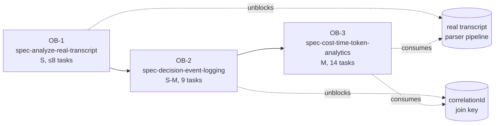

# Epic: observability-v2

## Vision

curdx-flow ship 后**自己产出 R1-R7 报表 + 推荐引擎**，用户照表改 prompt/spec → 下一轮自动 measure → 闭环自优化。底盘三件套：(1) `analyze` 读真 transcript 不读 fixture；(2) L3 业务事件日志（hook 决策 + correlation + rotation）；(3) cost/time/token 三级聚合 + 推荐。

## Original Goal (verbatim)

> 给 curdx-flow 加完整可观测性体系 —— 让插件自己能告诉用户哪 spec/phase/task 该优化。
> 1. 先修 `analyze` 命令读真 transcript 的 critical bug（B1: index.ts:23 hardcoded fixture）
> 2. 再升级 L3 业务事件日志（hook 决策、命中、性能 + correlationId + log rotation + schema 升级支持 info/metric/decision 三 level）
> 3. 再加 cost/time/token 分析（按 task → phase → spec 三级聚合，含价格表、cache 命中率、subagent 分摊、推荐引擎）

## Hard Constraints

1. **复用 plugin-observability** — `error-logger.ts` (134 LOC) + `analyze/*` (1414 LOC) 已 ship；只扩不重写
2. **schema 向后兼容** — 老 errors.jsonl（无 level/kind/payload/correlationId）行能被新 parser 读，缺字段走默认值
3. **本地优先** — 数据 `~/.claude/curdx-flow/`；零 phone-home
4. **零 npm runtime deps** — log rotation / pricing / recommend 全自家代码
5. **size cap** — OB-1 = S（≤8 任务）/ OB-2 = S-M（8-12）/ OB-3 = M（12-18）

## "Must-Build" Filter Results

每项加项给：consensus（外部/codebase 证据）/ 本地 gap / 不做代价。

| 加项 | Consensus | 本地 gap | 不做代价 | Spec |
|---|---|---|---|---|
| 真 transcript 路径解析 | R1: `~/.claude/projects/<slug>/<uuid>.jsonl` 是稳定路径 | `index.ts:23` hardcode `tests/analyze/fixtures/sample.jsonl` | `analyze` 命令对用户**完全无效**（critical） | OB-1 |
| L3 schema 升级（level/kind/payload） | R2 Langfuse tag-driven attribution；现有 errors.jsonl 只有 5 字段 | error-logger.ts L70 `level: 'error'` 写死、L70 `event: string` 无枚举 | OB-3 报表无法按 hook decision 维度切片 | OB-2 |
| correlationId 三段式 `<sid>:<task>:<iter>` | R1 transcript 已有 session_id；state file 已有 task_idx + iter | error-logger.ts L68-77 无 correlation 字段 | 跨 hook 事件无法 join，subagent 分摊算不出 | OB-2 |
| log rotation（自家） | constraint #4 禁外部 deps；30 LOC size+age 双闸够用 | error-logger.ts L124 `appendFileSync` 无限追加 | 长 session errors.jsonl 涨爆磁盘 | OB-2 |
| pricing.ts 静态价格表 | R1: Anthropic 2026 公开 5 字段 each model；ccusage 同模式 | 完全空白 | cost 数字算不出来，R5 报表不存在 | OB-3 |
| transcript usage 解析 | R1: `assistant.message.usage.{input,output,cache_read,cache_creation.ephemeral_5m/1h}` | parser.ts 只读 errors.jsonl | token/cache 维度全断 | OB-3 |
| 推荐引擎（threshold + MAD z-score） | R2 TensorMesh "aggregate misleads" → per-stream + robust z-score | 无 recommend.ts | 数字有了但用户不知改哪 | OB-3 |

剔除项（曾考虑，不做）：
- ❌ pino-roll 等外部 log lib —— 违反 constraint #4
- ❌ UUID + correlationMap —— Q5 决策；三段式无外部状态、可读性强
- ❌ 推荐引擎独立 spec —— Q2 决策；3-4 任务不值得单 spec，OB-3 M 上限有余地

## Spec Decomposition

---

### OB-1: spec-analyze-real-transcript

**Goal (user story)**: 作为 curdx-flow 用户，运行 `npx curdx-flow analyze` 时读取我**真实 session 的 transcript**（`~/.claude/projects/<encoded-cwd>/<session-uuid>.jsonl`），不再读测试 fixture，使报表反映我自己的工作而非 sample 数据。

**Acceptance Criteria**:
- AC1: `npx curdx-flow analyze` 在 cwd `/Users/x/foo/bar` 下解析路径为 `~/.claude/projects/-Users-x-foo-bar/`
- AC2: 同目录多个 session-uuid.jsonl 时，**默认聚合该 project dir 下所有 session**（token/cost 跨 session 求和）；CLI 加 `--session <uuid>` flag 提供 single-session view。**Open Question 在 OB-1 design phase 落定，不再延期。**
- AC3: 项目目录不存在 → 友好错误 "no transcript found for this project"，**exit code ≠ 0**
- AC4: 老的 fixture path 仍可走 `CURDX_TRANSCRIPT_FIXTURE=...` env var（test-only）
- AC5: 5 新单测全部通过（path resolver / encoding / multi-session / missing project / fallback env var）
- AC6: 现有 `tests/analyze/integration.test.ts` 不破

**Size**: S（5-7 任务，≤8 cap）

**Dependencies**: 无（最底层）

**Interface contract（exported from `src/analyze/transcript-path.ts` — new file）**:
```ts
export interface TranscriptSource {
  kind: 'real' | 'fixture';
  paths: string[];   // 绝对路径数组（多 session 聚合）
  cwd: string;       // 解析时的 cwd
}

export function resolveTranscriptSource(opts: {
  cwd?: string;                    // default = process.cwd()
  fixtureOverride?: string;        // CURDX_TRANSCRIPT_FIXTURE
  sessionFilter?: 'latest' | 'all'; // default 'all'
}): TranscriptSource;

// throws TranscriptNotFoundError when kind='real' but no project dir exists
export class TranscriptNotFoundError extends Error {}
```

**Owner files**:
- MODIFY `/Users/wdx/opc/curdx-flow/src/analyze/index.ts` — **4 个 fixturePath 引用全部替换为 `resolveTranscriptSource()` pattern**：
  - L23  `POC_FIXTURE_REL` const 删除
  - L116 `statSync(fixturePath)` 改用解析后路径
  - L150 `parseTranscript(fixturePath, …)` 改用解析后路径
  - L203 `state.files[fixturePath]` 的 state-file key 改用解析后路径
- NEW `/Users/wdx/opc/curdx-flow/src/analyze/transcript-path.ts`
- NEW `/Users/wdx/opc/curdx-flow/tests/analyze/transcript-path.test.ts`（5 cases）

**Validation hint**: 在 reality-verification 阶段，用 `CURDX_TRANSCRIPT_FIXTURE=tests/analyze/fixtures/sample.jsonl npx curdx-flow analyze` BEFORE/AFTER 输出比对（应一致 = 兜底 OK），再 unset env var 跑 → 应读真 transcript 或干净失败。
- **Runnable check**: `npx curdx-flow analyze --json | jq '.transcripts | length'` 应 ≥ 1（读到的是真 transcript 不是 fixture）。

---

### OB-2: spec-decision-event-logging

**Goal (user story)**: 作为 curdx-flow hook 维护者，当 stop-watcher / task-completed-verifier / subagent-context-injector / stop-failure-handler 做出决策时，能用 `logHookEvent({ level: 'decision', kind: 'block', payload: {...}, correlationId })` 写出**结构化、可 join、自动轮换**的 events.jsonl，OB-3 报表能按 kind/correlationId 切片。

**Acceptance Criteria**:
- AC1: error-logger.ts schema 加 4 字段（level/kind/payload/correlationId），老行（缺这些字段）能被新 parser 读，level 默认 `'error'`、kind 默认 `'unknown'`
- AC2: B2-B6 五个 bug 全修：level 不再写死、event 走 enum 枚举、appendFileSync 加 rotation、correlationId 出现在每行、payload 字段支持任意 JSON-safe object（透传后被 redact 模块 D-9 white-list 兜底）
- AC3: 新 `logHookEvent(input: HookEventInput): void` 函数，NEVER-throw 契约（继承 NFR-9）
- AC4: log rotation 自家代码：单文件 ≥ 10MB **或** mtime ≥ 30 天 → rename 为 `events.<ts>.jsonl`，新写入新文件；最多保留 5 个轮换文件
- AC5: 4 个 hook 接入 logHookEvent，共约 10 个 event kind（如 `stop_block`/`stop_unblock`/`task_verify_pass`/`task_verify_fail`/`subagent_context_injected`/`stop_failure_recovered` 等）
- AC6: parser.ts 加 events.jsonl 解析路径（与 errors.jsonl 平级），integration test 跑通
- AC7: correlationId 格式 `<session_id>:<task_idx>:<iter>` 在 hook 内用 transcript context + state file 拼出
- AC8: CHANGELOG 加独立 entry
- AC9: 现有 `tests/hooks/error-logger.test.ts` 4 个 case 不修改即继续通过（schema 加项纯粹 additive；老 errors.jsonl 行必须能 round-trip 过新 parser）

**Size**: S-M（8-12 任务，9 任务目标）

**Dependencies**: **OB-1**（OB-2 的 parser 改动假设 OB-1 已让 analyze 读真 transcript；否则 events.jsonl 解析在 fixture 里测不出真效果）

**Interface contract（exported from `src/hooks/_shared/error-logger.ts` — extend existing file）**:
```ts
export type EventLevel = 'error' | 'info' | 'metric' | 'decision';
export type EventKind =
  | 'stop_block' | 'stop_unblock'
  | 'task_verify_pass' | 'task_verify_fail'
  | 'subagent_context_injected'
  | 'stop_failure_recovered'
  | 'unknown';                         // for old log rows + safety fallback

export interface HookEventInput {
  hook: string;                        // hook 文件名
  event: EventKind;                    // 强枚举
  level: EventLevel;
  msg?: string;                        // ≤ 500 chars
  payload?: Record<string, unknown>;   // 透传后过 redact white-list
  correlationId?: string;              // <sid>:<task_idx>:<iter>
}

// schema-on-disk (events.jsonl line)
export interface EventLogRow {
  ts: string;                          // ISO 8601
  hook: string;
  event: EventKind;
  level: EventLevel;
  msg?: string;
  payload?: Record<string, unknown>;
  correlationId?: string;
}

// NEVER-throw 契约
export function logHookEvent(input: HookEventInput): void;

// 老 logError 保持不变 — 内部转发到 logHookEvent({level:'error', kind:'unknown'})
```

**Owner files**:
- MODIFY `/Users/wdx/opc/curdx-flow/src/hooks/_shared/error-logger.ts`（schema 扩 + rotation + logHookEvent）
- MODIFY `/Users/wdx/opc/curdx-flow/src/hooks/stop-watcher.ts`
- MODIFY `/Users/wdx/opc/curdx-flow/src/hooks/task-completed-verifier.ts`
- MODIFY `/Users/wdx/opc/curdx-flow/src/hooks/subagent-context-injector.ts`
- MODIFY `/Users/wdx/opc/curdx-flow/src/hooks/stop-failure-handler.ts`
- MODIFY `/Users/wdx/opc/curdx-flow/src/analyze/parser.ts`（events.jsonl 解析）
- MODIFY `/Users/wdx/opc/curdx-flow/src/analyze/types.ts`（EventLogRow 类型）
- NEW `/Users/wdx/opc/curdx-flow/tests/hooks/event-logger.test.ts`（rotation + correlationId + payload redact + 老行兼容）
- MODIFY `/Users/wdx/opc/curdx-flow/CHANGELOG.md`（独立 OB-2 entry）

**Validation hint**: 
- 写 100 行 events.jsonl 强制超过 10MB → 应 rename 出 1 个 events.<ts>.jsonl
- 用 v7.1.6 老 errors.jsonl 喂新 parser → 0 报错，level 全归 `'error'`
- 4 hook 触发场景手跑 → grep correlationId 应在每行出现，且同 session 三段式相同 prefix
- **Runnable check**: `cat ~/.claude/curdx-flow/errors.jsonl | head -1 | jq .level` 应不报错（schema 有效）。

---

### OB-3: spec-cost-time-token-analytics

**Goal (user story)**: 作为 curdx-flow 用户，运行 `npx curdx-flow analyze --cost-summary --by-spec --since 7d` 后，看到 R1-R7 七张报表 + 一段**推荐文字**告诉我"spec X 的 design phase cache hit 28% 低于 30% SEV 阈值，建议提取常量到 system prompt"。

**Pre-task (Task 0)**: 创建 `tests/analyze/fixtures/sample-with-usage.jsonl`，覆盖 Opus 4.7 + Sonnet 4.6 + Haiku 4.5 三个 model 的行，每行 `assistant.message.usage` 全字段（input / output / cache_read / `cache_creation.ephemeral_5m_input_tokens` / `cache_creation.ephemeral_1h_input_tokens`）。**现有 sample.jsonl 0 个 usage block — cost.ts 单测无法复用它**。

**Acceptance Criteria**:
- AC0: `tests/analyze/fixtures/sample-with-usage.jsonl` 存在且 3 model 各 ≥1 行带完整嵌套 usage（前置任务交付物）
- AC1: `pricing.ts` 含 Opus 4.7 / Sonnet 4.6 / Haiku 4.5 三个 model 的 5 字段（input / output / cache_read / cache_5m_write / cache_1h_write），README 注明价格来源 + 修订流程
- AC2: parser.ts schema-map 扩展 `assistant.message.usage` 全 6 字段（含嵌套 `cache_creation.ephemeral_{5m,1h}_input_tokens`） + `attachment.hook_success.durationMs` + `turn_duration.durationMs`
- AC3: cost.ts 公式 = `(input·base + 5m·1.25·base + 1h·2·base + read·0.1·base + output·out)/1e6`，单元测试覆盖 3 个 model
- AC4: 三级聚合：task / phase / spec —— 用 OB-2 的 correlationId 做 join key，subagent `<usage>` trailer 用 R1 regex `/<usage>total_tokens:N\ntool_uses:N\nduration_ms:N<\/usage>/` 解析后分摊到父 task
- AC5: R1-R7 七张报表落地（R1 = per-spec cost / R2 = per-phase / R3 = per-task / R4 = cache hit / R5 = wall-clock / R6 = model split / R7 = top-N hot tasks）
- AC6: recommend.ts 含 6-8 threshold rules（cache < 60% warn / < 30% SEV / hit-cap > 20% / output > 8K → 拆 task / Opus 占比 > 50% 在非 critical phase → 建议 Sonnet …）+ 1 个 robust z-score (MAD) outlier 函数；输出文字推荐
- AC7: CLI 5 新 flag：`--cost-summary` / `--by-spec` / `--by-phase` / `--by-task` / `--since`（`--since` 复用现有 filter 逻辑，仅 CLI 接线）
- AC8: Opus 4.7 vs 4.6 tokenizer 归一化注释（不强制实现，但报表脚注提醒跨模型对比慎用）
- AC9: requestId 去重 key 接入 filter.ts dedup
- AC10: CHANGELOG 加独立 entry

**Size**: M（12-18 任务，14 任务目标）

**Dependencies**: **OB-2**（cost.ts 三级聚合用 OB-2 的 correlationId 作 join key；没 OB-2 就只能用更弱的 ts proximity heuristic，AC4 不达成）

**Interface contract**:

```ts
// src/analyze/pricing.ts (NEW)
export interface ModelPrice {
  inputPerMTok: number;  outputPerMTok: number;
  cacheReadMul: number;  cache5mWriteMul: number;  cache1hWriteMul: number;
}
export const PRICING: Record<string, ModelPrice>;  // keyed by model id

// src/analyze/cost.ts (NEW)
export interface UsageRow {
  ts: string; requestId: string; model: string;
  inputTokens: number; outputTokens: number;
  cacheReadTokens: number;
  cacheCreate5mTokens: number; cacheCreate1hTokens: number;
  correlationId?: string;     // <sid>:<task>:<iter> from OB-2
}
export function computeCost(row: UsageRow): number;     // USD
export function aggregateBy(
  rows: UsageRow[],
  level: 'spec' | 'phase' | 'task'
): AggregateBucket[];

// src/analyze/recommend.ts (NEW)
export interface Recommendation {
  rule: string;          // rule id
  severity: 'info' | 'warn' | 'sev';
  scope: { spec?: string; phase?: string; task?: string };
  message: string;       // human-readable
  evidence: Record<string, unknown>;
}
export function recommend(buckets: AggregateBucket[]): Recommendation[];
```

**Owner files**:
- NEW `/Users/wdx/opc/curdx-flow/src/analyze/pricing.ts`
- NEW `/Users/wdx/opc/curdx-flow/src/analyze/cost.ts`
- NEW `/Users/wdx/opc/curdx-flow/src/analyze/recommend.ts`
- MODIFY `/Users/wdx/opc/curdx-flow/src/analyze/parser.ts`（usage schema map）
- MODIFY `/Users/wdx/opc/curdx-flow/src/analyze/report.ts`（R1-R7）
- MODIFY `/Users/wdx/opc/curdx-flow/src/analyze/filter.ts`（requestId dedup）
- MODIFY `/Users/wdx/opc/curdx-flow/src/analyze/index.ts`（5 CLI flags）
- MODIFY `/Users/wdx/opc/curdx-flow/src/analyze/types.ts`
- NEW `/Users/wdx/opc/curdx-flow/tests/analyze/pricing.test.ts`
- NEW `/Users/wdx/opc/curdx-flow/tests/analyze/cost.test.ts`
- NEW `/Users/wdx/opc/curdx-flow/tests/analyze/recommend.test.ts`
- MODIFY `/Users/wdx/opc/curdx-flow/tests/analyze/integration.test.ts`（R1-R7 snapshot）
- MODIFY `/Users/wdx/opc/curdx-flow/CHANGELOG.md`（独立 OB-3 entry）

**Validation hint**:
- 喂一段 fixture 含 3 个 model 行 → cost.ts 输出与手算 ±0.001 USD
- 强造一段 cache_read=0 / cache_write=80 / read=20 的 row → R4 cache hit 报表应触发 recommend.ts SEV
- 跨 spec 对比：subagent `<usage>` trailer 加进父 task → R3 per-task 数字 = 父 + 子之和
- **Runnable check**: `npx curdx-flow analyze --cost-summary --json | jq '.totalCost.usd' | xargs -I{} test "{}" != "null"` 应 pass（非 null cost 数字落地）。

## Dependency Graph



**线性依赖**，3 spec 无并行机会 — 但每 spec 内部任务可并行。

## Sequencing Recommendation

| 顺序 | Spec | 卡点 | 解锁能力 |
|---|---|---|---|
| 1 | **OB-1** | B1 是 critical，先修才有意义 | analyze 读真 transcript |
| 2 | **OB-2** | OB-3 cost 聚合需要 correlationId join | 结构化事件 + correlation key |
| 3 | **OB-3** | 报表 + 推荐 = 用户价值终点 | R1-R7 + recommend 闭环 |

**预估 calendar**：每 spec **独立 PR**；OB-1 ≈ 1 day / OB-2 ≈ 2-3 days / OB-3 ≈ 3-5 days。

## Out-of-Scope

- ❌ 云端上报 / phone-home — 永远本地优先（constraint #3）
- ❌ Grafana / Prometheus 接入 — analyze CLI 即终端
- ❌ Real-time streaming — analyze 是 cold-read CLI
- ❌ Cross-tokenizer 历史归一化 **强制实施** — AC8 仅脚注提醒
- ❌ Opus 4.7 vs 4.6 tokenizer 归一化（Opus 4.7 同文本 +35% tokens per R1）— OB-3 Phase 5 仅在 cost 报表加脚注；跨 model 历史对比明确声明不可比
- ❌ 推荐引擎 LLM-based 自然语言生成 — 6-8 threshold rule 文字模板足够 MVP
- ❌ Web UI — `analyze --html` 不在 epic 内
- ❌ 多用户 / team rollup — 单 user 单 cwd

## Risks & Mitigations

| Risk | Likelihood | Impact | Mitigation |
|---|---|---|---|
| Anthropic transcript schema 变更（R1 `usage` 结构调整） | LOW | HIGH | parser.ts schema-map 已模式化；新增字段缺失走默认 0；OB-3 加 schema-version 探测 + warn |
| log rotation 自家代码 race condition | MED | MED | 写入前 stat → rename 用 `fs.renameSync`（atomic on POSIX）；Windows 走 unlink+rename fallback |
| isSidechain 假设破（subagent 跑 sidechain 不在自己 session） | LOW | MED | R1 30 样本 0 出现已侧证；OB-3 实施时强制复核（验收挂钩） |
| Opus 4.7 tokenizer 偏移破跨模型对比 | MED | LOW | AC8 脚注提醒；不强制实现归一化（out-of-scope） |
| correlationId 三段式碰撞（同 session 同 task 同 iter） | VERY LOW | LOW | 三段足够 unique；若真碰撞则两行被合并入同 bucket，无静默错 |
| OB-3 推荐引擎规则误报 | MED | MED | severity 三级（info/warn/sev），warn 以下不打扰；规则可通过 env var 关闭 |
| log rotation 删旧文件丢历史 | LOW | LOW | 只保留 5 个轮换文件 = 50MB 上限；用户可手动备份 |

## Decision Log (Q1-Q6)

| Q | 决议 | Rationale |
|---|---|---|
| **Q1** OB-2 拆 vs 合并 | **合并**（9 任务一个 spec） | hook 接入是机械活，每 hook ≈ 0.5 hr，拆 4 个独立 spec 协调成本远超执行成本；S-M 上限够装 |
| **Q2** OB-3 推荐引擎 vs 独立 spec | **纳入 OB-3** | 6-8 threshold rules + 1 z-score lib ≈ 3-4 任务，单 spec 不值；M cap (18) 留余地 |
| **Q3** B2-B6 五个修复在哪 | **全在 OB-2** | B2-B6 都是 error-logger.ts 改动，OB-2 已经在改这文件，自然合并；额外拆 spec 增加合并冲突 |
| **Q4** log rotation 自家 vs pino-roll | **自家** ≈ 30 LOC | constraint #4「不引入 npm runtime deps」是 hard；size+age 双闸够用 |
| **Q5** correlationId 格式 | **三段式 `<sid>:<task_idx>:<iter>`** | sid 来自 transcript context、task_idx + iter 来自 state file，**0 外部状态、0 UUID 开销、可读性强、grep 友好** |
| **Q6** CHANGELOG 路径 | **3 spec 各独立 entry** | match 现有 superpowers-uplift epic 模式（5 spec 各自加段）；epic 完成不需额外 rollup commit |

## Phase Completion Checklist

- [x] Vision + Original Goal 落定
- [x] 3 spec 边界定义（OB-1/2/3）
- [x] interface contracts 写出（TS signatures）
- [x] dependency graph（mermaid）
- [x] D5/D6 schema additions 显式（HookEventInput / UsageRow）
- [x] 每 spec Owner files 列绝对路径
- [x] 每 spec Validation hint
- [x] Q1-Q6 决议入档
- [ ] (next) `/curdx-flow:requirements` 进入 OB-1
