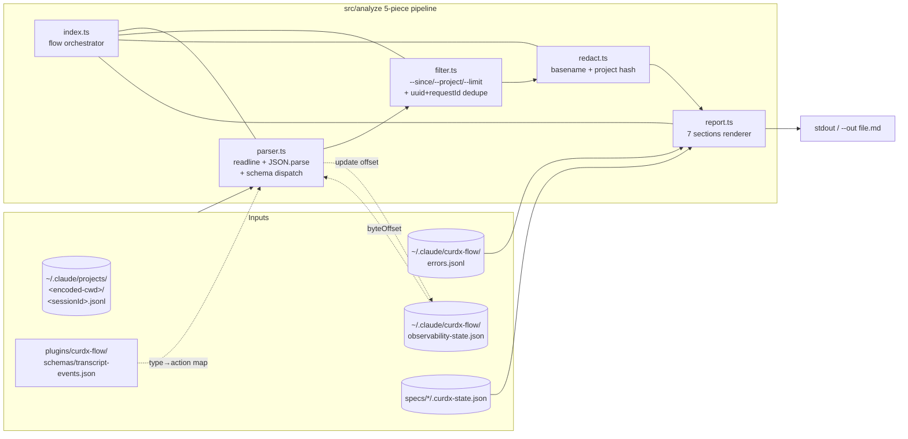
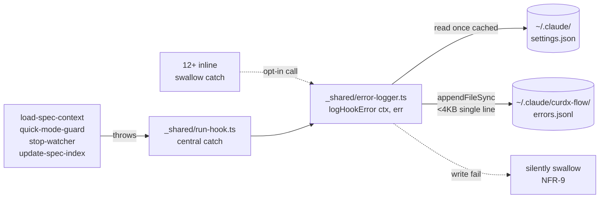
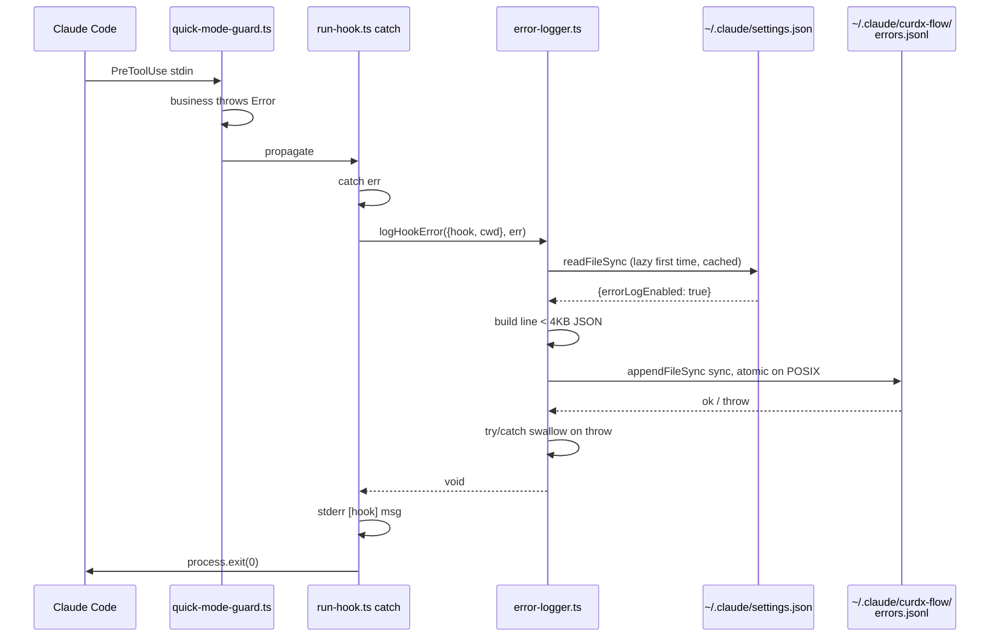

# Design — plugin-observability

## Overview

为 curdx-flow 增加"自我观测"能力：解析 Claude Code 已有的 `~/.claude/projects/<encoded-cwd>/<sessionId>.jsonl` transcript，并在 4 个 hook 的中央 catch 写 `~/.claude/curdx-flow/errors.jsonl`，由新增 CLI 子命令 `npx @curdx/flow analyze` 输出 markdown 报告（FR-1..7）。

数据流是**单向流式只读**：jsonl + errors.jsonl 是输入，markdown / JSON 是输出，所有中间状态只有一个 `observability-state.json`（仅存 byteOffset）。

不引入任何新基础设施：CLI 复用现有 citty 路由（4 处微改），错误埋点接入现有 `_shared/run-hook.ts` 中央 catch，schema map 与 `spec.schema.json` 同目录随 plugin 分发。零新增 npm 依赖（NFR-4）。

## Architecture

### 图 A：analyze CLI 数据流



### 图 B：hook 错误埋点路径



## 模块边界与职责（5 件套）

| 模块 | 文件 | 职责 | 输入 | 输出 | 单测策略 |
|---|---|---|---|---|---|
| parser | `src/analyze/parser.ts` | `node:readline` 流式按行 → `JSON.parse` → schema map 派发为归一化 `Event` | jsonl path + 起始 byteOffset | `AsyncIterable<Event>` + 终态 byteOffset + counters（unknown_type / parse_error） | fixture jsonl + snapshot Event 列表 |
| filter | `src/analyze/filter.ts` | `--since` 时间窗 / `--project` / `--limit` Top-N + `(uuid, requestId)` 双键去重 | `Event[]` + flags | `Event[]` (filtered, dedup) | 纯函数 + 边界 case（同 uuid 不同 requestId、缺 requestId fallback） |
| redact | `src/analyze/redact.ts` | prompt 全文裁掉只留长度、路径仅 basename + project hash、file-history-snapshot 字段直接 drop | raw value | redacted value | grep test：默认输出 grep 不到原 prompt |
| report | `src/analyze/report.ts` | 7 类报告聚合 + markdown 渲染（含 `--json` 切换）；errors.jsonl 与 jsonl `hook_success.exitCode≠0` join | `Event[]` + errors.jsonl 行 + specs/*/.curdx-state.json | markdown string \| JSON | snapshot |
| error-logger | `src/hooks/_shared/error-logger.ts` | 同步 `appendFileSync` errors.jsonl + 缓存 `errorLogEnabled` settings + 写失败静默 | `{hook, event, msg, …}` ctx + `Error` | void（绝不抛） | inject fake fs，验证 `errorLogEnabled=false` 时 0 写、写失败不冒泡 |

`src/analyze/index.ts` 是编排入口（`runAnalyze(opts)`）：
- 推断 `--project`（cwd → encoded-cwd）
- 读 state.json 取 byteOffset
- 调 parser → filter → report
- 写回 state.json（finally 即便部分失败也写已成功 offset）
- stdout / `--out` 落盘

`src/flows/analyze.ts` 是 citty `defineCommand` 包装层（仅做 args 解析 + i18n + 调 `runAnalyze`）。

## 数据契约

### `transcript-events.json` schema map（FR-5）

仿 claude-mem `transcript-watch.json`，type → action + 抽取字段：

```jsonc
{
  "version": 1,
  "events": {
    "hook_success": {
      "action": "hook_invocation",
      "fields": ["hookName", "hookEvent", "exitCode", "durationMs", "stderr"],
      "stderrMaxBytes": 500
    },
    "tool_use": {
      "action": "tool_call",
      "fields": ["name", "input.subagent_type"],
      "filter": { "name": ["Agent", "Task"] }
    },
    "assistant": {
      "action": "assistant_turn",
      "fields": ["attributionPlugin", "attributionSkill"]
    },
    "user": {
      "action": "user_turn",
      "fields": ["content"],
      "extractCommandName": true
    }
  }
}
```

未识别 type → 静默跳过 + `unknown_type_count++`（FR-6, NFR-7）。

### `errors.jsonl` schema（FR-8）

5 必填 + 5 可选：

```jsonc
{
  "ts": "2026-05-05T01:54:00.000Z",   // ISO8601, required
  "level": "error",                    // error|warn|info, required
  "hook": "quick-mode-guard",          // hook name, required
  "event": "stdin_parse_failed",       // slug, required
  "msg": "<= 500B free text",          // required
  // optional:
  "cwd": "/Users/.../proj",            // from HookStdin.cwd
  "spec": "plugin-observability",      // resolved from cwd/state if available
  "path": "specs/.../tasks.md",        // any relevant file
  "stack": "<= 2KB Error.stack",
  "transcript_path": "<from HookStdin>"
  // 注：sessionId/toolUseID 不可得（HookStdin 仅 3 字段，见 Risks R-2）
}
```

单行 < 4KB（NFR-8 / POSIX `PIPE_BUF`），超长字段截断。

### `observability-state.json` schema（FR-3）

```jsonc
{
  "version": 1,
  "files": {
    "/Users/wdx/.claude/projects/-Users-wdx-opc-curdx-flow/abc.jsonl": {
      "byteOffset": 1048576,
      "lastModifiedMs": 1730000000000,
      "sizeBytes": 1234567
    }
  }
}
```

未存 SHA / inode：见决策表 D-1。

## 关键技术决策

| # | 议题 | 选项 | 采纳 | 理由 | 被拒代价 |
|---|---|---|---|---|---|
| D-1 | offset 失效检测 | (a) 仅看 size 倒退 (b) 加 inode (c) 加 SHA-256 头 256B | **(a) size 倒退** | KISS；jsonl 是 append-only 设计，rotate 极少；size 减小或 mtime 倒退即视为新文件全量重读 | (b)(c) 跨平台 inode 不稳 / SHA 浪费 IO；NFR-1 性能预算 |
| D-2 | 去重 key 设计 | (a) uuid 单键 (b) `(uuid, requestId)` 双键 (c) `(uuid, ts)` | **(b) 双键** | F5 已验 ccusage 因单键去重被社区追加 requestId；resume session 同 uuid 不同 requestId | (a) 漏算 retry 导致漂移诊断失真 |
| D-3 | requestId 缺失 fallback | (a) 当作未知 (b) 用 uuid 单键退化 (c) 跳过 | **(b) 退化** | v2.1.119 旧事件无 requestId；与 v2.1.126+ 共存时不能整段丢 | (a) parse_error 噪声 (c) 新事件丢失 |
| D-4 | attribution 缺失 fallback | (a) 跳过 (b) 解析 user.content 内 `<command-name>` XML | **(b) XML 解析** | NFR-6 要求 v2.1.119+ 兼容；v2.1.126 前没有 attribution 字段 | (a) AC-2.1 失败 |
| D-5 | bundle 增量超 20KB 触发 | (a) 砍功能 (b) lazy import 全部 `src/analyze/*` (c) 拆独立 entry | **(b) lazy import**（条件触发） | OQ-4 先实测，超 20KB 才改；动态 `await import('./analyze/index.js')` 仅 analyze 命中 | (a) 砍 7 报告违反 FR-7 (c) 拆 entry 增加 npm publish 复杂度 |
| D-6 | Windows NTFS append 原子性 | (a) 加锁 (b) 声明非保证 (c) async queue | **(b) 声明非保证** | NFR-5 / OQ-3 已对齐；POSIX `PIPE_BUF` 4KB 是 macOS/Linux 保证；Windows 留 README 标注 | (a) 拖慢 quick-mode-guard 10s timeout (c) async 与 sync 写冲突 |
| D-7 | settings.json 读时机 | (a) 每 hook 同步读 (b) lazy 首次读+缓存到 module 局部变量 (c) env var | **(b) lazy + 缓存** | NFR-2 < 5ms；Hook 进程生命周期是 one-shot，模块缓存自然失效 | (a) 多吞 fs.readFile 拖慢 quick-mode-guard |
| D-8 | spec 漏斗扫描范围 | (a) 仅 `./specs/` (b) 递归 `./packages/*/specs/` (c) 用户传 `--specs-root` | **(a) + (c)** | 现网 monorepo 主流是 `./specs/`；`--specs-root` 留给后续扩展 | (b) 扫太深拖慢 |
| D-9 | redact-by-default 范围 | (a) 仅 prompt (b) prompt + path + snapshot (c) 全字段白名单 | **(b)** | F6 已验；与 FR-13 一致 | (a) 路径泄漏项目结构 (c) 实现成本爆炸 |

## 错误处理矩阵

| 失败场景 | 期望行为 | 由谁处理 | 关联 FR/NFR |
|---|---|---|---|
| jsonl 半行截断 | 跳过 + `parse_error_count++` | parser | FR-20 |
| 未知 type | 跳过 + `unknown_type_count++`，写入报告顶部 | parser | FR-6 / NFR-7 |
| state 文件损坏 / 字段缺失 | 视为新文件全量重读 | parser | FR-3 |
| state size 倒退 / mtime 倒退 | 视为 rotate，全量重读 | parser | D-1 |
| schema map 文件缺失 | 退化为内置最小白名单（hook_success / tool_use / assistant / user） | parser | FR-5 |
| schema map JSON 损坏 | 同上 + stderr 1 行 warning | parser | FR-5 |
| errors.jsonl 写失败（fs full / readonly） | 静默 swallow，绝不冒泡 | error-logger | FR-12 / NFR-9 |
| settings.json 不存在 | 默认 `errorLogEnabled=true` | error-logger | FR-9 |
| settings.json 损坏 | 默认 `errorLogEnabled=true` + stderr 1 行 warning | error-logger | FR-9 |
| Windows NTFS 并发 append | 不保证原子性，README 标注 | error-logger | NFR-5 / D-6 |
| `--since` 解析错误（如 `8d` 非法） | exit 1 + 用户友好 stderr | analyze CLI | FR-16 |
| `--project` 未匹配 | exit 0 + warning + 空报告 | analyze CLI | FR-18 |
| jsonl 目录不存在 | exit 0 + warning + 空报告 | analyze CLI | FR-2 |

## 文件清单

| 操作 | 路径 | 行数估 | 用途 |
|---|---|---|---|
| 创建 | `src/analyze/parser.ts` | ~200 | 流式解析 + offset + counters |
| 创建 | `src/analyze/filter.ts` | ~80 | 时间/项目过滤 + 双键去重 |
| 创建 | `src/analyze/report.ts` | ~400 | 7 报告聚合 + markdown/JSON 渲染 |
| 创建 | `src/analyze/redact.ts` | ~60 | basename + project hash + snapshot drop |
| 创建 | `src/analyze/index.ts` | ~50 | flow 编排 + state.json 读写 |
| 创建 | `src/analyze/types.ts` | ~50 | normalized `Event` / `Counters` / `Options` |
| 创建 | `src/flows/analyze.ts` | ~40 | citty `defineCommand` 包装 + i18n |
| 创建 | `src/hooks/_shared/error-logger.ts` | ~80 | sync errors.jsonl 写入 + settings 缓存 |
| 创建 | `plugins/curdx-flow/schemas/transcript-events.json` | ~150 | declarative schema map（OQ-1） |
| 创建 | `tests/analyze/fixtures/sample.jsonl` | ~30 行 | snapshot 输入（含 hook_success / tool_use / 半行 / 未知 type） |
| 创建 | `tests/analyze/fixtures/errors.jsonl` | ~5 行 | 错误埋点 fixture |
| 创建 | `tests/analyze/parser.test.ts` | ~100 | parse + offset + counters |
| 创建 | `tests/analyze/filter.test.ts` | ~80 | dedupe + time-window |
| 创建 | `tests/analyze/report.test.ts` | ~120 | snapshot 整体 markdown |
| 创建 | `tests/analyze/redact.test.ts` | ~50 | grep 不到原 prompt |
| 创建 | `tests/hooks/error-logger.test.ts` | ~80 | inject fake fs，验证开关 + 静默 |
| 修改 | `src/index.ts` | +6 | 4 处微改：import / `defineCommand` 引用 / `subCommands` / `SUBCOMMANDS.add()` |
| 修改 | `src/hooks/_shared/run-hook.ts` | +5 | catch 内调 `logHookError` |
| 修改 | `src/hooks/_shared/types.ts` | +4 字段 | 扩 `HookStdin`（保留可选；FR-10 落地） |
| 修改 | `src/i18n/en.ts` + `src/i18n/zh.ts` | +10 | analyze 文案（描述 / `--help` 摘要） |
| 修改 | `vitest.config.ts` | +1 行 | `include: 'tests/analyze/**'` |
| 修改 | `package.json` | +1 script | `"test:analyze": "vitest run tests/analyze"` |
| 修改 | `tsup.config.ts` | 0 | 不改（D-5 lazy 触发后再考虑） |
| 修改 | `README.md` | +20 | analyze 子命令文档 + redact 清单 + Windows 未实测声明 |

## 测试策略

### 单元（vitest 纯函数）
- **parser**：fixture jsonl（10 行含 hook_success / tool_use / 半行 / 未知 type / resume 同 uuid）→ snapshot Event 列表 + offset 终态 + counters。
- **filter**：6 case：单 uuid 去重、双键去重、`--since 7d` 边界、`--limit 10` 截断、`--project` 不匹配、空输入。
- **redact**：grep test：默认输出不含 `prompt 原文 sample`；`--include-prompts` 命中。
- **report**：snapshot 整体 markdown（7 段全在），`--json` 切换 schema 验证。
- **error-logger**：inject fake fs，验证：
  - `errorLogEnabled=true` 写 1 行
  - `errorLogEnabled=false` 写 0 行
  - settings.json 损坏默认 true
  - `appendFileSync` throw 不冒泡

### 集成
- `analyze --json` 跑 fixture 整体输出做 snapshot（AC-1.2 双源 join + AC-6.1 漂移诊断段）。
- `analyze` 跑 2 次（AT-2 增量 offset：第二次 ≤ 1/5 时间）。

### CI gate
- AT-9 bundle 增量：CI 加 `npm run build && wc -c dist/index.mjs`，对比阈值 84KB（NFR-3 当前 64KB + 20KB），超阈则触发 D-5 lazy 改造。
- AT-10 macOS + Linux 矩阵；Windows 仅冒烟（不跑 errors.jsonl 并发测）。

### 真实 session 冒烟（implement 阶段）
- 用本机 `~/.claude/projects/-Users-wdx-opc-curdx-flow/` 真实 jsonl 跑一遍 `analyze`（reality verification），不 assert 内容仅 assert 不抛错。

## 关键时序图：hook 写错误日志



## 已知风险

| # | 风险 | 缓解 |
|---|---|---|
| R-1 | schema 漂移（v2.1.x 月级新增 type） | declarative schema map（FR-5）+ 未识别静默（FR-6）+ 漂移诊断报告（AC-6.1）；改 JSON 不改代码 |
| R-2 | HookStdin 仅 3 字段（cwd/transcript_path/stop_hook_active），无 sessionId/toolUseID | errors.jsonl 这两字段标 optional；report 阶段用 ts ± 2s 时间窗 + cwd 做 join key 关联 jsonl 事件（粗粒度但够诊断） |
| R-3 | bundle 超 20KB（7 报告 + schema 加载） | D-5 lazy import；CI gate 跑 `wc -c`；超阈触发改造而非砍功能 |
| R-4 | 100MB+ jsonl OOM | 全程 `node:readline` 流式，不 `readFileSync`；增量 offset 复跑只读 tail |
| R-5 | resume session 双键去重不足（同 requestId 多次出现） | D-3 fallback uuid 单键；report 顶部输出 `parentUuid_broken_ratio` 给用户可观测 |
| R-6 | Windows NTFS 并发 append 撕行 | NFR-5 声明非保证 + README 标注 + 单行 < 4KB 尽量靠 OS write buffer atomic |
| R-7 | quick-mode-guard 10s timeout 内被 settings.json 同步读拖慢 | D-7 lazy + module 局部缓存；进程生命周期 one-shot 自然失效 |
| R-8 | redact 漏掉新增字段（schema map 加 type 但忘改 redact） | redact 走"白名单透出"模式（默认 redact，显式列出可输出字段），新字段默认被裁；测试加 grep 守护 |
| R-9 | errors.jsonl 与 jsonl `hook_success.exitCode≠0` 重复计数 | report 层 join 时按 `(hook, ts ±2s, cwd)` 去重；优先用 jsonl 来源（含 durationMs 等更全字段） |
| R-10 | 用户跑在非 git 仓库 cwd（`--project` 推断失败） | exit 0 + warning「无法推断当前 project，请用 `--project <name>` 指定」+ 空报告 |

## Out of Scope（与 requirements 一致）

- Web dashboard / 实时流处理。
- Token 成本 / 账单分析（让给 ccusage）。
- 上报通道 / 跨用户对比 / 云端聚合。
- Windows 平台**实测**（声明支持但用户自验，README 标注未实证）。
- file-history-snapshot 的文件内容（隐私）。
- 修改 / 扩展 Claude Code 自身 hook spec。
- 其他 plugin 的 observability（仅限 curdx-flow）。
- errors.jsonl 自动轮转（KISS：日均 << 100 行 / 年 < 10MB）。

## Action Steps

1. user review `design.md`。
2. 通过则跑 `/curdx-flow:tasks` 拆 POC-first 任务。
3. tasks.md 必含 POC：先跑通"读 1 个 fixture jsonl → 输出 1 段 hook-failure markdown"，再扩展 7 报告 / 增量 offset / errors.jsonl / redact / `--include-prompts` / `--since` / `--project` / `--limit` / `--json` / `--out`。
4. POC 验证后 lazy import D-5 改造仅在 NFR-3 触发时启动。
5. implement 阶段先跑 fixture 单测 + 集成，再用本机真实 jsonl 冒烟（reality verification）。
