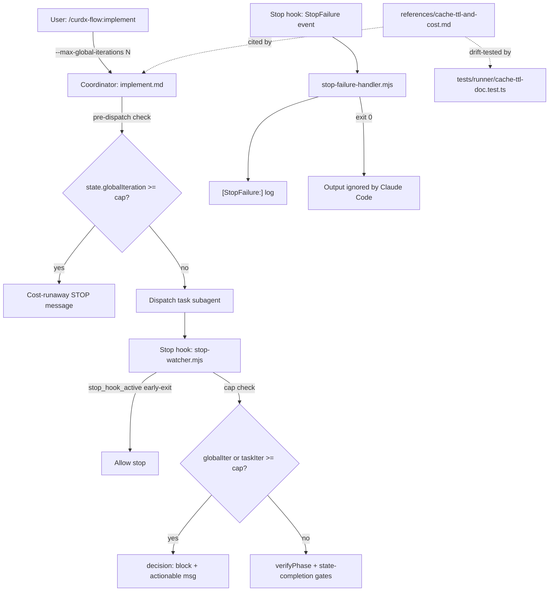
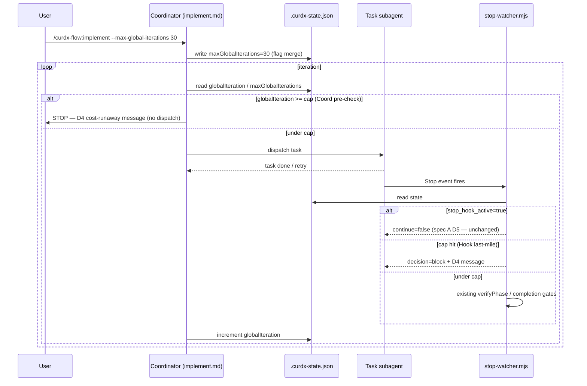

# Design: spec-cost-runaway-guards

## Overview

Real enforcement of declared `maxGlobalIterations` / `maxTaskIterations` caps on both coordinator and Stop hook surfaces (defense in depth), default tightening 100 → 30, plus StopFailure observability handler and cache-TTL reference doc. Closes the declared-but-not-enforced cost-runaway gap surfaced by research.

## Architecture Diagram



## Decisions

### D1: BOTH coordinator + hook enforcement (defense in depth)

| Layer | Where | Why |
|---|---|---|
| Coordinator | `commands/implement.md` pre-dispatch check | Loop-level — avoids wasted subagent dispatch when cap already hit |
| Stop hook | `stop-watcher.ts` hard block | Last-mile gate — catches if coordinator forgot or state mutated mid-run |

Both surfaces emit identical actionable message (per D4) so user sees one consistent error regardless of which fired. Hook fires **only if** coordinator missed it (in practice, hook is the safety net).

### D2: Pure CHANGELOG note for default tightening (no env var)

- New init writes `state.maxGlobalIterations: 30` (from schema default).
- Existing states with stored value (e.g. `100`) keep their stored value (FR-C1) — schema default only applies to **new** state init.
- Power user opt-in: explicit `--max-global-iterations 100` flag (per US-6).
- **No** `CURDX_MAX_GLOBAL_ITERATIONS_LEGACY` env var (FR-C3) — clutter for nothing; CHANGELOG headline + flag covers all use cases.

### D3: StopFailure handler in separate file

- New file `src/hooks/stop-failure-handler.ts` (≤200 LOC per FR-H2).
- `stop-watcher.ts` already 903 LOC (post-spec-A); StopFailure logic is independent (observability-only, never blocks) — separate file enables independent test + bundling + ownership clarity (R3 risk: prevent re-bloating stop-watcher).
- Bundled by esbuild to `plugins/curdx-flow/hooks/scripts/stop-failure-handler.mjs`.

### D4: Block decision message format (actionable)

```
Cost runaway guard tripped: globalIteration={N} >= maxGlobalIterations={cap}.
Loop blocked. Either:
- Investigate why your loop ran {N} iterations (check .progress.md)
- Override with: /curdx-flow:implement --max-global-iterations <higher-cap>
- Reset by editing {state-file-path}: set globalIteration to a lower value

Spec: {specName}  Phase: implement
```

Mirrors spec-A `buildVerificationBlockFailDecision` shape (NFR-3): phase + cmd + spec + actionable steps. Same template reused for `taskIteration` cap (substitute `taskIteration`/`maxTaskIterations`/`--max-task-iterations`).

## Components

### C1: Coordinator-side enforcement — `plugins/curdx-flow/commands/implement.md` (EDIT)

- Pre-dispatch check at top of iteration loop body.
- Reads `state.globalIteration`, `state.maxGlobalIterations`, `state.taskIteration`, `state.maxTaskIterations`.
- If `globalIteration >= maxGlobalIterations` → output cost-runaway STOP message + halt (do not dispatch).
- If current task's `taskIteration >= maxTaskIterations` → mark task failed, break retry loop (US-2 AC-2.2).
- Mirrors existing `--max-task-iterations` pattern (L42-47 / L73-78).

### C2: Stop hook last-mile gate — `src/hooks/stop-watcher.ts` (EDIT, surgical)

- Replace soft warn at L779-787 with hard block decision.
- Insert order (after `stop_hook_active` early-exit at L626-628, before existing verify/completion gates):
  1. `stop_hook_active` early-exit (D5 from spec A — unchanged)
  2. **NEW** cap-enforcement block (this spec)
  3. existing `buildVerificationBlockFailDecision` etc.
- Reuse `buildVerificationBlockFailDecision`-style helper → new `buildCostRunawayBlock(state)` returning `{ decision: "block", reason: "..." }`.

### C3: StopFailure handler — `src/hooks/stop-failure-handler.ts` (NEW)

- Reads stdin JSON, extracts `matcher` field.
- Logs `[StopFailure:<matcher>] <human-readable description>` to stderr.
- 8 matcher table embedded as const map (rate_limit / authentication_failed / oauth_org_not_allowed / billing_error / invalid_request / server_error / max_output_tokens / unknown).
- Echo unknown/missing matcher verbatim (R4 mitigation — don't strict-enum).
- Always `process.exit(0)` (FR-H5 / NFR-5).
- Wraps body in try/catch; any throw → stderr + exit 0 (fail-open).

### C4: Default tightening — `plugins/curdx-flow/schemas/spec.schema.json` (EDIT)

- `maxGlobalIterations.default`: `100` → `30`.
- `maxTaskIterations.default`: unchanged at `5` (FR-D2).
- Affects only **new** state init; existing state files retain stored values.

### C5: CLI flag exposure — `commands/implement.md` (EDIT, same file as C1)

- Existing `--max-task-iterations` parsing pattern at L42-47.
- Add `--max-global-iterations` mirror entry.
- Both flags merge into state on init / update.
- Documented in implement.md header section.

### C6: Cache-TTL reference doc — `plugins/curdx-flow/references/cache-ttl-and-cost.md` (NEW)

| Section | Content |
|---|---|
| §1 5min cache TTL trap | Default 5min; GH#46829 closed-not-planned silent regression |
| §2 Cost multiplier | cache-read 0.1× / cache-write 1.25× (5m) / 2× (1h); 17.1% multi-pay實測 |
| §3 stop_hook_active early-exit | Cross-link to spec-A `iron-law-verification.md` |
| §4 Loop budget | 30 iter ≈ ~$4.50 nominal blast radius vs old 100 ≈ ~$13+; opt-in `ttl: "1h"` example |

### C7: Hooks registration — `plugins/curdx-flow/hooks/hooks.json` (EDIT)

- Add `StopFailure` event entry pointing to `hooks/scripts/stop-failure-handler.mjs`.
- No matcher filter (handler enumerates internally).

### C8: Build pipeline — `scripts/build-hooks.mjs` (EDIT)

- Add `stop-failure-handler` entry to esbuild source list.
- Output: `plugins/curdx-flow/hooks/scripts/stop-failure-handler.mjs`.
- `npm run check:hooks-fresh` will fail until baseline updated (C9).

### C9: Tests

| File | Action | Cases |
|---|---|---|
| `tests/hooks/stop-failure-handler.test.ts` | NEW | 5: rate_limit / billing_error / max_output_tokens / unknown / missing-matcher (FR-T1) |
| `tests/hooks/max-iterations-enforcement.test.ts` | NEW | 3: globalIteration cap-1/cap/cap+1; taskIteration cap; both-caps simultaneous (FR-T2) |
| `tests/hooks/stop-watcher.test.ts` | EDIT | +2 boundary cases for new block path (FR-T2) |
| `tests/hooks/byte-equal.test.ts` | EDIT | +1 baseline entry for stop-failure-handler.mjs (FR-T4) |
| `tests/cli/check.test.ts` (or new) | EDIT/NEW | 1-2 cases: `--max-global-iterations` flag → state propagation (FR-T5) |
| `tests/runner/cache-ttl-doc.test.ts` | NEW | Drift: assert "5 minute" / "GH#46829" / "5-10×" tokens present (FR-T3 / R5) |

### C10: CHANGELOG entry — `CHANGELOG.md` (EDIT)

- **Changed** (headline): `maxGlobalIterations` default `100 → 30`; existing state values preserved; opt-in via `--max-global-iterations 100`.
- **Added**: StopFailure handler (8 matchers); `references/cache-ttl-and-cost.md` reference; `--max-global-iterations` CLI flag.
- **Fixed**: `maxGlobalIterations` / `maxTaskIterations` now actually block at cap (was stderr-warn only).

## File Structure

| Path | Action |
|---|---|
| `src/hooks/stop-failure-handler.ts` | NEW |
| `src/hooks/stop-watcher.ts` | EDIT (surgical — hard block at cap) |
| `plugins/curdx-flow/commands/implement.md` | EDIT (coordinator pre-check + new flag) |
| `plugins/curdx-flow/schemas/spec.schema.json` | EDIT (default 100 → 30) |
| `plugins/curdx-flow/hooks/hooks.json` | EDIT (StopFailure registration) |
| `scripts/build-hooks.mjs` | EDIT (add stop-failure-handler entry) |
| `plugins/curdx-flow/references/cache-ttl-and-cost.md` | NEW |
| `tests/hooks/stop-failure-handler.test.ts` | NEW |
| `tests/hooks/max-iterations-enforcement.test.ts` | NEW |
| `tests/hooks/stop-watcher.test.ts` | EDIT |
| `tests/hooks/byte-equal.test.ts` | EDIT (extend baseline) |
| `tests/cli/check.test.ts` | EDIT (or new file under tests/cli/) |
| `tests/runner/cache-ttl-doc.test.ts` | NEW |
| `CHANGELOG.md` | EDIT |

**14 files: 5 NEW + 9 EDIT.**

## Test Strategy

| Test | NFR/FR | What it traces |
|---|---|---|
| `stop-failure-handler.test.ts` × 5 | FR-H3, FR-H5, NFR-5 | All matchers + fail-open + exit 0 |
| `max-iterations-enforcement.test.ts` × 3 | FR-E1, FR-E2, FR-E3, US-9 | Boundary off-by-one (R2) |
| `stop-watcher.test.ts` +2 | FR-E1 | Hard block path (was soft warn) |
| `byte-equal.test.ts` +1 | FR-T4 | Bundle freshness gate |
| `check.test.ts` flag prop | FR-CLI1, FR-CLI2, FR-T5 | CLI flag → state |
| `cache-ttl-doc.test.ts` | FR-DOC2, R5 | Doc drift |
| Smoke (manual) | FR-C1, FR-C2, NFR-3 | Old state w/ 100 keeps; new state takes 30 |
| Manual fixture | US-4 AC-4.2 | Trigger rate_limit → stderr `[StopFailure:rate_limit]` |
| Manual fixture | US-1 AC-1.1 | `--max-global-iterations 3` → block at iter 4 |

## Data Flow — Cap Enforcement



## Edge Cases

| Edge | Handling |
|---|---|
| `state.maxGlobalIterations` undefined (legacy state pre-spec) | Fall through to schema default 30; covered by FR-C2 |
| `state.maxGlobalIterations: 0` (user pathology) | Block on first iteration (`0 >= 0` fires); D4 message says `globalIteration=0 >= maxGlobalIterations=0` — user can spot it |
| `state.maxGlobalIterations: -1` (sentinel "unlimited") | Out of scope; schema requires non-negative integer (existing constraint) |
| Cap reduced mid-run via direct state edit (not flag) | Next iteration's pre-check picks up new value; no migration needed |
| `taskIteration` cap hit but `globalIteration` under cap | Coordinator marks current task failed, advances to next task; loop continues |
| Both caps hit simultaneously | Block message prefers globalIteration (loop-level), task-level only mentioned if `taskIteration >= maxTaskIterations` and `globalIteration < maxGlobalIterations` |
| StopFailure stdin malformed JSON | Fail-open: stderr "stop-failure-handler: malformed stdin"; exit 0 (NFR-5) |
| StopFailure matcher field absent | Treat as `unknown`; echo full payload to stderr for debugging (R4) |

## Performance Budget

| Surface | Target | NFR |
|---|---|---|
| stop-failure-handler.mjs p95 | < 30ms | NFR-2 |
| stop-watcher cap-check overhead | < 5ms (state already loaded) | (NFR-2 sibling) |
| Coordinator pre-dispatch check | < 5ms (state read once per iter) | implicit |

## Cross-Platform Considerations

No new fs / process / path patterns. stop-failure-handler reads stdin + writes stderr only — same surface as existing hooks. Cross-platform-clean per existing infra (NFR-4).

## Out of Scope (carried)

- Top-level `curdx-flow implement` CLI subcommand (use existing implement.md flag pattern).
- StopFailure auto-retry (observability-only by design).
- Cache-write 1h auto-injection (manual `ttl: "1h"`; doc-only).
- Cost report numbers (precise pricing data needed; future spec).
- `CURDX_MAX_GLOBAL_ITERATIONS_LEGACY` env var (CHANGELOG note replaces).
- `.progress.md` audit trail for StopFailure (gitignored; stderr only v1).

## Risks

| ID | Risk | Mitigation |
|---|---|---|
| R1 | Default tightening breaks long-running legitimate loops | CHANGELOG headline + `--max-global-iterations 100` opt-in (FR-CLI1) |
| R2 | Coordinator + hook double-fire = confusing errors | Both paths emit identical D4 message; hook fires only if coordinator missed |
| R3 | stop-watcher.ts re-bloats (someone patches StopFailure inline later) | D3 separate file + file-header comment "DO NOT MERGE INTO stop-watcher.ts" |
| R4 | Anthropic adds new matcher → `unknown` swallows name | Handler echoes raw matcher string verbatim (no strict enum) |
| R5 | cache-ttl-and-cost.md drifts vs upstream pricing | drift test (`cache-ttl-doc.test.ts`) asserts key tokens |
| R6 | Off-by-one cap boundary (cap-1 vs cap vs cap+1) | Boundary test trio in `max-iterations-enforcement.test.ts` |

## Open Questions for Tasks Phase

1. **Block decision payload UX** — when stop-watcher returns `decision: block`, does Claude Code chat-reply but stop tool use? (research open Q2; verify in task-1 manual fixture before committing).
2. **byte-equal baseline directory** — reuse spec-D's baseline dir or new section? (open Q4; default: append in place — same dir).
3. **stop-failure-handler stderr format** — free text vs JSON line for ingest? (open Q5; default: free text v1).

## Implementation Steps

1. Create `src/hooks/stop-failure-handler.ts` with 8 matcher map + fail-open wrapper.
2. Add `stop-failure-handler` entry to `scripts/build-hooks.mjs`; run `npm run build:hooks`.
3. Register `StopFailure` event in `plugins/curdx-flow/hooks/hooks.json`.
4. Edit `src/hooks/stop-watcher.ts`: replace soft warn at L779-787 with `buildCostRunawayBlock` hard block; verify insertion order vs `stop_hook_active` early-exit.
5. Edit `plugins/curdx-flow/schemas/spec.schema.json`: `maxGlobalIterations.default` 100 → 30.
6. Edit `plugins/curdx-flow/commands/implement.md`: add coordinator pre-dispatch cap-check + `--max-global-iterations` flag mirror of `--max-task-iterations`.
7. Create `plugins/curdx-flow/references/cache-ttl-and-cost.md` (4 sections per C6).
8. Write `tests/hooks/stop-failure-handler.test.ts` (5 cases).
9. Write `tests/hooks/max-iterations-enforcement.test.ts` (3 boundary cases).
10. Extend `tests/hooks/stop-watcher.test.ts` (+2), `tests/hooks/byte-equal.test.ts` (+1 baseline), `tests/cli/check.test.ts` (flag prop).
11. Write `tests/runner/cache-ttl-doc.test.ts` (drift tokens).
12. Update `CHANGELOG.md` (Added / Changed / Fixed).
13. Run full chain: `npm run typecheck && npm run build:hooks && npm run check:hooks-fresh && npm run test:hooks && npm run verify`.
14. Manual fixture: `--max-global-iterations 3` → confirm block at iter 4; trigger rate_limit StopFailure → confirm stderr label.
