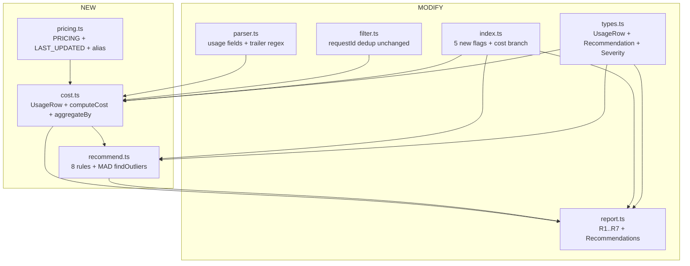

# Design: spec-cost-time-token-analytics

## Overview

OB-3 在 `src/analyze/` 现有 5-piece pipeline 之上**追加 3 个纯模块**（`pricing.ts` / `cost.ts` / `recommend.ts`）+ **改动 5 个现有模块**，把 OB-1 真 transcript + OB-2 三段式 correlationId 接成 cost / time / token 三级聚合 + R1-R7 报表 + 8 条 rule 文字推荐的闭环底盘。零 npm runtime deps、NEVER-throw、向后兼容 schema、`--json` 接 `costBreakdown` + `recommendations` 两个新顶层 key 与现有 7 flat section 共存。

数据流总览：transcript JSONL → parser 抽 usage（`assistant.message.usage` 嵌套 + 顶层冗余）→ filter dedupe（uuid|requestId）+ `--since` 窗 → cost.ts `computeCost` 单行算 USD → `aggregateBy(level)` 用 OB-2 correlationId 拆 spec/phase/task → recommend.ts 8 rule + MAD outlier → report.ts 渲染 R1-R7 + `## Recommendations`。subagent `<usage>` trailer（本机 27.7% sidechain / 681 出现）走 R1 regex 解析归并到父 task bucket，与 parent assistant_turn usage **互不重复**。

## Architecture

### Data Flow Diagram

```mermaid
flowchart LR
  T[transcript JSONL] --> P[parser.ts<br/>usage fields + trailer regex]
  E[errors.jsonl<br/>OB-2 events] --> P
  P --> F[filter.ts<br/>dedupe uuid|requestId<br/>--since window]
  F --> C[cost.ts<br/>computeCost per row]
  C --> A[aggregateBy<br/>spec / phase / task]
  S[specs/&lt;name&gt;/.curdx-state.json<br/>phase lookup] --> A
  A --> R[recommend.ts<br/>8 rules + MAD]
  A --> RP[report.ts<br/>R1..R7]
  R --> RP
  RP --> MD[markdown stdout]
  RP --> JS[--json: costBreakdown + recommendations]
```

### Component Diagram



## Components

### 1. pricing.ts (NEW)

**Purpose**: 静态 pricing 表 + 常量；零 runtime fetch；alias 解析。

**Interface**:
```typescript
export interface ModelPrice {
  inputPerMTok: number;
  outputPerMTok: number;
  cacheReadMul: number;      // 0.1
  cache5mWriteMul: number;   // 1.25
  cache1hWriteMul: number;   // 2.0
}

export const PRICING: Record<string, ModelPrice> = {
  'claude-opus-4-7':            { inputPerMTok: 5, outputPerMTok: 25, cacheReadMul: 0.1, cache5mWriteMul: 1.25, cache1hWriteMul: 2 },
  'claude-sonnet-4-6':          { inputPerMTok: 3, outputPerMTok: 15, cacheReadMul: 0.1, cache5mWriteMul: 1.25, cache1hWriteMul: 2 },
  'claude-haiku-4-5-20251001':  { inputPerMTok: 1, outputPerMTok:  5, cacheReadMul: 0.1, cache5mWriteMul: 1.25, cache1hWriteMul: 2 },
};

export const MODEL_ALIASES: Record<string, string> = {
  'claude-haiku-4-5': 'claude-haiku-4-5-20251001',
};

export const LAST_UPDATED = '2026-05-07'; // ISO date, ≤ 90 days NFR-8
export const SOURCE_URL = 'https://platform.claude.com/docs/en/about-claude/pricing';

export function resolveModelId(modelStr: string | undefined): string | undefined;
// Returns canonical PRICING key, applying alias map; undefined when unknown.
```

**Invariants**:
- 三 model × 5 字段精确匹配 research §Pricing 三方零矛盾验证（FR-PRICING-1）
- `LAST_UPDATED` ISO 字符串，README 三步刷新流程同步（NFR-8）
- 不触发任何 HTTP / file I/O（FR-PRICING-4 / NFR-3）

### 2. cost.ts (NEW)

**Purpose**: 单 row USD 计算 + 三级聚合 + subagent trailer 解析。

**Interface**:
```typescript
export interface UsageRow {
  ts: string;
  requestId: string;
  uuid?: string;
  model: string;
  inputTokens: number;
  outputTokens: number;
  cacheReadTokens: number;
  cacheCreate5mTokens: number;
  cacheCreate1hTokens: number;
  correlationId?: string;     // <sid>:<task>:<iter>
  isSidechain?: boolean;
  source: 'assistant' | 'subagent_trailer';
  durationMs?: number;
}

export interface AggregateBucket {
  level: 'spec' | 'phase' | 'task';
  key: string;                 // spec name | phase name | <sid>:<task>:<iter>
  totalUSD: number;
  inputTokens: number;
  outputTokens: number;
  cacheReadTokens: number;
  cacheCreate5mTokens: number;
  cacheCreate1hTokens: number;
  rowCount: number;
  trailerCount: number;        // R3 trailer 命中率分子
  durationMs: number;
  modelMix: Record<string, { tokens: number; usd: number }>;
  spec?: string;               // task→spec lookup
  phase?: string;              // task→phase lookup（state-file）
}

export function computeCost(row: UsageRow): number;
export function aggregateBy(
  rows: UsageRow[],
  level: 'spec' | 'phase' | 'task',
  ctx: { specPhaseMap: Record<string, string> },   // sid → phase from state file
): AggregateBucket[];

export function extractTrailerUsage(
  text: string,
  parentRow: { ts: string; requestId: string; correlationId?: string },
): UsageRow[];                  // returns 0..N rows; 1 trailer = 1 row, source='subagent_trailer'
```

**Cost 公式（FR-COST-1）** — 单 row：
```
USD = (input · base
     + cache5m · 1.25 · base
     + cache1h · 2.0  · base
     + cacheRead · 0.1 · base
     + output · out) / 1_000_000
```
四舍五入到 4 位小数（$0.0001 精度，覆盖 ±0.001 USD AC + buffer），最后聚合时累加 raw double，渲染前 round。

**三级聚合策略**：
- `level='task'`：bucket key = correlationId（缺则 fallback `unknown:<requestId>`）；同 correlationId 的 assistant + sidechain trailer 行合并；trailerCount 单独计数。
- `level='phase'`：先 task 聚合 → 用 `ctx.specPhaseMap[sid]` 把 task 维度映射到 phase；缺 phase 走 `unknown` 桶。
- `level='spec'`：从 correlationId 取首段 `<sid>` → 通过 state-file 找到 spec name；fallback `unknown` 桶。

**correlationId 解析（含 fallback）**：
```ts
function parseCorrelationId(cid?: string): { sid?: string; task?: string; iter?: string } {
  if (!cid) return {};
  const [sid, task, iter] = cid.split(':');
  return { sid, task, iter };
}
```
缺 correlationId 时：spec/phase 维度走 `unknown`；task 维度走 ts-proximity（按 ±5min 聚类到最近的有 correlationId 的 task，命中失败回 `unknown:<requestId>`）。Phase 来源：`specs/<name>/.curdx-state.json` 的 `phase` 字段（index.ts 已加载 `loadSpecStates()` 提供，cost.ts 复用）。

**Subagent trailer regex**（research §Trailer 实证）：
```ts
const TRAILER_RE =
  /<usage>[\s\S]*?total_tokens:\s*(\d+)[\s\S]*?tool_uses:\s*(\d+)[\s\S]*?duration_ms:\s*(\d+)[\s\S]*?<\/usage>/g;
```
- `[\s\S]*?` 非贪婪跨 `\n` 与字面换行（research §Trailer JSON-escape 实证）
- 全局 flag 同一 tool_result.content[].text 多 trailer 全收（峰值 session 5b0d961c 单 session 181 个）
- 命中后构造 `UsageRow{ source: 'subagent_trailer' }`：tool_uses 字段映射到 `inputTokens=0` + `outputTokens=total_tokens`（trailer 不细分 input/output；保守归并到 output 桶不破公式精度，因 trailer 已经是 subagent 自己 reported total），`durationMs` 直接用
- **去重防双计**：trailer 携带 parent requestId（同一 message），但 source 字段区分 → aggregateBy task 维度合并；filter.ts dedupe 仅按 uuid|requestId 去重 parent 行，trailer 走单独 row 不参与 dedupe（uuid 缺省，requestId 与 parent 相同但 source 不同）。

### 3. recommend.ts (NEW)

**Purpose**: 8 rules + MAD outlier 检测 → `Recommendation[]`。

**Interface**:
```typescript
export type Severity = 'info' | 'warn' | 'sev' | 'insufficient_data';

export interface Recommendation {
  rule: string;                // FR-RULE-N id, e.g. 'cache-hit-low'
  severity: Severity;
  scope: { spec?: string; phase?: string; task?: string };
  message: string;             // 人类可读，含数字 + action
  evidence: Record<string, unknown>;
}

export const REC_THRESHOLDS = {
  cacheHitWarn: 0.60,    cacheHitSev: 0.30,
  outputTokWarn: 8000,   outputTokSev: 16000,
  hitCapWarn: 0.10,      hitCapSev: 0.20,
  opusMixWarn: 0.30,     opusMixSev: 0.50,
  madZ: 3.5,
  wallClockWarn: 1.5,    wallClockSev: 2.0,
  cacheChurnWarn: 1.0,   cacheChurnSev: 3.0,
  retryWarn: 3,          retrySev: 5,
  madMinN: 10,           // research §MAD 推荐 5-10，design 取保守 10 与 NFR-10 对齐
} as const;

export function recommend(
  buckets: AggregateBucket[],
  ctx: { criticalPhases: string[] },   // ['critical', 'debug-hard'] skip rule-4
): Recommendation[];

export function findOutliers(values: number[]): number[]; // research 22-LOC MAD
export function modifiedZScore(values: number[]): number[];
```

**8 Rules 表（design 拍板，落 research §Threshold 区间）**：

| id | warn | sev | scope | data-source | rationale |
|---|---|---|---|---|---|
| FR-RULE-1 cache-hit-low | < 60% | < 30% | spec/phase/task | bucket cacheRead/(cacheRead+5m+1h) | research §Threshold #1 — **报表脚注非 Anthropic blessed** |
| FR-RULE-2 output-tok-high | > 8 K/turn | > 16 K/turn | task | per-row outputTokens | Anthropic `MAX_THINKING_TOKENS=8000`（强信号） |
| FR-RULE-3 hit-cap-rate | > 10% | > 20% | spec | events.jsonl `kind='ratelimit_429'` 占比 | Helicone 50/80/95 分级 |
| FR-RULE-4 opus-mix-high | > 30% | > 50% | phase | bucket.modelMix Opus token 占比 | 70/20/10 共识；**critical phase skip** |
| FR-RULE-5 cost-per-task-spike | \|z\| > 3.5 | — | task | MAD on cost array | Iglewicz & Hoaglin 1993；**单档 sev** |
| FR-RULE-6 wall-clock-p95 | > 1.5× rolling | > 2× rolling | task kind | per-kind p95 vs 30d baseline | 多源 1.2-2× 区间 |
| FR-RULE-7 cache-churn | write/read > 1.0 | > 3.0 | spec/phase | (5m+1h)/cacheRead | Anthropic prompt-caching 失败模式 #1 |
| FR-RULE-8 retry-loop | ≥ 3 same prompt | ≥ 5 | task | events.jsonl `kind='retry'` 计数 by correlationId | reivo-guard / AgentSonar 默认 |

**Severity 4 档（NFR-10）触发条件**：
- `insufficient_data`：rule-5 n < `madMinN` (10) / MAD = 0；任意 rule 数据字段缺失（cacheRead+write 全 0、outputTokens 缺）；rule-4 缺 phase tag
- `info` / `warn` / `sev`：按表中阈值；`info` 仅 rule-1/4/7 在数字优于 warn 时 emit（lifestyle 提示，可由 env `CURDX_REC_INFO=off` 关闭——不在 MVP 范围，预留）

**MAD 实现**：直接采用 research §MAD 22-LOC 参考代码（`MIN_N=5` short-circuit 走 `[]`，rule-5 在 n < 10 时通过 `insufficient_data` severity 表达，与 NFR-10 一致）。

**Phase-aware（rule-4）**：`ctx.criticalPhases = ['critical', 'debug-hard', 'security']`（design 默认；可由 spec state-file `meta.criticalPhase=true` 覆盖，MVP 走默认）；rule-4 在 phase ∈ criticalPhases 时跳过不 emit，避免误伤。

### 4. parser.ts (MODIFY)

**改动点**：仅扩 schema-map JSON 的 `assistant.fields`（advisory，零代码改动）+ 加一个 `attachment.hook_success` durationMs / `turn_duration` 字段声明。`payload: raw as Record<string, unknown>` 在 L221-232 已全量保留 → cost.ts 直接读嵌套字段。Trailer regex 解析**不放在 parser**（避免污染 Event union）；放在 cost.ts `extractTrailerUsage()`，由 index.ts 在 cost branch 触发。

**Schema-map 增量（AC2 落点）**：
```json
"assistant": {
  "action": "assistant_turn",
  "fields": [
    "attributionPlugin", "attributionSkill",
    "message.model",
    "message.usage.input_tokens",
    "message.usage.output_tokens",
    "message.usage.cache_read_input_tokens",
    "message.usage.cache_creation_input_tokens",
    "message.usage.cache_creation.ephemeral_5m_input_tokens",
    "message.usage.cache_creation.ephemeral_1h_input_tokens"
  ]
}
```
`hook_success.fields` 已含 `durationMs`（无需改）。`turn_duration.durationMs`：若 transcript 真实存在，加 events 表新条目；本 MVP 走 hook_success.durationMs 已就绪即可。

**向后兼容（FR-PARSER-3）**：缺嵌套 `cache_creation` → 顶层 `cache_creation_input_tokens` fallback；都缺 → 默认 0。所有 nested-read 走 `?? 0` 三层兜底。

### 5. report.ts (MODIFY)

**R1-R7 七张报表**（FR-REPORT-1）：

| R | Title | 列 | 默认排序 | 默认 Top-N |
|---|---|---|---|---|
| R1 | per-spec cost | spec / totalUSD / inTok / outTok / cacheHit% / runDur | totalUSD desc | all |
| R2 | per-phase cost | spec.phase / wallClock / cost / token | spec asc, phase 顺序 | all |
| R3 | per-task hot-spots | corrId / model / cost / token / dur / trailerHit | cost desc | top 20 |
| R4 | cache hit | scope (spec) / cacheRead / 5m / 1h / hitRate% | hitRate asc | all |
| R5 | wall-clock dist | taskKind / p50 / p95 / max | p95 desc | all |
| R6 | model split | model / token / cost / 占比 | cost desc | all |
| R7 | top-N hot tasks | corrId / spec / phase / cost / dur | cost desc | top N (`--top` flag, default 10) |

**章节顺序**：现有 7 flat sections（不动）→ `## Cost Breakdown`（含 R1-R7 子段）→ `## Recommendations`（Decision 4）。

**Recommendations 渲染**（severity 颜色编码）：
- `sev` → `[SEV]` 红色（terminal: ``，禁色环境降级纯文本前缀）
- `warn` → `[WARN]` 黄色（``）
- `info` → `[INFO]` 蓝色（``）
- `insufficient_data` → `[N/A]` 灰色（``）+ message "n=X 不足以判断"

每条格式：`[SEV] FR-RULE-1 cache-hit-low @ spec=X phase=design — 28% < 30% threshold; suggest extracting constants to system prompt. (cacheRead=12K, write=30K)`

**JSON 出口（FR-REPORT-2 / NFR-6）**：
```ts
{
  // ... existing 7 flat sections (unchanged)
  costBreakdown: {
    R1_perSpec: AggregateBucket[],
    R2_perPhase: AggregateBucket[],
    R3_perTask: AggregateBucket[],
    R4_cacheHit: { scope, hitRate, ... }[],
    R5_wallClock: { kind, p50, p95, max }[],
    R6_modelSplit: { model, tokens, usd, share }[],
    R7_topN: AggregateBucket[],
    totalCost: { usd: number },          // top-level for jq smoke validation hint
  },
  recommendations: Recommendation[],
}
```
`totalCost.usd` 顶层冗余便于 `jq '.totalCost.usd'` 一行 smoke（plan.md Validation Hint）。`costBreakdown.totalCost.usd` 是真源，顶层 `totalCost` 是 mirror。

**Tokenizer 脚注（FR-REPORT-4 / AC8）**：R6 末尾 `> Note: Opus 4.7 tokenizer counts ~35% more tokens than 4.6 for the same text; cross-model token comparison is not normalized.`

### 6. filter.ts (MODIFY)

**改动**：零 — `--since` 解析（`7d` / `YYYY-MM-DD`）+ `uuid|requestId` 双键 dedupe 已就绪，cost.ts 复用 `filterEvents()` 后再喂 cost 公式。requestId dedup AC9 已 live（filter.ts L74-80 `computeDedupeKey`）。**唯一加项**：`--since` 默认值在 index.ts 决（all-time / 不传不过滤），filter.ts 行为不变。

### 7. index.ts (MODIFY)

**5 新 CLI flag 接线**（FR-CLI-1）：
```ts
interface CostOptions extends Options {
  costSummary?: boolean;     // --cost-summary, default false (opt-in)
  bySpec?: boolean;          // --by-spec
  byPhase?: boolean;         // --by-phase
  byTask?: boolean;          // --by-task
  // since: 已存在 Options
  top?: number;              // --top N (default 10, R7)
}
```
- `--cost-summary` 默认 **opt-in / false**（plan.md 例子一致；不破现有默认报表行为 US-2 AC）
- `--since` 默认 **不传不过滤（all-time）**（design 决；`--since 7d` 是 opt-in，与 plan.md `--since 7d` 例子一致）
- `--by-spec` / `--by-phase` / `--by-task` 互斥提示（任一开启即触发对应 R 段，全开则 R1+R2+R3 全出）；都不开 + `--cost-summary=true` 时 default 全出

**runAnalyze flow 改动**：在现有 `renderReport()` 后插入 cost branch：
```ts
if (opts.costSummary) {
  const usageRows = extractUsageRowsFromEvents(filtered, errorEntries);
  const buckets = {
    spec:  aggregateBy(usageRows, 'spec',  { specPhaseMap }),
    phase: aggregateBy(usageRows, 'phase', { specPhaseMap }),
    task:  aggregateBy(usageRows, 'task',  { specPhaseMap }),
  };
  const recs = recommend([...buckets.spec, ...buckets.phase, ...buckets.task],
                         { criticalPhases: ['critical', 'debug-hard', 'security'] });
  // append to markdown / json (mutated in place; existing 7 sections untouched)
}
```
`extractUsageRowsFromEvents` 内部分两路：(a) 主路径 `assistant_turn` event 读 `payload.message.usage` → UsageRow{source:'assistant'}；(b) sidechain `tool_result.content[].text` 字段触发 `extractTrailerUsage()` → UsageRow{source:'subagent_trailer'}。

**幂等缓存兼容**：`lastIncludePrompts` 缓存 key 扩展加 `lastCostSummary: boolean` 字段（types.ts StateFile 加可选），切 flag 时 cache bust。

### 8. types.ts (MODIFY)

加 `UsageRow` / `AggregateBucket` / `Severity` / `Recommendation` 类型；`StateFile` 加 `lastCostSummary?: boolean` 缓存 discriminator。`EventLogRow` / `Event` / `Counters` / `Options` 不破。

## Interface Contract (final, design-locked)

合并 plan.md interface contract + design 加项：

```typescript
// pricing.ts
export interface ModelPrice { inputPerMTok: number; outputPerMTok: number; cacheReadMul: number; cache5mWriteMul: number; cache1hWriteMul: number; }
export const PRICING: Record<string, ModelPrice>;
export const MODEL_ALIASES: Record<string, string>;
export const LAST_UPDATED: string;
export const SOURCE_URL: string;
export function resolveModelId(modelStr: string | undefined): string | undefined;

// cost.ts
export interface UsageRow {
  ts: string; requestId: string; uuid?: string; model: string;
  inputTokens: number; outputTokens: number;
  cacheReadTokens: number; cacheCreate5mTokens: number; cacheCreate1hTokens: number;
  correlationId?: string; isSidechain?: boolean;
  source: 'assistant' | 'subagent_trailer';
  durationMs?: number;
}
export interface AggregateBucket {
  level: 'spec' | 'phase' | 'task';
  key: string; totalUSD: number;
  inputTokens: number; outputTokens: number;
  cacheReadTokens: number; cacheCreate5mTokens: number; cacheCreate1hTokens: number;
  rowCount: number; trailerCount: number; durationMs: number;
  modelMix: Record<string, { tokens: number; usd: number }>;
  spec?: string; phase?: string;
}
export function computeCost(row: UsageRow): number;
export function aggregateBy(rows: UsageRow[], level: 'spec'|'phase'|'task', ctx: { specPhaseMap: Record<string, string> }): AggregateBucket[];
export function extractTrailerUsage(text: string, parent: { ts: string; requestId: string; correlationId?: string }): UsageRow[];
export function extractUsageRowsFromEvents(events: Event[], errorEntries: EventLogRow[]): UsageRow[];

// recommend.ts
export type Severity = 'info' | 'warn' | 'sev' | 'insufficient_data';
export interface Recommendation { rule: string; severity: Severity; scope: { spec?: string; phase?: string; task?: string; }; message: string; evidence: Record<string, unknown>; }
export const REC_THRESHOLDS: Readonly<Record<string, number>>;
export function recommend(buckets: AggregateBucket[], ctx: { criticalPhases: string[] }): Recommendation[];
export function findOutliers(values: number[]): number[];
export function modifiedZScore(values: number[]): number[];

// types.ts additions
export interface Options { /* existing + */ costSummary?: boolean; bySpec?: boolean; byPhase?: boolean; byTask?: boolean; top?: number; }
export interface StateFile { /* existing + */ lastCostSummary?: boolean; }
```

## Technical Decisions

| # | Decision | Options | Choice | Rationale |
|---|---|---|---|---|
| 1 | trailer regex 范围 | (a) 字面 `\n` only (b) `[\s\S]*?` 跨行 | (b) | research §Trailer 实证存在 JSON-escaped `\n`；非贪婪 + global flag 防误匹配跨 trailer |
| 2 | `--since` 默认值 | (a) all-time (b) 7d | (a) all-time | 不破现有 analyze 默认；`--since 7d` 显式 opt-in 与 plan.md 例子一致 |
| 3 | recommendations JSON 结构 | (a) array (b) by-rule map | (a) array | 与 Helicone / Langfuse 业界一致；同 rule 多 scope 时不丢；下游 jq 易过滤 |
| 4 | phase 来源 | (a) state-file (b) correlationId 加段 | (a) state-file | OB-2 三段式 locked 不能改；index.ts `loadSpecStates()` 已加载，cost.ts 复用零成本 |
| 5 | rule-4 critical phase 列表来源 | (a) hardcode (b) state-file meta | (a) hardcode default | MVP 默认 `['critical','debug-hard','security']`；预留未来 state-file `meta.criticalPhase` 覆盖 |
| 6 | MAD 最小样本 N | (a) 5 (b) 10 | (b) 10 | research §MAD 推荐 5-10；保守 10 与 NFR-10 `insufficient_data` 对齐；rule-5 在 n<10 退化 |
| 7 | recommend insufficient_data 渲染 | (a) 隐藏 (b) 灰色 prefix `[N/A]` | (b) 灰色 prefix | NFR-10 区分"看起来 OK"和"算不出"；隐藏会让用户误以为通过 |
| 8 | CHANGELOG entry 粒度 | (a) 单 OB-3 entry (b) 拆 pricing/cost/recommend 三 entry | (a) 单 entry | OB-3 是闭环 spec 一次性 ship；三组件无独立用户可见行为 |
| 9 | fixture 设计 | (a) 合成 minimal (b) 真实采样 | (b) 真实采样 | research §Trailer 已有 681 真样本（session 5b0d961c 181 trailer）；脱敏后取 3-5 行更可信 |
| 10 | cost rounding | (a) 4 位 (b) 6 位 | (a) 4 位 USD | $0.0001 精度覆盖 ±0.001 USD AC + buffer；累加 raw double 渲染前 round 防误差累积 |
| 11 | 双重计费防止 | (a) 同 requestId 仅算一次 (b) source 分桶不重 dedup | (b) source 分桶 | trailer reports subagent total（独立链路花费），parent assistant 是 main thread 花费；分桶累加 = 真实总成本 |
| 12 | trailer token 字段映射 | (a) 全归 outputTokens (b) 推算 input/output 比 | (a) 全归 output | trailer 不细分（research §Trailer 实证）；保守归 output（高价字段）不低估成本；不引入猜测公式 |

## File Structure (final)

| File | Action | Purpose |
|---|---|---|
| `src/analyze/pricing.ts` | NEW | PRICING + alias + LAST_UPDATED + resolveModelId |
| `src/analyze/cost.ts` | NEW | UsageRow / computeCost / aggregateBy / extractTrailerUsage / extractUsageRowsFromEvents |
| `src/analyze/recommend.ts` | NEW | Recommendation / 8 rules / MAD findOutliers / REC_THRESHOLDS |
| `src/analyze/parser.ts` | MODIFY | (代码无改) — schema-map JSON 加 fields 字段 |
| `src/analyze/report.ts` | MODIFY | R1-R7 渲染 + `## Cost Breakdown` + `## Recommendations` 章节 + JSON costBreakdown / recommendations key |
| `src/analyze/filter.ts` | UNCHANGED | 已就绪（`--since` + uuid\|requestId dedupe） |
| `src/analyze/index.ts` | MODIFY | 5 新 CLI flag + cost branch + cache discriminator |
| `src/analyze/types.ts` | MODIFY | UsageRow / AggregateBucket / Severity / Recommendation / Options 扩 |
| `plugins/curdx-flow/schemas/transcript-events.json` | MODIFY | `assistant.fields` 加 6 项（advisory only） |
| `tests/analyze/fixtures/sample-with-usage.jsonl` | NEW | Task 0 — 3 model × ≥1 主路径 + 1 sidechain + 1 subagent trailer 行 |
| `tests/analyze/pricing.test.ts` | NEW | 3 model × 5 字段 lookup + alias |
| `tests/analyze/cost.test.ts` | NEW | computeCost ±0.001 USD + aggregateBy + trailer regex |
| `tests/analyze/recommend.test.ts` | NEW | 8 rules × 4 severity + MAD edge cases (11 cases) |
| `tests/analyze/integration.test.ts` | MODIFY | R1-R7 snapshot + Recommendations 渲染 + `--json` 含 costBreakdown + recommendations |
| `CHANGELOG.md` | MODIFY | 单 OB-3 entry |
| `README.md` | MODIFY | pricing 三步刷新流程 |

## Error Handling

继承 NFR-9（NEVER-throw），所有新模块 try/catch + 静默 fallback：

| Error Scenario | Handling | User Impact |
|---|---|---|
| 缺 correlationId | spec/phase/task 维度全走 `unknown` 桶 | R1-R3 出现 `unknown` 行 + `[N/A]` 推荐文 |
| 缺 model id（payload.message.model 缺）| skip 该 row（不计费）| 计费侧少一行；不污染聚合 |
| `resolveModelId(x)` 未知 model | skip 该 row + log via `logHookEvent({kind:'analyze_internal_error'})` | 同上；O&M 通过 errors.jsonl 看到 alert |
| 缺嵌套 cache_creation | 走顶层 cache_creation_input_tokens fallback；都缺 → 0 | R4 cache hit 维度可能偏低；推荐 `insufficient_data` |
| MAD n < 10 | severity=`insufficient_data` | rule-5 显示 `[N/A]` 不误报 |
| trailer regex 抛异常 | catch + skip → 仅父 row 计费 | trailer 命中率下降；R3 trailerCount 字段 = 0 |
| TranscriptNotFoundError | OB-1 已处理（exit 1） | OB-3 不变 |
| state-file 损坏（specPhaseMap 缺）| `phase=undefined` → 走 unknown 桶 | R2 出现 `unknown` 行 |

`logHookEvent` 调用复用 OB-2 `src/hooks/_shared/error-logger.ts` 接口（zero-deps，4-field schema）。

## Test Strategy

| Layer | File | Coverage |
|---|---|---|
| Unit | `pricing.test.ts` | 3 model × 5 字段 lookup + 1 alias `claude-haiku-4-5` resolve + unknown model returns undefined + LAST_UPDATED ISO format |
| Unit | `cost.test.ts` | computeCost: 3 model × 1 行手算 vs 输出 ±0.001 USD（`$5/M·1M input + $25/M·1M output = $30`）；aggregateBy: 10 fake UsageRow × 3 level snapshot；extractTrailerUsage: 5 真实 trailer 样本（session 5b0d961c）+ 0/1/N 命中边界 + cross-line `\n` |
| Unit | `recommend.test.ts` | 8 rules × 4 severity 触发（每 rule 至少 1 个 sev / 1 个 warn / 1 个 info / 1 个 insufficient_data）+ MAD 11 edge cases（research §MAD: N=0/1/4 short-circuit / all-equal / MAD=0+outlier / 单/多 outlier / 负 outlier / no-mutation）+ rule-4 critical phase skip + rule-5 n<10 → insufficient_data |
| Integration | `integration.test.ts` | 喂 sample-with-usage.jsonl → R1-R7 markdown snapshot + `## Recommendations` 渲染 + `--json` 含 `costBreakdown.R1..R7` + `recommendations[]` + 顶层 `totalCost.usd` 非 null + 现有 7 flat section 不破 |
| Smoke (CLI) | （手测 / CI bash） | `node dist/index.mjs analyze --cost-summary --json \| jq '.totalCost.usd' \| xargs -I{} test "{}" != "null"` |
| Fixture | `sample-with-usage.jsonl` | Opus 4.7 + Sonnet 4.6 + Haiku 4.5 各 ≥1 行 assistant 嵌套 usage（input/output/cache_read/5m/1h 全字段）；1 行 isSidechain=true；1 行 tool_result.content[].text 含 1 个 `<usage>total_tokens:N\ntool_uses:N\nduration_ms:N</usage>` trailer；附 1 行老 schema（缺嵌套）测兼容 |

## Sequencing & Risks

**Task 依赖序**：Task 0 fixture（前置 blocker）→ types.ts → pricing.ts + tests → cost.ts + tests（依赖 pricing.ts）→ schema-map JSON → recommend.ts + tests（依赖 cost.ts）→ report.ts → index.ts CLI flag wiring → integration.test.ts → README pricing 三步流程 → CHANGELOG。

**Risk 表**（plan.md 6 项 + design 加 2 项）：

| Risk | L | I | Mitigation |
|---|---|---|---|
| Anthropic transcript schema 变更 | LOW | HIGH | schema-map advisory + 缺字段默认 0 + Counters.unknown_type warn |
| Pricing 价格漂移 | MED | MED | LAST_UPDATED + README 三步 + 季度自检 NFR-8 |
| Trailer regex 误匹配跨行 | LOW | MED | `[\s\S]*?` 非贪婪 + global flag + 681 真样本采样 fixture |
| Recommend 误报扰民 | MED | MED | 4 severity 分级 + warn 以下不打扰 + insufficient_data 兜底 |
| MAD n<10 数值不稳 | MED | LOW | severity 退化 insufficient_data；不出 sev/warn |
| sidechain 重复计费 | LOW | MED | source='subagent_trailer' 分桶；R3 测试断言 `parent + 子 = 总` |
| Opus 4.7 tokenizer 跨期对比 | MED | LOW | R6 脚注；不归一化（OoS） |
| `--json` 字段命名碰撞 | LOW | MED | costBreakdown / recommendations 一级 key 隔离；现有 7 flat section 不动 |
| **NEW** subagent trailer regex 误匹配父 message | LOW | MED | trailer 仅在 sidechain `tool_result.content[].text` 内查；assistant payload 不查；fixture 有 negative 样本 |
| **NEW** recommend insufficient_data 漏报 | MED | LOW | rule-by-rule 显式判 n + 数据存在；测试每 rule 至少 1 个 insufficient_data 触发用例 |

## Acceptance Mapping

| AC | Requirement | Component | Test |
|---|---|---|---|
| AC0 | sample-with-usage.jsonl | fixtures/sample-with-usage.jsonl | integration.test.ts loads it |
| AC1 | pricing 3 model × 5 字段 + LAST_UPDATED + alias | pricing.ts | pricing.test.ts |
| AC2 | schema-map usage 字段 + duration | transcript-events.json + cost.ts read | parser.test.ts (existing) + cost.test.ts |
| AC3 | cost 公式 | cost.ts computeCost | cost.test.ts ±0.001 USD |
| AC4 | 三级聚合 + correlationId join + trailer 解析 | cost.ts aggregateBy + extractTrailerUsage | cost.test.ts |
| AC5 | R1-R7 报表 | report.ts | integration.test.ts snapshot |
| AC6 | recommend 8 rules + MAD + 4 severity | recommend.ts | recommend.test.ts |
| AC7 | 5 CLI flag | index.ts | integration.test.ts CLI invocation |
| AC8 | tokenizer 脚注 | report.ts R6 footer | integration.test.ts contains note |
| AC9 | requestId dedup | filter.ts (already live) | filter.test.ts (existing) |
| AC10 | CHANGELOG entry | CHANGELOG.md | manual review |

US-1..US-14 全部锚回 AC0-AC10 和 FR-* 表格，requirements.md 已交叉链。

## Unresolved Questions

无。Decision 1-12 全部 design 阶段拍板；rule 数值、severity 渲染、phase 来源、--since 默认、trailer 字段映射、MAD min-N 全锁。tasks 阶段直接编排。

## Implementation Steps

1. 创建 `tests/analyze/fixtures/sample-with-usage.jsonl` — 3 model × ≥1 行嵌套 usage + 1 sidechain + 1 trailer + 1 老 schema 兼容行（脱敏自 session 5b0d961c）
2. 改 `src/analyze/types.ts` — 加 UsageRow / AggregateBucket / Severity / Recommendation；扩 Options + StateFile
3. 创建 `src/analyze/pricing.ts` — PRICING / MODEL_ALIASES / LAST_UPDATED / SOURCE_URL / resolveModelId + `tests/analyze/pricing.test.ts`
4. 改 `plugins/curdx-flow/schemas/transcript-events.json` — assistant.fields 加 6 项（advisory）
5. 创建 `src/analyze/cost.ts` — computeCost / aggregateBy / extractTrailerUsage / extractUsageRowsFromEvents + `tests/analyze/cost.test.ts`
6. 创建 `src/analyze/recommend.ts` — REC_THRESHOLDS / 8 rules / MAD findOutliers + `tests/analyze/recommend.test.ts`
7. 改 `src/analyze/report.ts` — R1-R7 渲染 + `## Cost Breakdown` + `## Recommendations` + JSON costBreakdown / recommendations / totalCost
8. 改 `src/analyze/index.ts` — 5 新 flag 解析 + cost branch + cache discriminator (lastCostSummary)
9. 改 `tests/analyze/integration.test.ts` — R1-R7 snapshot + Recommendations + `--json` 结构稳定 + 老 7 section 不破
10. 改 `README.md` — pricing 三步刷新流程章节
11. 改 `CHANGELOG.md` — 单 OB-3 entry
12. CI smoke：`npm run typecheck && npm run build && npm test && node dist/index.mjs analyze --cost-summary --json | jq '.totalCost.usd'`
