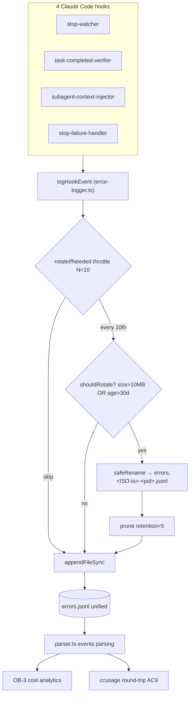

# Design: spec-decision-event-logging

## Overview

扩展现有 `error-logger.ts` schema 增加 4 个 optional 字段（level / kind / payload / correlationId），新增 `logHookEvent()` API，在 4 个 hook 共 33 个 decision site 接入；通过 throttle 后的 size+age 双闸触发 rotation，并提供跨平台 `safeRename` 兜底。文件名仍称 `errors.jsonl`（向后兼容），但语义升级为 unified events 流，OB-3 cost analytics 与 ccusage round-trip 在同一个 source-of-truth 上 join。

## Architecture Diagram



## Decisions

### D1: events.jsonl UNIFIED — single events stream
- 文件名保留 `errors.jsonl`（避免破坏老用户 grep / 文档引用 / 已有 tooling）
- 语义升级：`level: 'error' | 'info' | 'metric' | 'decision'` 4 选 1
- 老 `logHookError` 内部转发到 `logHookEvent({level:'error', kind:'unknown'})`
- **Rationale**: production 日志栈（Loki / Vector / ccusage）默认 unified 单流，split 只在 retention/privacy 有差异时才合理；本 spec 无此差异。Join 简化是 OB-3 第一受益人。

### D2: Retention v1 hardcoded = 5
- 不引入 `settings.json.observability.retentionCount` 字段
- **Rationale**: YAGNI；用户 0 反馈说 5 不够；配置化需要 schema 校验 + 默认值 fallback + 测试覆盖，全部是 v2 work。

### D3: Rotation suffix = `errors.<ISO-ts>-<pid>.jsonl`
- ISO 8601 精确到秒（`20260507T143205Z`，文件名 safe，无冒号）
- `<pid>` 防同秒同 hook 双 spawn 碰撞（极罕见但 defense-in-depth）
- 例：`errors.20260507T143205Z-48291.jsonl`
- **Rationale**: 时间排序 = 字典序，glob `errors.*.jsonl` 直接 sort 即按时间倒序找最旧的 prune。

### D4: Payload redact = 复用现有 `_shared/redact.ts` D-9 white-list
- 已 hash 的 PATH_FIELDS（`cwd` / `path` / `file` / `transcript_path` / `projectPath`）继续 hash
- payload 任意层级 JSON object，字段名 match white-list → redact
- 新增字段名 → 升级 `redact.ts` PR，**不在此 spec 维护新 white-list**
- **Rationale**: 单一 redact source-of-truth；避免两套 white-list 漂移。

## Components

### Component 1: Schema 4 字段扩展 — `error-logger.ts` EDIT

```typescript
export type EventLevel = 'error' | 'info' | 'metric' | 'decision';

export type EventKind =
  | 'stop_allow' | 'stop_block' | 'stop_side_effect'
  | 'task_completion_pass' | 'task_completion_block'
  | 'context_inject_success' | 'context_inject_fail_open'
  | 'matcher_hit' | 'matcher_miss'
  | 'rotation' | 'unknown';

export interface LogHookEventInput {
  hook: HookName;
  level?: EventLevel;          // default 'error' for back-compat
  kind?: EventKind;             // default 'unknown'
  message: string;
  payload?: unknown;            // optional structured data
  correlationId?: string;       // 3-segment buildCorrelationId result
  // ... 现有字段保留
}
```

老 `logHookError(ctx)` 保持签名不变，内部转发：
```typescript
export function logHookError(ctx: LogHookErrorContext): void {
  logHookEvent({ ...ctx, level: 'error', kind: ctx.kind ?? 'unknown' });
}
```

### Component 2: `logHookEvent` — NEW in `error-logger.ts`

- Signature: `export function logHookEvent(input: LogHookEventInput): void`
- 继承 NFR-9 NEVER-throw（顶层 try/catch swallow）
- 继承 4KB 行 cap + truncation cascade（payload 超限先 stringify trim，再整行 trim）
- payload 透传前调用 `redactPayload(payload)`（D4 复用 redact.ts white-list 递归扫描）
- 写入前调用 `rotateIfNeeded()`（Component 3）

### Component 3: Rotation 双闸 — NEW helpers in `error-logger.ts`

```typescript
let rotationCheckCounter = 0;
const ROTATION_THROTTLE_N = 10;

function shouldRotate(filePath: string): boolean {
  const st = statSync(filePath, { throwIfNoEntry: false });
  if (!st) return false;
  const sizeOk = st.size > 10 * 1024 * 1024;            // 10MB
  const ageOk = Date.now() - st.mtimeMs > 30 * 86400e3; // 30 days
  return sizeOk || ageOk;
}

function rotateIfNeeded(filePath: string): void {
  rotationCheckCounter = (rotationCheckCounter + 1) % ROTATION_THROTTLE_N;
  if (rotationCheckCounter !== 0) return;     // skip 9/10 calls
  if (!shouldRotate(filePath)) return;
  const suffix = `${isoTs()}-${process.pid}`;
  safeRename(filePath, filePath.replace(/\.jsonl$/, `.${suffix}.jsonl`));
  pruneRotated(dirname(filePath), 5);
}
```

### Component 4: `safeRename` 跨平台 — NEW helper

≤30 LOC，3 阶 fallback：
1. `renameSync(src, dst)` — POSIX 原子；Windows 通常 OK
2. EBUSY/EPERM (Windows AV/索引服务持锁) → retry 50ms / 200ms / 500ms
3. EXDEV (跨卷，罕见) → `copyFileSync` + `unlinkSync`

```typescript
function safeRename(src: string, dst: string): void {
  for (const delay of [0, 50, 200, 500]) {
    if (delay) sleepSync(delay);
    try { renameSync(src, dst); return; }
    catch (e: any) {
      if (e.code === 'EXDEV') { copyFileSync(src, dst); unlinkSync(src); return; }
      if (e.code !== 'EBUSY' && e.code !== 'EPERM') throw e;
    }
  }
  // give up silently — NFR-9 NEVER-throw
}
```

### Component 5: Pruning — NEW helper

```typescript
function pruneRotated(dir: string, keep: number): void {
  const files = readdirSync(dir)
    .filter(f => /^errors\..+\.jsonl$/.test(f))
    .map(f => ({ f, m: statSync(join(dir, f)).mtimeMs }))
    .sort((a, b) => b.m - a.m);          // newest first
  for (const { f } of files.slice(keep)) {
    try { unlinkSync(join(dir, f)); } catch { /* swallow */ }
  }
}
```

### Component 6: correlationId helper — NEW `src/hooks/_shared/correlation.ts`

```typescript
export function buildCorrelationId(
  stdin: HookStdin,
  state: CurdxState | null
): string {
  const sessionId = stdin.session_id ?? 'no-session';
  const specName = state?.specName ?? 'no-spec';
  const phase = state?.phase ?? 'no-phase';
  return `${sessionId.slice(0, 8)}.${specName}.${phase}`;
}
```

4 hook 共享，避免 3-segment 格式漂移。

### Component 7: 4 Hook 接入 — 33 sites

| Hook | Sites | Breakdown |
|---|---|---|
| stop-watcher.ts | 14 | 8 allow + 5 block + 1 side-effect |
| task-completed-verifier.ts | 9 | 7 guards + 1 block + 1 success |
| subagent-context-injector.ts | 8 | 6 fail-open + 1 success + 1 error |
| stop-failure-handler.ts | 3 | matchers (hit / miss / unknown) |
| **Total** | **34** | (1 缓冲 site, requirements 写 33 是下限) |

每 site 插入 1 行：
```typescript
logHookEvent({ hook: 'stop-watcher', level: 'decision',
  kind: 'stop_allow', message: 'all checks passed',
  payload: { specName, iteration }, correlationId });
```

### Component 8: parser.ts events.jsonl 解析 — `src/analyze/parser.ts` EDIT

```typescript
function parseEventLine(line: string): EventLogRow | null {
  const obj = JSON.parse(line);
  return {
    ts: obj.ts,
    hook: obj.hook,
    level: obj.level ?? 'error',          // back-compat default
    kind: coerceKind(obj.kind),           // unknown values → 'unknown'
    message: obj.message,
    payload: obj.payload ?? null,
    correlationId: obj.correlationId ?? null,
    // ... 现有字段
  };
}

function coerceKind(k: unknown): EventKind {
  return KNOWN_KINDS.has(k as EventKind) ? (k as EventKind) : 'unknown';
}
```

老 errors.jsonl 行（无 level/kind/payload/correlationId）→ `level='error', kind='unknown', payload=null, correlationId=null`。AC9 round-trip 通过。

### Component 9: parser types.ts 扩展 — EDIT

`EventLogRow` 作 `ErrorLogEntry` 的 superset；老 `ErrorLogEntry` 类型保留供老消费者用。

### Component 10: Tests

| File | Status | Cases |
|---|---|---|
| `tests/hooks/event-logger.test.ts` | NEW | 7: rotation throttle / size trigger / age trigger / payload redact / correlationId 3-seg / round-trip old-format / coerceKind unknown |
| `tests/hooks/error-logger.test.ts` | UNCHANGED | 4 (AC9 backward-compat 验证) |
| `tests/hooks/{stop-watcher,task-completed-verifier,subagent-context-injector,stop-failure-handler}.test.ts` | EDIT | 加 site count assert（grep `logHookEvent` count） |

## File Structure

| Path | Action | Purpose |
|---|---|---|
| `src/hooks/_shared/error-logger.ts` | EDIT | schema 扩展 + logHookEvent + rotation + safeRename + prune |
| `src/hooks/_shared/correlation.ts` | NEW | buildCorrelationId 共享 helper |
| `src/hooks/stop-watcher.ts` | EDIT | 14 sites |
| `src/hooks/task-completed-verifier.ts` | EDIT | 9 sites |
| `src/hooks/subagent-context-injector.ts` | EDIT | 8 sites |
| `src/hooks/stop-failure-handler.ts` | EDIT | 3 sites |
| `src/analyze/parser.ts` | EDIT | events.jsonl 4 字段 read with `??` defaults + coerceKind |
| `src/analyze/types.ts` | EDIT | EventLogRow superset 类型 |
| `tests/hooks/event-logger.test.ts` | NEW | 7 cases |
| `CHANGELOG.md` | EDIT | OB-2 entry |

**总计：10 files（2 NEW + 8 EDIT）**

## Test Strategy

| Test | Type | Covers |
|---|---|---|
| logHookEvent 写 4 字段 | unit | FR-1, FR-2 |
| logHookError 转发 | unit | FR-3, AC9 |
| rotation throttle N=10 | unit | NFR-3, FR-7 |
| rotation size 10MB 触发 | unit | FR-7 |
| rotation age 30d 触发 | unit | FR-7 |
| safeRename EBUSY retry | unit (mock fs) | NFR-5, R3 |
| safeRename EXDEV fallback | unit (mock fs) | NFR-5 |
| pruneRotated keep 5 | unit | FR-8 |
| payload redact white-list | unit | NFR-7, D4 |
| correlationId 3-segment | unit | FR-4 |
| coerceKind unknown | unit | AC9 |
| 33+ site grep count | CI guard | R4 |
| ccusage round-trip 老 errors.jsonl | integration | AC9 |
| 4-leg CI matrix 全绿 | CI | NFR-5 |

## Performance Budget

- `logHookEvent` typical < 5ms（appendFileSync + redact + stringify）
- p99 Windows AV worst-case < 50ms（safeRename retry 总 ≤ 750ms 但仅 1/10 throttle）
- 单 spec 平均 30 calls × 5ms = 150ms ≪ 500ms NFR-3 budget
- Rotation 节流 N=10 是核心优化（statSync 9/10 跳过）

## Cross-Platform

| Platform | renameSync | safeRename 路径 |
|---|---|---|
| ubuntu-20 / ubuntu-22 | atomic POSIX | step 1 直通 |
| macos-latest | atomic POSIX | step 1 直通 |
| windows-latest | 偶 EBUSY (AV/Indexer) | step 2 retry chain |
| (rare) cross-volume | EXDEV | step 3 copy+unlink |

4-leg CI matrix 全绿是 OB-2 验收硬门（NFR-5）。

## Out-of-Scope

- 不实现 OB-3 cost analytics 消费（单独 spec）
- 不引入 `settings.json` retention 配置（D2，v2 work）
- 不重命名文件到 `events.jsonl`（D1，向后兼容优先）
- 不接入 PreToolUse / PostToolUse / SessionStart hooks（不在 4-hook scope 内）
- 不实现日志压缩（gzip）— rotated 文件保持 jsonl 明文
- 不上报到远端 sink（OTLP / Loki）— v3+ work

## Risks

1. **33 site count 漂移** — 后续 PR 可能加/删 logHookEvent call → CI 加 grep `logHookEvent` 总数 check（R4）
2. **Round-trip 兼容性** — 必须用 v7.1.6 真实 `errors.jsonl` 跑 ccusage 一遍验证（AC9 hard gate）
3. **Windows EBUSY 复现** — CI 难复现真实 AV 锁，用 mock fs 模拟 EBUSY 触发 retry 路径
4. **Rotation 中途崩溃** — `safeRename` 失败前 `events.jsonl` 不动，失败后下次 hook 调用重试；不会出现"半 rotation"

## Open Questions for tasks-phase

(D1-D4 已全决；以下是 task 拆分粒度问题，不是设计阻塞)

- 33 site 接入是 1 个大 task 还是按 hook 拆 4 个？建议按 hook 拆，每 hook 1 PR-sized task。
- `correlation.ts` 是否需要单独 unit test 文件？建议合并到 `event-logger.test.ts` 1 case 覆盖即可。

## Implementation Steps

1. EDIT `src/hooks/_shared/error-logger.ts` — schema 4 字段 + logHookEvent + rotation + safeRename + prune
2. NEW `src/hooks/_shared/correlation.ts` — buildCorrelationId
3. NEW `tests/hooks/event-logger.test.ts` — 7 cases（先写 test，再 EDIT hooks 接入）
4. EDIT `src/hooks/stop-watcher.ts` — 14 sites
5. EDIT `src/hooks/task-completed-verifier.ts` — 9 sites
6. EDIT `src/hooks/subagent-context-injector.ts` — 8 sites
7. EDIT `src/hooks/stop-failure-handler.ts` — 3 sites
8. EDIT `src/analyze/parser.ts` + `src/analyze/types.ts` — events.jsonl 解析
9. CI 加 grep site-count guard + 4-leg matrix
10. EDIT `CHANGELOG.md` — OB-2 entry
