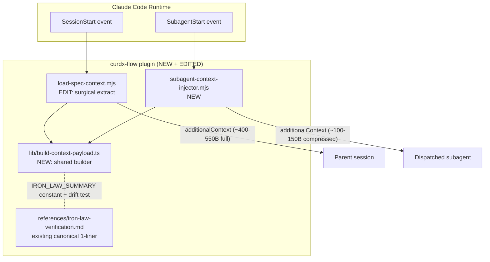

# Design: spec-subagent-context-reinjection

## Overview

新增 `SubagentStart` hook (`subagent-context-injector`) 在每次 `Task()` 派发时注入压缩 spec context (~100-150B) + iron-law 1-liner，填补 superpowers #237 (CLOSED wontfix) 留下的真空。新建共享 lib `build-context-payload.ts` 同时被既有 SessionStart hook 与新 SubagentStart hook 双向引用；`load-spec-context.ts` 走 surgical refactor，外部行为字节级零回归。

## Architecture Diagram



Data flow: stdin (universal fields + `agent_type`) → resolve `.current-spec` → load `.curdx-state.json` → call `buildContextPayload(state, dir, {forSubagent:true})` → emit `hookSpecificOutput.additionalContext` → exit 0. 任何错误链路 → 写 stderr trace + 输出 `{continue: true}` + exit 0。

## Decisions

### D1: Hardcoded `IRON_LAW_SUMMARY` constant + drift test

**Choice**: 在 `lib/build-context-payload.ts` 顶部声明 `export const IRON_LAW_SUMMARY = "No completion claim without fresh verification."`，配合 `tests/runner/subagent-context-doc.test.ts` 单测断言常量与 `references/iron-law-verification.md` lines 8-18 字节级一致。

**Rationale**: startup-fast (零 I/O on every fire — NFR-2 30ms 预算更宽裕)，drift 风险由 CI 闸门拦截 (test grep → assert byte-equal)。runtime read 方案在 hot path 加 readFileSync 不值得换"drift 自动同步"。

**Alternatives rejected**: runtime read reference doc each fire (added ~5ms I/O for zero correctness benefit since drift test already enforces); env var injection (over-engineered).

### D2: Universal injection (no `agent_type` filter v1)

**Choice**: 所有 subagent type (general-purpose / Explore / 自定义 subagent) 都注入相同 payload。不在 v1 添加 `agent_type` allowlist/denylist。

**Rationale**: 100-150B payload overhead per subagent 在 NFR-1 2KB 预算内可忽略；50+ dispatch session 累计 ~1.5s overhead (NFR-2) 已研究确认 acceptable；filter 引入 config surface area + 测试矩阵 vs 零证据收益。如果未来 perf data 出问题，filter 可纯加性引入而无 breaking change。

**Alternatives rejected**: agent_type allowlist (premature optimization, no perf signal); skip injection for spec-executor (parent already has context, but subagent reset losses iron-law — 必须保留).

### D3: Structured key:value text block in `additionalContext`

**Choice**: `hookSpecificOutput.additionalContext` 是单一字符串 (Claude Code API 规约)，内容用 `<curdx-spec-context>` 包裹的 key:value 行：

```
<curdx-spec-context>
phase: execution
spec: ./specs/spec-name
iron-law: No completion claim without fresh verification.
</curdx-spec-context>
```

**Rationale**: subagent 收到时 Claude Code 将其包成 `<system-reminder>` 块；在外层已有 framing 时再嵌套 JSON 反而冗余且不易被 LLM 解析；key:value 行 LLM-friendly + human-readable + parser-friendly (后续若需 mech check)；payload size ~120B 落入目标区间。

**Alternatives rejected**: pretty-printed JSON object (~+30B 冗余, 嵌套 system-reminder 中可读性差); prose paragraph (LLM 解析不稳定, 缺乏字段语义); compact JSON (`{"phase":"execution",...}` — 比 key:value 仅省 ~10B 但失去可读性).

### D4: Surgical refactor of `load-spec-context.ts`

**Choice**: 仅抽取 inline payload-construction 段为 `buildContextPayload(state, dir)` (default `forSubagent: false`)；保留 `loadSpecContextHandler` / `readEnabledSetting` / `readGoalFromProgress` 三函数签名 + handler 控制流 + stderr emission 完全不变。Byte-equal baseline (frozen v6.0.6 SessionStart fixtures) 必须仍 green。

**Rationale**: refactor 风险面 = 改动行数 × 接触函数数。surgical 路径只动 1 段连续代码 → 1 个 lib import → diff < 50 行；handler 逻辑 / stderr banner / settings.json 读取 / .progress.md 解析全部不动 → 零外部行为变化 → byte-equal 自然守住。

**Alternatives rejected**: full handler-into-lib migration (R1 风险 high, byte-equal 易破); leave duplicated payload-build code (违反 FR-2 + AC-4.2 DRY).

## Components

### Component 1: `src/hooks/lib/build-context-payload.ts` (NEW)

**Purpose**: SessionStart 与 SubagentStart 共享的 payload builder。

**Exports**:
```typescript
export const IRON_LAW_SUMMARY = "No completion claim without fresh verification.";

export interface BuildContextPayloadOpts {
  forSubagent?: boolean;   // default false → SessionStart full shape
  maxBytes?: number;       // default 2048
}

export function buildContextPayload(
  state: CurdxState,
  specDir: string,
  opts?: BuildContextPayloadOpts
): string;
```

**Behavior**:
- `forSubagent === false` (default): 返回当前 SessionStart payload (specName, phase, taskIndex, totalTasks, goal, awaitingApproval) — byte-equal 现状
- `forSubagent === true`: 返回 `<curdx-spec-context>...</curdx-spec-context>` 块 (phase + spec + iron-law)
- 输出 byte length > `maxBytes` → throw `PayloadOverBudgetError` (handler 捕获 → fail-open)
- 内部纯函数, 不读 fs (state 与 specDir 由 caller 注入)

### Component 2: `src/hooks/subagent-context-injector.ts` (NEW)

**Purpose**: SubagentStart hook handler entry。

**Flow**:
1. `readStdinJson()` → 解析 5 字段 (`session_id`, `transcript_path`, `cwd`, `hook_event_name`, `agent_type`)
2. `resolveActiveSpec(cwd)` → 读 `./specs/.current-spec` (缺失 → fail-open exit 0)
3. `readStateFile(specDir)` → 读 `.curdx-state.json` (缺失/损坏 → fail-open exit 0 + stderr trace)
4. `state.completed === true` → fail-open exit 0 (no injection — open question 5 决议)
5. `buildContextPayload(state, specDir, { forSubagent: true })` → string
6. emit `{ hookSpecificOutput: { hookEventName: "SubagentStart", additionalContext: "<text>" }, continue: true }` → exit 0
7. Any throw above → catch → stderr trace + emit `{ continue: true }` + exit 0

**Reuses**: `lib/state.ts` (state IO), `lib/spec-resolver.ts` (active spec), `lib/stdin.ts` (stdin parse) — 全部既有。

### Component 3: `src/hooks/load-spec-context.ts` (EDIT — surgical)

**Edit scope**: 仅替换 inline payload-build 段为 `buildContextPayload(state, dir)` 调用。

**Preserve verbatim**: `readEnabledSetting()` / `readGoalFromProgress()` / `loadSpecContextHandler()` 三函数签名 + handler 控制流 + stderr banner 文案 + settings.json opt-out 分支 + .progress.md 错误处理 + JSON.stringify 序列化形态。

**Validation**: byte-equal baseline diff = 0 bytes vs v6.0.6 SessionStart fixtures。

### Component 4: `plugins/curdx-flow/hooks/hooks.json` (EDIT)

新增 `SubagentStart` 顶层条目，shape 与既有 `SessionStart` 一致：

```json
"SubagentStart": [
  {
    "hooks": [
      {
        "type": "command",
        "command": "node \"${CLAUDE_PLUGIN_ROOT}/hooks/scripts/subagent-context-injector.mjs\""
      }
    ]
  }
]
```

无 matcher (events with no matcher fire on all dispatches).

### Component 5: `scripts/build-hooks.mjs` (EDIT)

`HOOK_ENTRIES` 数组追加 `'src/hooks/subagent-context-injector.ts'`。esbuild 配置 (ESM target, `outbase`, zero-runtime-deps) 已支持 — 仅加 1 entry。`npm run build:hooks` 产出 `plugins/curdx-flow/hooks/scripts/subagent-context-injector.mjs`。

### Component 6: Tests

| Test file | Action | LOC est | Coverage |
|---|---|---|---|
| `tests/hooks/subagent-context-injector.test.ts` | NEW | ~110 | 7 cases (a)-(g) — FR-13 |
| `tests/runner/subagent-context-doc.test.ts` | NEW | ~25 | iron-law drift assertion — FR-5 |
| `tests/hooks/byte-equal.test.ts` | EDIT | +~15 | SessionStart baseline preserved + new SubagentStart baseline added — AC-9.1, AC-9.2 |

Drift test 实现:
```typescript
import { IRON_LAW_SUMMARY } from "../../src/hooks/lib/build-context-payload";
const ref = readFileSync("plugins/curdx-flow/references/iron-law-verification.md", "utf8");
expect(ref).toContain(IRON_LAW_SUMMARY);
```

### Component 7: `CHANGELOG.md` (EDIT)

v7.1.7 段落 `Added` 子节追加：
> - `SubagentStart` hook injects compressed spec context + iron-law summary into every dispatched subagent (spec-subagent-context-reinjection; closes superpowers#237 with local fix)

## File Structure

| Path | Action | Purpose |
|---|---|---|
| `src/hooks/lib/build-context-payload.ts` | NEW | Shared payload builder + IRON_LAW_SUMMARY constant |
| `src/hooks/subagent-context-injector.ts` | NEW | SubagentStart hook handler entry |
| `src/hooks/load-spec-context.ts` | EDIT | Surgical: replace inline payload build with lib call |
| `plugins/curdx-flow/hooks/hooks.json` | EDIT | Register SubagentStart event |
| `scripts/build-hooks.mjs` | EDIT | Add HOOK_ENTRIES entry for new hook source |
| `tests/hooks/subagent-context-injector.test.ts` | NEW | 7 unit cases (a)-(g) |
| `tests/runner/subagent-context-doc.test.ts` | NEW | Iron-law drift gate |
| `tests/hooks/byte-equal.test.ts` | EDIT | Extend baseline coverage |
| `CHANGELOG.md` | EDIT | v7.1.7 Added entry |

**Total: 9 files (4 NEW + 5 EDIT).**

## Test Strategy

| Test | Type | Asserts | Trace |
|---|---|---|---|
| (a) happy path | unit | `additionalContext` text contains `phase:` + `spec:` + `iron-law:` | FR-1, AC-1.1/1.2 |
| (b) state absent | unit | `{continue:true}`, exit 0 | FR-9, AC-6.1 |
| (c) state malformed | unit | exit 0 + stderr trace | FR-10, AC-6.2 |
| (d) payload size | unit | `JSON.stringify(r.json).length ≤ 2048` AND ≤ 200B | NFR-1, AC-2.1/2.2 |
| (e) iron-law verbatim | unit | matches `IRON_LAW_SUMMARY` constant | FR-5, AC-3.1 |
| (f) completed spec | unit | `{continue:true}` no injection | FR-11 |
| (g) quick-mode | unit | injection still present | FR-12 |
| drift test | unit | `IRON_LAW_SUMMARY` substring of reference doc | FR-5, AC-3.2/3.3 |
| byte-equal SessionStart | regression | baseline diff = 0 bytes | NFR-3, AC-5.1 |
| byte-equal SubagentStart | regression | new baseline frozen | AC-9.1 |
| `npm run typecheck` | gate | TS strict on lib + hook source | NFR-6 |
| `npm run check:hooks-fresh` | gate | bundle vs source freshness | FR-8 |
| `npm run test:hooks` | aggregate | all hook tests green | AC-8.2 |

## Performance Budget

- Hook fire wall-clock < 30ms (NFR-2) — file I/O dominated, in-memory build ~sub-ms
- Subagent payload size: hard ≤ 2048 bytes (NFR-1) / target 100-150 bytes
- Cumulative overhead per 50-dispatch session: ~1.5s (research §cost-latency)

## Cross-Platform Considerations

- 复用既有 `createFixtureSpec()` + `runHook()` test infra (NFR-4 — research E2 confirmed cross-platform-clean)
- 路径处理走 `path.join` / `path.resolve` (既有 lib helpers)，无 backslash/eol 分支
- esbuild `outbase` 已 flatten — Windows nested path 无问题
- 不引入新 fs 模式

## Out of Scope

(per requirements)

- `agent_type` 过滤 (D2 决议 v1 不做)
- per-subagent customized payload shape (单一 shape)
- 替换 system-reminder → system-prompt (issue #23885 wontfix upstream)
- 老版 Claude Code (无 SubagentStart event) — 仅 runtime warn
- SessionStart payload shape 变更 (refactor 仅 extract)
- 嵌入完整 goal / .progress.md log (NFR-1 预算排除)

## Risks

| ID | Risk | Likelihood | Impact | Mitigation |
|---|---|---|---|---|
| R1 | SessionStart byte-equal regression from surgical refactor | Low | High | Byte-equal CI gate + diff < 50 行 + handler 不动 |
| R2 | Iron-law string drift between lib constant and reference doc | Medium | Medium | Drift test asserts substring at CI time |
| R3 | High-volume Team API session cumulative overhead | Low | Medium | NFR-2 budget per fire; smoke test on 50+ dispatch session |

## Open Questions for tasks-phase

(none — D1-D4 settled; open question 5 from requirements settled by D2-adjacent rationale: completed spec → fail-open `{continue: true}` no injection, since subagent 在 completed spec 下被派发本身已是 coordinator-side bug 由别处治理，不在此 hook scope)

## Implementation Steps

1. Create `src/hooks/lib/build-context-payload.ts` with `IRON_LAW_SUMMARY` constant + `buildContextPayload(state, specDir, opts)` (forSubagent branch + default branch)
2. Create `src/hooks/subagent-context-injector.ts` handler (stdin → state → lib → emit `additionalContext` → fail-open everywhere)
3. Surgical-refactor `src/hooks/load-spec-context.ts` to import from new lib (preserve byte-equal)
4. Edit `scripts/build-hooks.mjs` HOOK_ENTRIES; run `npm run build:hooks`
5. Edit `plugins/curdx-flow/hooks/hooks.json` to register SubagentStart event
6. Create `tests/hooks/subagent-context-injector.test.ts` (cases a-g)
7. Create `tests/runner/subagent-context-doc.test.ts` (iron-law drift gate)
8. Extend `tests/hooks/byte-equal.test.ts` with new SubagentStart baseline (preserve SessionStart baseline)
9. Run `npm run typecheck && npm run check:hooks-fresh && npm run test:hooks && npm run verify`
10. Append v7.1.7 `Added` entry to `CHANGELOG.md`
