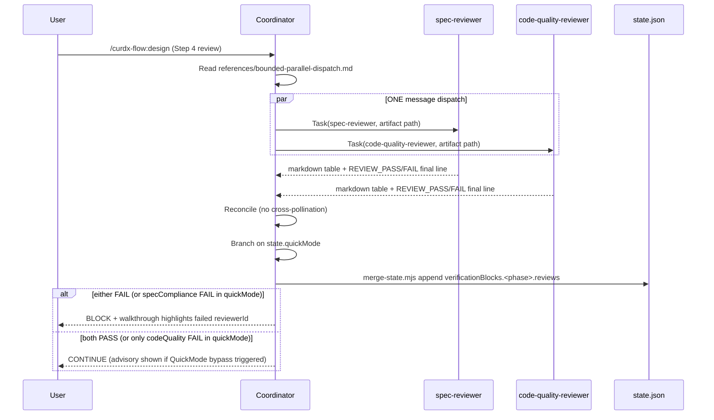

# Design: spec-two-stage-review

## Overview

在 design / tasks 两个 phase 边界并行 dispatch `spec-reviewer`（收窄到 spec-compliance only）+ 新建 `code-quality-reviewer`，coordinator 单源 reconcile 双 verdict 写入 `verificationBlocks.<phase>.reviews` keyed object（SLSA-shape）。3-layer drift defense 保证零域重叠；`REVIEW_PASS` / `REVIEW_FAIL` final-line 协议字节级保留向后兼容；QuickMode 下 code-quality 降级 advisory，spec-compliance 仍 hard gate。

## Architecture Diagram

```mermaid
graph TD
  Cmd[commands/design.md or tasks.md] -->|Step 4: Artifact Review| Coord[Coordinator]
  Coord -->|read state.quickMode| QM{quickMode?}
  Coord -->|Task ONE message x2| SR[spec-reviewer subagent<br/>compliance only]
  Coord -->|Task ONE message x2| CQ[code-quality-reviewer subagent<br/>NEW, isolated context]
  SR -->|REVIEW_PASS or FAIL + findings| Reconcile[Reconcile / no cross-pollination]
  CQ -->|REVIEW_PASS or FAIL + findings| Reconcile
  Reconcile -->|merge-state.mjs atomic| VB[(verificationBlocks.&lt;phase&gt;.reviews<br/>= {specCompliance, codeQuality})]
  QM -->|true: code-quality FAIL = advisory| Reconcile
  QM -->|false: either FAIL = block| Reconcile
  VB -->|verdict| Walk[Walkthrough output<br/>shows both reviewerIds]
  classDef new fill:#e1f5ff,stroke:#0288d1
  class CQ,VB new
```

## Dispatch Sequence



## Decisions

### D1: code-quality-reviewer prompt — ADAPTED from spec-reviewer [QUALITY] items

| Option | Pros | Cons |
|---|---|---|
| Fresh write | 无历史包袱；纯净域 | 失去 battle-tested 措辞；测试 parity 重做 |
| **Adapted (chosen)** | 复用 17 [QUALITY] + 13 straddling 已验证文案；零字段 drift；NFR-5 mapping 直通 | 必须严格执行 E1 cut/move map，否则有残留泄漏 |

**Rationale**: deduplication；spec-reviewer [QUALITY] 段已经过线上 review，搬过来再叠 3-layer drift defense scaffolding（独立 judge / isolated context / 排除 list）即可。

**Tradeoff**: 收紧 PR review — 必须 grep 验证 spec-reviewer 残留 0 quality 关键字（FR-N5 reverse-grep CI gate 兜底）。

### D2: Drift defense JSON schema — ADVISORY in v1

| Option | Pros | Cons |
|---|---|---|
| Hard gate | 强制结构化；自动丢弃 off-domain | 假阳性会 block loop；schema 调参成本高 |
| **Advisory (chosen)** | 仍 surface 越界；human verify；零 false-block 风险 | 越界 finding 会进入 walkthrough，需人脑过滤 |

**Rationale**: research 已倾向 advisory；hard gate 风险 > 收益（越界数据点稀疏，假阳性代价高）。schema 验证仍跑，mismatch 写为 `advisory: true` 标签。

**Tradeoff**: 接受 v1 仍可能有越界 finding 滴漏；v2 看积累数据再决定升级 hard gate。

### D3: Verdict storage — KEYED OBJECT under `verificationBlocks.<phase>.reviews`

| Option | Pros | Cons |
|---|---|---|
| Top-level `reviews` field | 与 verification 解耦 | 顶层 schema bloat；语义重复 |
| Array `[{reviewerId, ...}]` | 可扩展任意 reviewer | 失去语义 key；查找需遍历 |
| **Keyed object (chosen)** | `{specCompliance, codeQuality}` O(1) 查找；与 phase 同源；SLSA 形保留 | reviewerId 数量固定（v2 加新 reviewer 仍能扩 key） |

**Shape**:
```ts
verificationBlocks.<phase>.reviews = {
  specCompliance?: ReviewVerdict;
  codeQuality?: ReviewVerdict;
}
type ReviewVerdict = {
  verdict: "PASS" | "FAIL" | "advisory";
  findings: string[];
  reviewerId: "spec-compliance" | "code-quality";
  timestamp: string;  // ISO8601
}
```

**Rationale**: phase-boundary 语义（reviews 跟随 phase）；keyed 形避免 array linear scan；spec A `verificationBlocks` 已是 keyed map → 子结构同构。

### D4: Narrowed spec-reviewer phases — KEEP all 5 phases

| Option | Pros | Cons |
|---|---|---|
| Only design / tasks | 与 two-stage 实际作用面一致 | 破坏 5-file 命令面；research/requirements 失去合规审查 |
| **Keep all 5 (chosen)** | 现有 5-file 命令面零破坏；spec-compliance 在每个 phase 都仍有价值 | research/requirements/execution 仍单 reviewer，不并行 dispatch |

**Rationale**: spec-compliance 维度对 research / requirements / execution 内容都仍适用（trace / format / coverage）；code-quality 只在 design / tasks 才有意义（这两阶段才接触结构化伪代码或任务）。

**Behavior matrix**:

| Phase | spec-reviewer | code-quality-reviewer | Dispatch |
|---|---|---|---|
| research | ✅ | ❌ | single |
| requirements | ✅ | ❌ | single |
| **design** | ✅ | ✅ | **parallel two-stage** |
| **tasks** | ✅ | ✅ | **parallel two-stage** |
| execution | ✅ | ❌ (deferred v2) | single |

### D5: QuickMode bypass — COORDINATOR BRANCH reading `state.quickMode`

| Option | Pros | Cons |
|---|---|---|
| Env var | 用户 shell 污染 | 不持久；hooks 难获取 |
| New state field | 显式 | 重复 — `state.quickMode` 已存在（spec A） |
| **Coordinator branch (chosen)** | 零新 state；逻辑集中；和 quickMode 现有分支同源 | 分支逻辑分散在 2 个 commands（design.md / tasks.md），需保持同步 |

**Branch logic**（pseudocode in command.md）:
```
after parallel dispatch:
  read verificationBlocks.<phase>.reviews
  if state.quickMode === true:
    if reviews.specCompliance.verdict === "FAIL" → BLOCK (hard gate retained)
    if reviews.codeQuality.verdict === "FAIL" → mark advisory:true, CONTINUE
  else (normal mode):
    if either verdict === "FAIL" → BLOCK
```

**Rationale**: `state.quickMode` 已存在；coordinator branch 把策略集中在 2 个 command 文件，避免 reviewer prompt 知道 mode（保持 reviewer 纯函数）。

## Components

### Component 1: spec-reviewer narrowing — `agents/spec-reviewer.md` (EDIT)

按 E1 audit 13-item map 执行：

- **Cut**: Design / Principles 整段 7 items（SOLID/DRY/KISS/YAGNI etc.）
- **Split**: Design / Holistic-Awareness 5→2-3 keep（保留 cross-cutting impact，移走 architectural thinking）
- **Split**: Tasks / Quality-Gates 2→1 keep（保留 tasks-exist，移走 frequency-optimal）
- **Move**: Execution / No-Hallucinations 6 items 全部 → code-quality-reviewer
- **Preserve**: REVIEW_PASS / REVIEW_FAIL final-line 协议字节相等（FR-X3）

### Component 2: code-quality-reviewer (NEW) — `agents/code-quality-reviewer.md`

Front-matter:
```yaml
---
name: code-quality-reviewer
description: Independent code-quality reviewer. Invoked at design/tasks phase boundaries in parallel with spec-reviewer.
model: sonnet
color: orange
---
```

Body sections:

1. **Role boundary** — 引用 `references/two-stage-review.md` 域边界
2. **Exclusion list (Layer 3 drift defense)** — `do NOT comment on`：
   - traceability to requirements
   - phase artifact structure
   - requirement coverage
   - artifact format / front-matter
3. **Rubrics (~30 items)**：
   - 17 [QUALITY] items adapted from spec-reviewer
   - 13 straddling items moved per E1 audit
   - Categories: code smell / 安全 / 实现质量 / 可读性 / test quality
4. **Output protocol** — markdown table + final line `REVIEW_PASS` / `REVIEW_FAIL`（FR-A4 byte-equal with spec-reviewer）

3-layer defense embedding:
- Layer 1 (independent judge): coordinator 用 Task subagent_type=`code-quality-reviewer` 起新 thread（不在 coordinator 内 inline）
- Layer 2 (isolated context): prompt 不收 spec-reviewer output / 摘要
- Layer 3 (exclusion list): 上面 #2 显式 ≥4 项

### Component 3: Coordinator parallel dispatch (EDIT) — `commands/design.md` + `commands/tasks.md`

`Step 4: Artifact Review` 段改为：

```
1. Read references/bounded-parallel-dispatch.md (independence + ONE message rule)
2. In ONE message dispatch BOTH:
   - Task(subagent_type: spec-reviewer, prompt: <artifact path + read-only artifact>)
   - Task(subagent_type: code-quality-reviewer, prompt: <artifact path + read-only artifact>)
3. Wait for both verdicts
4. Reconcile (do NOT pass A's output to B)
5. merge-state.mjs append verificationBlocks.<phase>.reviews
6. QuickMode branch (D5)
```

`commands/research.md` / `requirements.md` / `start.md`: **unchanged** (single spec-reviewer per D4).
Execution phase (`commands/implement.md`): unchanged (deferred v2).

### Component 4: Verdict storage (EDIT) — `src/hooks/_shared/types.ts` + `plugins/curdx-flow/schemas/spec.schema.json`

TS interface extension（additive only）:
```ts
interface VerificationBlock {
  command: string;
  exitCode: number;
  timestamp: string;
  srcMtime: string;
  reviews?: {
    specCompliance?: ReviewVerdict;
    codeQuality?: ReviewVerdict;
  };
}
interface ReviewVerdict {
  verdict: "PASS" | "FAIL" | "advisory";
  findings: string[];
  reviewerId: "spec-compliance" | "code-quality";
  timestamp: string;
  advisory?: boolean;  // true when QuickMode bypass downgraded
}
```

JSON schema 同步加 `reviews` sub-schema（optional，向后兼容）。

写入路径：`merge-state.mjs` 原子合并（FR-T3，不裸写）。

### Component 5: QuickMode coordinator branch — embedded in commands/design.md + tasks.md

见 D5 pseudocode；advisory verdict 在 walkthrough 顶部高亮 `[ADVISORY]` 标签（AC-9.2）。

### Component 6: two-stage-review reference doc (NEW) — `plugins/curdx-flow/references/two-stage-review.md`

内容大纲：

1. 域边界表（spec-compliance vs code-quality）
2. anti-rationalization 规则（reviewer 不得为对方 finding 找借口）
3. SLSA-shape verdict 字段说明
4. 3-layer drift defense 实现细节
5. exclusion list 的最小关键字集

被 link 来源（AC-12.4）：
- `agents/spec-reviewer.md`
- `agents/code-quality-reviewer.md`
- `commands/design.md`
- `commands/tasks.md`

### Component 7: drift detection test (NEW) — `tests/runner/two-stage-review.test.ts`

断言：

- `spec-reviewer.md` grep 不命中 `"code quality" | "smell" | "security" | "readability"` 4 关键字（FR-N5）
- `code-quality-reviewer.md` 存在 + 含 ≥4 项 exclusion 关键字（AC-10.2）
- `commands/design.md` + `commands/tasks.md` 含 `references/bounded-parallel-dispatch.md` link + 双 Task 调用模式（FR-D1/D2）
- `REVIEW_PASS` / `REVIEW_FAIL` byte-equal（FR-X3）

## File Structure (NEW vs EDIT)

| Path | Action | Purpose |
|---|---|---|
| `plugins/curdx-flow/agents/spec-reviewer.md` | EDIT | 收窄到 compliance（删 7 + 拆 7 + 移 6 = 13 items 减项） |
| `plugins/curdx-flow/agents/code-quality-reviewer.md` | NEW | 独立 reviewer + 3-layer drift defense |
| `plugins/curdx-flow/commands/design.md` | EDIT | parallel dispatch + QuickMode branch |
| `plugins/curdx-flow/commands/tasks.md` | EDIT | 同 design.md |
| `plugins/curdx-flow/references/two-stage-review.md` | NEW | 域边界 / anti-rationalization / SLSA shape |
| `src/hooks/_shared/types.ts` | EDIT | `VerificationBlock.reviews` field + `ReviewVerdict` type |
| `plugins/curdx-flow/schemas/spec.schema.json` | EDIT | reviews sub-schema |
| `tests/runner/two-stage-review.test.ts` | NEW | drift + protocol + dispatch wiring tests |
| `CHANGELOG.md` | EDIT | Added/Changed entry，标注向后兼容 |

**总计 9 files**: 4 NEW + 5 EDIT

## Test Strategy

| Test | File | What it asserts | Traces to NFR/FR |
|---|---|---|---|
| spec-reviewer narrowed | `tests/runner/two-stage-review.test.ts` | 4 关键字 grep miss + items 数减少 | FR-N5, NFR-7 |
| code-quality-reviewer exists | same | 文件存在 + 3-layer 段全在 | FR-A1/A2/A3, NFR-7 |
| Parallel dispatch wired | same | 2 commands link bounded-parallel-dispatch + 双 Task | FR-D1/D2/D3 |
| REVIEW_PASS/FAIL byte-equal | same | final-line 字节级（trailing newline + 大小写） | NFR-1, FR-X3, AC-8.1/8.2 |
| Verdict schema | extend `tests/runner/buildFreshness.test.ts` | reviews field optional + backwards-compat | FR-T1, FR-T2 |
| QuickMode bypass | extend `tests/hooks/quick-mode-guard.test.ts` | code-quality FAIL → advisory + continue；spec-compliance FAIL → block | FR-M1, FR-M2 |
| drift fixture | `tests/runner/two-stage-review.test.ts` | mock cross-domain finding 被丢弃或自标 | FR-X2, AC-6.4 |

## Performance Budget

- Parallel dispatch ≤ 1.3× single-reviewer wall-clock（NFR-6；ONE message dispatch + Task 并发）
- Per-phase-boundary（非 per-task）→ 5× cost vs no-review baseline，per Q3 verdict 可接受
- 不引入额外 LLM call beyond 2 reviewer calls per design/tasks phase

## Cross-Platform Considerations

- 所有改动均为 .md / .ts / .json 文本编辑；agent .md 由 Claude Code 跨平台解析，无 OS 分支
- 测试 fixture 必须用 `os.tmpdir()` 写临时 state（NFR-4 CI matrix 全绿）
- `merge-state.mjs` 原子合并已跨平台（spec A 已验证）

## Existing Patterns to Follow

- `bounded-parallel-dispatch.md` ONE-message dispatch 模式（spec C 已 ship）
- `verificationBlocks` keyed-by-phase 结构（spec A 已 ship；本 spec 仅加 sub-key）
- `merge-state.mjs` 原子合并 API（无新 helper）
- `state.quickMode` 字段（spec A 已存在）
- `REVIEW_PASS` / `REVIEW_FAIL` final-line 协议（spec-reviewer 已有）

## Out-of-Scope (carried)

- Per-task review（v2 opt-in）
- Pre-commit / execution phase 双审查（v2，HIGH difficulty per E2）
- JSON schema validation 作为 hard gate（v1 advisory，per D2）
- 重新评估已纳入 narrowed spec-reviewer 的 compliance items（信任 E1 audit）
- post-research / post-requirements 双审查
- 新增 skill
- 改 `.curdx-state.json` schema 顶层结构

## Risks

| # | Risk | Mitigation |
|---|---|---|
| 1 | code-quality-reviewer 角色漂移到 compliance 域 | 3-layer defense + drift test 断言 exclusion list ≥4 项关键字 |
| 2 | REVIEW_PASS/FAIL byte-equal 回退（markdown linter 改 trailing newline） | drift test byte-equal 断言 + .editorconfig 锁 |
| 3 | QuickMode 错误降级 spec-compliance 也变 advisory | FR-M2 fixture 测试显式断言 spec-compliance FAIL 仍 block |
| 4 | TS interface ↔ JSON schema drift | 同 commit 双改 + drift test grep 字段名 |
| 5 | 串行实现导致总耗时翻倍（违反 NFR-6） | command.md 显式写 ONE message + dispatch；test 检测 |
| 6 | `verificationBlocks.reviews` peer field 与 spec A schema 冲突 | additive only + merge-state.mjs 原子写（test fixture 验证 backwards-compat） |

## Unresolved Questions for tasks-phase

- 测试拆分：单一 `two-stage-review.test.ts` 还是按断言面拆 2-3 个文件？（倾向单一，便于检索）
- exclusion list 关键字是硬编码 4 个还是允许 ≥4？（倾向 ≥4 keyword 数量门槛，覆盖 traceability / phase structure / requirement coverage / artifact format）
- code-quality-reviewer 是否在 `references/two-stage-review.md` 定义 rubric mother file？（避免 prompt 文案漂移）

## Implementation Steps

1. EDIT `agents/spec-reviewer.md` — 按 E1 13-item map 删 / 拆 / 移；保留 REVIEW_PASS/FAIL final-line
2. NEW `references/two-stage-review.md` — 写域边界表 + anti-rationalization + SLSA shape + 3-layer 说明
3. NEW `agents/code-quality-reviewer.md` — front-matter + exclusion list + 30 rubric items + 输出协议；link reference doc
4. EDIT `src/hooks/_shared/types.ts` — `VerificationBlock.reviews` + `ReviewVerdict` 类型
5. EDIT `plugins/curdx-flow/schemas/spec.schema.json` — reviews sub-schema
6. EDIT `commands/design.md` — Step 4 改为 parallel dispatch + QuickMode branch；link bounded-parallel-dispatch
7. EDIT `commands/tasks.md` — 同 6
8. NEW `tests/runner/two-stage-review.test.ts` — 4 类断言（narrow / exists / dispatch / byte-equal）+ drift fixture
9. EXTEND `tests/runner/buildFreshness.test.ts` + `tests/hooks/quick-mode-guard.test.ts` — verdict schema + QuickMode bypass
10. Run `npm run verify` — typecheck + test:hooks + check:hooks-fresh 三关全绿
11. EDIT `CHANGELOG.md` — Added/Changed 条目 + "backwards compatible — REVIEW_PASS/FAIL protocol unchanged"
12. Walkthrough manual check — 跑一次 design + tasks phase 肉眼确认双 verdict 都呈现
