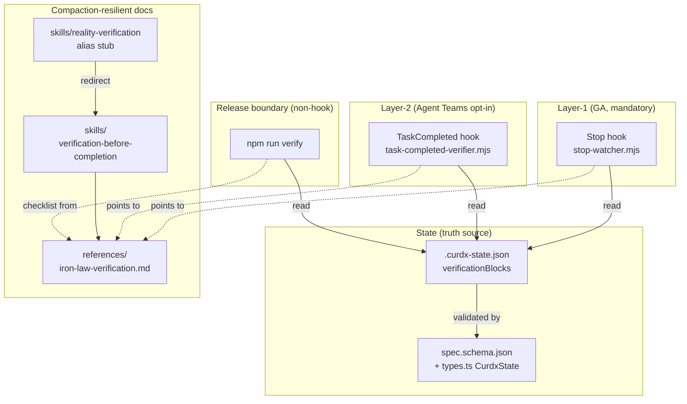
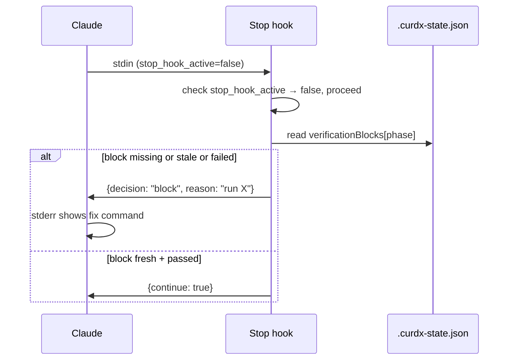
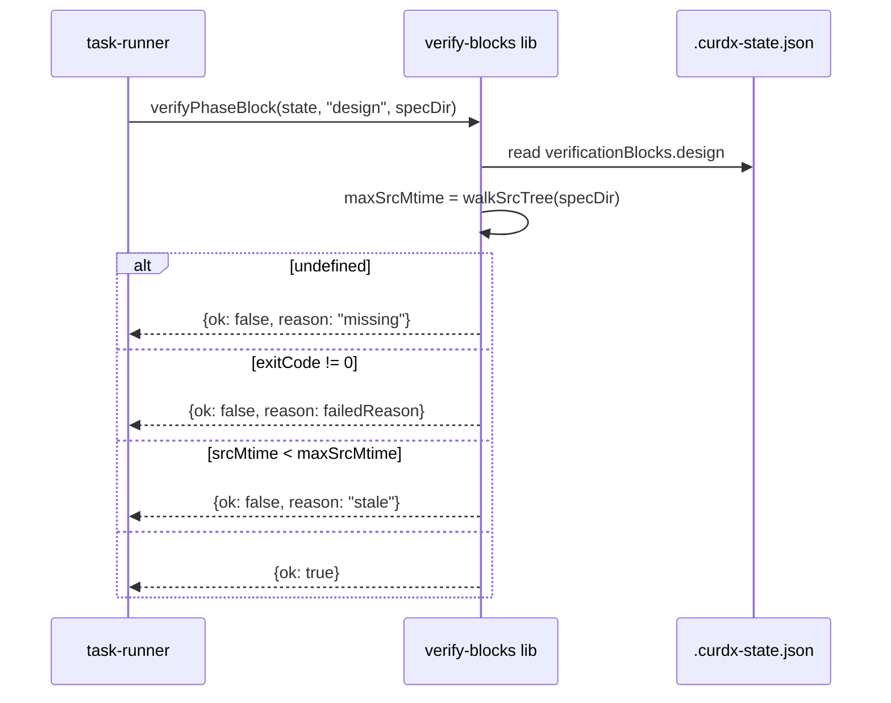
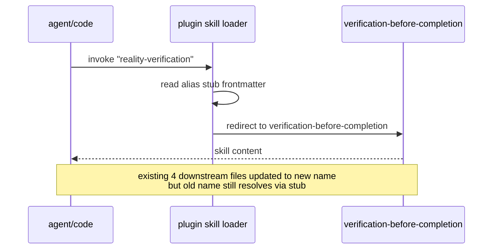

# Design: spec-verification-iron-law

## Overview

构建"未经验证不得声称完成"的双层铁律：Layer-1 = `Stop` hook（GA、强制、所有用户经过）作为主闸；Layer-2 = `TaskCompleted` hook（Agent Teams opt-in）作为加固层。铁律以三处冗余落地——hook 代码 + `.curdx-state.json::verificationBlocks` + `references/iron-law-verification.md`——抗 LLM compaction；release 边界由 `npm run verify` 复用同一 verificationBlocks 字段。

## Architecture Diagram



## Decisions

### D1: TaskCompleted v1 inclusion

**Decision**: INCLUDE Layer-2 in v1 as opt-in.
**Rationale**: Source ships and bundles regardless of env var; runtime detection is one-line (`process.env.CLAUDE_CODE_EXPERIMENTAL_AGENT_TEAMS === "1"` plus presence of `task_id` in stdin). Cost to non-Agent-Teams users = zero (event never fires). Cost to maintainers = one extra ~200-LOC hook + 5 tests. Value: registers discipline in code, not just docs; Agent Teams users get real protection day one.
**Tradeoff accepted**: Slightly larger plugin surface; one more bundle to keep fresh in `check:hooks-fresh`. Mitigated by reusing the same `verificationBlocks` reader as Layer-1 (shared lib in `src/hooks/lib/verify-blocks.ts`).
**Detection of "Agent Teams enabled"**: TaskCompleted hook runs only when Claude Code dispatches the event. If the user has not enabled Agent Teams, the event is never dispatched and the hook is unreachable. Inside the hook we additionally guard with `if (!input.task_id || input.hook_event_name !== "TaskCompleted") return passThrough();` for malformed payloads.

### D2: verificationBlocks data structure

**Decision**: **Object map keyed by phase** (`research|requirements|design|tasks|execution`). Value is a single VerificationBlock record. NOT array.
**Rationale**: Phase is the natural primary key; requirements explicitly map blocks to phase boundaries (FR-2, AC-1.x); stale-detection is O(1) per phase; merge-state.ts `$unset` semantics already work field-by-field on objects; Layer-1 and Layer-2 both look up by phase. Array form is rejected because it adds an index search to every read and complicates atomic single-phase updates.
**Tradeoff accepted**: One block per phase. If a phase needs multiple validations, they roll up into one composite verification command (e.g., `npm run verify` runs typecheck+test+bundle and reports one exit code). This matches how the project already gates releases.

**TS interface (`src/hooks/_shared/types.ts`)**:

```typescript
export type VerificationPhase = "research" | "requirements" | "design" | "tasks" | "execution";

export interface VerificationBlock {
  command: string;            // exact shell invocation, copy-pasteable
  exitCode: number;           // 0 = passed; non-zero = failed
  timestamp: string;          // ISO 8601 UTC, when command finished
  srcMtime: number;           // ms since epoch; max mtime of relevant src files at run time
  description?: string;       // human label, e.g. "design-phase typecheck"
  failedReason?: string;      // populated when exitCode !== 0
}

export interface CurdxState {
  // ... existing fields preserved verbatim
  verificationBlocks?: Partial<Record<VerificationPhase, VerificationBlock>>;
}
```

**JSON Schema fragment (`plugins/curdx-flow/schemas/spec.schema.json`)**:

```json
{
  "verificationBlocks": {
    "type": "object",
    "additionalProperties": false,
    "properties": {
      "research":    { "$ref": "#/$defs/verificationBlock" },
      "requirements":{ "$ref": "#/$defs/verificationBlock" },
      "design":      { "$ref": "#/$defs/verificationBlock" },
      "tasks":       { "$ref": "#/$defs/verificationBlock" },
      "execution":   { "$ref": "#/$defs/verificationBlock" }
    }
  },
  "$defs": {
    "verificationBlock": {
      "type": "object",
      "required": ["command", "exitCode", "timestamp", "srcMtime"],
      "properties": {
        "command":      { "type": "string", "minLength": 1 },
        "exitCode":     { "type": "integer" },
        "timestamp":    { "type": "string", "format": "date-time" },
        "srcMtime":     { "type": "number", "minimum": 0 },
        "description":  { "type": "string" },
        "failedReason": { "type": "string" }
      },
      "additionalProperties": false
    }
  }
}
```

### D3: commit/tag/release gate medium

**Decision**: **Hybrid: (a) extend `npm run verify` + (d) add `npx curdx-flow check`**. NOT git pre-commit (Husky overhead, conflicts with existing repo hooks). NOT GitHub Actions alone (too late, doesn't catch local commits).
**Rationale**: `npm run verify` is already the release-time gate (prepublishOnly + workflow). Adding a `check:verification-blocks` step makes release fail when `verificationBlocks.execution` is missing/stale. The `npx curdx-flow check` CLI subcommand gives users a one-shot pre-commit invocation they can wire themselves if desired (and lets `tasks-runner` agents call it programmatically).
**Implementation**:
- New script `scripts/check-verification-blocks.mjs` reads `.curdx-state.json` for current spec, validates each present block: `exitCode === 0` and `timestamp >= srcMtime` for relevant src tree. Exit 2 on fail with stderr listing.
- `package.json::scripts.verify` appends `&& node scripts/check-verification-blocks.mjs`.
- `src/cli/commands/check.ts` wraps the same logic for `npx curdx-flow check`.
**File ownership**: `scripts/check-verification-blocks.mjs` is the canonical impl; CLI subcommand imports the same lib. Single source of truth.

### D4: Skill rename compat period

**Decision**: **Indefinite alias stub.** Remove only on a future MAJOR (v8.x or later) and only if all 4 downstream references are migrated. v1 ships with stub.
**Rationale**: Cost = ~5 LOC frontmatter file with a redirect note. Benefit = zero downstream breakage for: cached plugin installs, in-flight Claude sessions, third-party tooling that grep'd the old skill name. Removal that isn't strictly needed creates risk-without-reward.
**Alias stub content** (`skills/reality-verification/SKILL.md`):

```markdown
---
name: reality-verification
description: |
  DEPRECATED ALIAS. This skill has been renamed to `verification-before-completion`
  and expanded to cover phase-exit / commit / tag / release boundaries.
  All triggers, references, and behaviors are preserved at the new path.
  Trigger keywords (forwarded): verify a fix, reproduce failure, BEFORE/AFTER, VF task,
  reality check, mock-only tests.
user-invocable: false
---

This skill was renamed in v7.x. See `skills/verification-before-completion/SKILL.md`
for the full and current content. The old name is preserved as an alias to keep
existing references working. This file will be removed in a future major release.
```

The alias does not duplicate logic; coordinator dispatch maps both names to the same target. Reference doc paths (`goal-detection-patterns.md`, `mock-quality-checks.md`) are physically moved to the new directory; old directory contains only `SKILL.md` (stub).

### D5: stop_hook_active coordination with spec E

**Decision**: **Spec A owns the canonical guard.** It is the FIRST line of `runStopHook()` in `src/hooks/stop-watcher.ts`. Spec E does not modify or duplicate the guard; spec E adds a separate `StopFailure` matcher in a NEW file (`src/hooks/stop-failure-handler.ts`) that registers under a different `hooks.json` event.
**Rationale**: Single canonical implementation; tests live with A; E only extends adjacent surface. Avoids merge conflicts on the shared file.
**Interface contract A guarantees to E**:
1. `runStopHook()` early-exits with `{ continue: false }` (or exit 0) when `input.stop_hook_active === true`. This behavior is committed and tested in spec A; E may not change it.
2. The verificationBlocks read happens AFTER the early-exit check. E may not insert logic before the early-exit.
3. The function exports a stable signature: `runStopHook(input: StopHookInput): StopHookOutput`. Type definitions live in `src/hooks/_shared/types.ts`.
**What E may do**: Add new exported helpers to `_shared/`, register new hook events, add a new top-level matcher dispatch — but `runStopHook()` itself is owned by A.

### D6: VerificationBlock field set

**Decision**: required `{command, exitCode, timestamp, srcMtime}` + optional `{description, failedReason}`. Skip `verifiedBy` and `evidenceHash` for v1.
**Rationale**: These four required fields satisfy every requirement AC (1.2 missing, 1.3 failed, 1.4 stale, 9.1 actionable). `description` improves error messages when a phase has multiple verifications. `failedReason` carries human-readable failure detail. `evidenceHash` adds tamper-detect that's not in any AC; deferred to v2 if attestation becomes a goal. `verifiedBy` (user vs automation) is not actionable today.
**Schema is the one in D2.**

## Components

### Component 1: Stop hook extension (`src/hooks/stop-watcher.ts` — EDIT)

**Responsibility**: Layer-1 main gate. Block phase exit if `verificationBlocks` for the active phase is missing/failed/stale.
**Inputs**: stdin JSON `{session_id, transcript_path, cwd, hook_event_name, stop_hook_active?, ...}`.
**Outputs**: stdout JSON `{ continue: boolean, decision?: "block", reason?: string }` or exit code (0 pass / 2 block).
**New behavior** (in this exact order):
1. **First line of `runStopHook()`**: if `input.stop_hook_active === true`, return `{ continue: false }` immediately. (US-6, AC-6.1, NFR-7)
2. Existing `ALL_TASKS_COMPLETE` regex check preserved verbatim (FR-23).
3. After existing logic determines current phase from state, call `verifyPhaseBlock(state, phase, specDir)`:
   - If `state.verificationBlocks?.[phase]` undefined → block with "missing verification block for phase X" (AC-1.2, US-9).
   - If `block.exitCode !== 0` → block with `failedReason` (AC-1.3).
   - If `block.srcMtime > Date.parse(block.timestamp)` → block with "stale evidence" (AC-1.4).
   - Else pass.
**Touch points preserved**: existing imports, function signature, exit semantics, all other matchers. New code is additive.
**Traces to**: US-1 (all AC), US-3 (AC-3.2), US-6 (all AC), US-9 (all AC), US-10 (perf gates).

### Component 2: TaskCompleted hook (`src/hooks/task-completed-verifier.ts` — NEW)

**Responsibility**: Layer-2 reinforcement. Re-verify on every Agent Teams subagent task close.
**Detection of Agent Teams enabled**: hook is registered in `hooks.json` for the `TaskCompleted` event. Claude Code only dispatches this event when `CLAUDE_CODE_EXPERIMENTAL_AGENT_TEAMS=1`. The hook itself adds a defensive guard: if stdin lacks `task_id` or `hook_event_name !== "TaskCompleted"`, returns pass-through (FR-5, AC-2.4).
**Behavior when not enabled**: hook is never invoked; bundle ships but stays dormant.
**Behavior when enabled + payload valid**:
1. Parse stdin → derive spec directory from `cwd`.
2. Read `.curdx-state.json`; if absent, return pass-through (not a curdx spec).
3. Compute current phase from state.phase.
4. Call shared `verifyPhaseBlock()` lib (same fn as Stop hook, in `src/hooks/lib/verify-blocks.ts`).
5. On block: emit `{decision: "block", reason: ...}` with copy-pasteable command.
**Idempotence with Layer-1**: When Layer-1 also blocks the same condition, output is identical. User sees one effective block (AC-2.3) — duplicates suppressed by short-circuit on first block.
**Traces to**: US-2 (all AC), US-3 (AC-3.1), FR-1, FR-5.

### Component 3: State schema extension (`src/hooks/_shared/types.ts` + `plugins/curdx-flow/schemas/spec.schema.json` — EDIT)

**TS diff** (insertion in `CurdxState` between `epicName` and `completed`):

```typescript
verificationBlocks?: Partial<Record<VerificationPhase, VerificationBlock>>;
```

Plus exported `VerificationPhase` and `VerificationBlock` types (per D2).

**JSON Schema diff**: Add `verificationBlocks` property under root `properties`; add `$defs.verificationBlock`. `additionalProperties: false` is preserved at root if currently set; field is optional.

**Backwards compat** (FR-9, FR-11, AC-5.1, AC-5.2): field is optional; old state files load with `undefined` (treated as "no blocks → block any completion claim that requires one"). New state files round-trip unchanged through old code paths because no existing logic writes to this key.
**Traces to**: US-3 (AC-3.1c), US-5 (all AC), FR-7, FR-8, FR-9.

### Component 4: merge-state.ts integration (`src/hooks/lib/merge-state.ts` — EDIT, minimal)

**Responsibility**: Atomic write channel for `verificationBlocks`. Existing temp+rename+pid+random-hex mechanism handles arbitrary nested objects; no logic change required. Add ONE thing: a verify-on-write check that, if `verificationBlocks` is in the patch, validates against schema (`Ajv` already present in deps via vitest? — confirm in tasks phase; if not, hand-rolled minimal validator).
**`$unset` compat**: existing `$unset: ["verificationBlocks.research"]` syntax must work — confirm test in tasks phase.
**Traces to**: FR-10.

### Component 5: Renamed skill + alias stub

**New canonical**: `plugins/curdx-flow/skills/verification-before-completion/SKILL.md` (moved from `skills/reality-verification/SKILL.md`, content preserved + scope expansion text added). Description ≤ 1,536 chars (FR-14, AC-4.3); explicit triggers retained.
**Moved references**: `references/goal-detection-patterns.md` and `references/mock-quality-checks.md` move physically into the new skill directory (FR-13, AC-4.2).
**Alias stub**: `plugins/curdx-flow/skills/reality-verification/SKILL.md` per D4. No reference docs in old dir.
**Downstream reference updates** (FR-16):
1. `plugins/curdx-flow/agents/task-planner.md` line 290 → update to new name.
2. `src/hooks/lib/count-mocks.ts` line 5 → update comment/import.
3. `src/hooks/lib/README.md` line 42 → update doc.
4. `plugins/curdx-flow/skills/reality-verification/.curdx-state.json` line 15 (if exists) → update.
After updates, `grep -r "reality-verification" --exclude-dir=node_modules` should return ONLY the alias stub file. Tasks phase enforces this as a check.
**Traces to**: US-4 (all AC), FR-12, FR-13, FR-14, FR-15, FR-16.

### Component 6: Reference doc (`plugins/curdx-flow/references/iron-law-verification.md` — NEW)

**Outline** (compaction-resilient single source of truth):
1. **Iron Law statement** (one paragraph): no completion claim without fresh verification.
2. **Two-layer model**: Layer-1 (Stop, GA, mandatory) and Layer-2 (TaskCompleted, opt-in via `CLAUDE_CODE_EXPERIMENTAL_AGENT_TEAMS=1`). Promise that Layer-1 alone is sufficient (AC-1.5, US-2 AC-2.2).
3. **VerificationBlock field reference**: copy of D6 schema with examples.
4. **Phase boundary checklist** (commit / tag / release): exact `npm run verify` invocations + which `verificationBlocks.<phase>` keys must be present and fresh.
5. **Failure recovery cookbook**: for each block-class (missing / failed / stale), the exact fix command.
6. **Cross-references**: link to `verification-before-completion` skill, hook source paths.
**Drift prevention** (NFR-9): tasks phase adds `tests/runner/iron-law-doc.test.ts` that asserts referenced commands match `package.json` scripts.
**Traces to**: US-3 (AC-3.1c, AC-3.3), US-8 (AC-8.2), FR-17, FR-18.

### Component 7: npm verify gate extension (`scripts/check-verification-blocks.mjs` — NEW; `package.json` — EDIT)

**Responsibility**: release-time guard.
**Behavior**: read active spec's `.curdx-state.json` (path inferred from cwd or `.curdx/active-spec` pointer); for each present phase block: assert exitCode === 0 and timestamp >= srcMtime; if `verificationBlocks` empty / missing entirely on a release, exit 2 with stderr explaining which command to run.
**Wiring**: `package.json::scripts.verify` chain becomes `... && node scripts/check-verification-blocks.mjs`. Order preserved per FR-22 (appended at tail).
**Traces to**: US-8 (all AC), FR-22.

### Component 8: CLI check command (`src/cli/commands/check.ts` — NEW)

**Responsibility**: user-facing one-shot, callable as `npx curdx-flow check`. Imports the same logic as Component 7 (refactored into shared `src/hooks/lib/verify-blocks.ts` so all three call sites — Stop hook, TaskCompleted hook, npm verify, CLI — read the same code).
**Traces to**: D3 hybrid decision; supports US-8.

### Component 9: hooks.json registration (`plugins/curdx-flow/hooks/hooks.json` — EDIT)

**Diff**: add a new `TaskCompleted` event entry pointing to `hooks/scripts/task-completed-verifier.mjs`. No matcher (run on all TaskCompleted dispatches).
**Traces to**: FR-1, AC-3.1a.

## File Structure

```
NEW  src/hooks/task-completed-verifier.ts
NEW  src/hooks/lib/verify-blocks.ts                              (shared lib for Stop + TC + verify gate + CLI)
NEW  src/cli/commands/check.ts
NEW  scripts/check-verification-blocks.mjs
NEW  plugins/curdx-flow/hooks/scripts/task-completed-verifier.mjs (esbuild output)
NEW  plugins/curdx-flow/references/iron-law-verification.md
NEW  plugins/curdx-flow/skills/verification-before-completion/SKILL.md
NEW  plugins/curdx-flow/skills/verification-before-completion/references/goal-detection-patterns.md
NEW  plugins/curdx-flow/skills/verification-before-completion/references/mock-quality-checks.md
NEW  plugins/curdx-flow/skills/reality-verification/SKILL.md      (alias stub; replaces moved file)
NEW  tests/hooks/task-completed-verifier.test.ts
NEW  tests/runner/iron-law-doc.test.ts
NEW  tests/runner/e2e-verification-flow.test.ts

EDIT src/hooks/stop-watcher.ts                                    (early-exit + verifyPhaseBlock call)
EDIT src/hooks/_shared/types.ts                                   (CurdxState + VerificationBlock + VerificationPhase)
EDIT src/hooks/lib/merge-state.ts                                 (verify-on-write for verificationBlocks)
EDIT plugins/curdx-flow/hooks/hooks.json                          (TaskCompleted event registration)
EDIT plugins/curdx-flow/hooks/scripts/stop-watcher.mjs            (esbuild output, regenerated)
EDIT plugins/curdx-flow/schemas/spec.schema.json                  (verificationBlocks node)
EDIT scripts/build-hooks.mjs                                      (HOOK_ENTRIES adds task-completed-verifier)
EDIT package.json                                                 (verify script + bin entry for cli check)
EDIT plugins/curdx-flow/agents/task-planner.md                    (line 290 rename)
EDIT src/hooks/lib/count-mocks.ts                                 (line 5 rename)
EDIT src/hooks/lib/README.md                                      (line 42 rename)
EDIT tests/hooks/stop-watcher.test.ts                             (3 new cases)
EDIT CHANGELOG.md                                                 (Added/Changed entries)
```

**Counts**: 13 NEW, 13 EDIT.

## Sequence Diagrams

### Sequence 1: Task completion claim → Stop hook gate



### Sequence 2: Phase exit → verification block check



### Sequence 3: Skill rename + downstream resolution



## Error Handling

| Scenario | Hook behavior | User-facing message |
|---|---|---|
| Missing verificationBlock for phase | Stop hook blocks, exit 2 | `Phase '<phase>' has no verification block. Run: <recommended cmd>. Then try again.` |
| `srcMtime > Date.parse(timestamp)` | Stop hook blocks, exit 2 | `Stale evidence: src changed at <iso>, last verified at <iso>. Re-run: <cmd>.` |
| `exitCode !== 0` | Stop hook blocks, exit 2 | `Verification failed: <failedReason>. Fix and re-run: <cmd>.` |
| Malformed `verificationBlocks` JSON | Stop hook blocks, exit 2 | `verificationBlocks malformed in .curdx-state.json. See references/iron-law-verification.md.` |
| `stop_hook_active = true` | Early-exit, `{continue: false}` | (silent — anti-loop guard) |
| Layer-2 fires when env not set | Hook unreachable | (no message — by design) |
| Layer-2 fires with malformed stdin | Pass-through (no block) | (no message — defensive) |
| `verify-blocks.ts` throws unexpected | Stop hook exits 2 with stack trace summary, `reason: "internal error in verify-blocks; see logs"` | Visible to user; bug report |

## Test Strategy

| Test | File | Type | Cases |
|---|---|---|---|
| Stop hook gate | `tests/hooks/stop-watcher.test.ts` | unit + fixture | (a) pass with valid block, (b) block missing, (c) block stale (srcMtime > timestamp), (d) block exitCode != 0, (e) early-exit on stop_hook_active=true, (f) preserved ALL_TASKS_COMPLETE behavior |
| TaskCompleted gate | `tests/hooks/task-completed-verifier.test.ts` | unit + fixture | (a) valid block pass, (b) missing block, (c) stale timestamp, (d) malformed stdin pass-through, (e) absent .curdx-state.json pass-through |
| Schema migration | `tests/runner/buildFreshness.test.ts` (extend) | unit | old state without verificationBlocks loads, new state round-trips through old logic |
| merge-state writes | `tests/hooks/merge-state.test.ts` (extend) | unit | atomic write of verificationBlocks; `$unset` of single phase; preserves siblings |
| Skill alias resolution | `tests/runner/claudeMd.test.ts` (extend) | unit | both old and new skill names resolve; alias stub frontmatter present |
| Iron-law doc drift | `tests/runner/iron-law-doc.test.ts` | unit | every command referenced in iron-law-verification.md exists in package.json scripts |
| End-to-end flow | `tests/runner/e2e-verification-flow.test.ts` | integration | spawn fixture spec → claim done without block → expect exit 2 → write block → claim → pass |
| CLI check | `tests/cli/check.test.ts` (extend) | unit | `npx curdx-flow check` returns 0 on valid, 2 on missing |

**NFR coverage**:
- NFR-1 (perf): e2e test asserts `mean ≤ 200ms / P95 ≤ 500ms` over 20 iterations on fixture state ≤ 100KB.
- NFR-2 (CI): tests run on full 4-leg matrix (existing CI config).
- NFR-3 (error msg): every block test asserts stderr contains `block id + cmd + spec context`.
- NFR-4 (coverage): TaskCompleted ≥ 5, Stop extension ≥ 3 (achieved above).
- NFR-5 (bundle freshness): existing `check:hooks-fresh` covers new hook automatically.
- NFR-6 (input validation): malformed stdin tests cover both hooks.
- NFR-7 (cost guard): early-exit fixture test asserts ≤ 1 block on repeated stop loop.

## Performance Budget

| Operation | Budget | Rationale |
|---|---|---|
| Stop hook total runtime (typical state ≤ 100KB) | mean ≤ 200ms, P95 ≤ 500ms | NFR-1; matches existing stop-watcher budget |
| TaskCompleted hook | ≤ 100ms | smaller payload, no transcript walk |
| verify-blocks.ts walkSrcTree | ≤ 50ms for ≤ 1000 files | NFR-10; use `fs.readdir withFileTypes` + cap depth at 6 |
| verificationBlocks JSON size | ≤ 5KB | 5 phases × ~1KB each upper bound |

## Cross-Platform Considerations

(Per research §Test + Verify Pipeline; tasks phase to enforce.)

- `mtimeMs` is in ms; `Date.parse(timestamp)` is also ms — compare directly without `/1000`. (AC-7.3)
- Use `??` (nullish coalesce) on every `spawnSync` stdout/stderr (Windows returns undefined). (AC-7.4)
- Fixture states use `tmpdir() + mkdtempSync()`, never hardcode `/tmp`. (Existing pattern.)
- Use `path.join` / `path.resolve` for all spec paths in hook code. (AC-7.2)
- Test assertions on stderr text use `.replace(/\r\n/g, "\n")` before string compare. (AC-7.5)
- `verify-blocks.ts` walkSrcTree must use `fs.promises.readdir(..., {withFileTypes: true})` with platform-correct path joining; skip `.git`, `node_modules`, `dist`, `.curdx`.

## Out-of-Scope

(Carried verbatim from requirements.)
- TaskCompleted as mandatory layer (stays opt-in until Anthropic GAs Agent Teams).
- Replacing existing VF tasks / qa-engineer agent flow.
- Modifying `completed` / `completedAt` semantics shipped by state-completion-marker.
- New skills/commands for brainstorming / writing-plans / TDD-mandate (epic CUT).
- spec E's StopFailure matcher and max-iterations tightening.
- Changing spec backbone command order.
- Metrics dashboard.

## Risks

| Risk | Severity | Design-level mitigation |
|---|---|---|
| Schema collision with state-completion-marker (both touched .curdx-state.json) | Medium | A merges AFTER state-completion-marker (which is already complete per research dep); D2 places `verificationBlocks` between `epicName` and `completed` to avoid serialization-order surprises. |
| Stop-watcher edit conflicts with future spec E | Medium | D5 contract; A owns `runStopHook()`, E only adds new files. |
| `verify-blocks.ts` walkSrcTree slow on huge repos | Low | depth cap 6 + ignore list; perf test in NFR-1 budget. |
| Skill alias misses one of 4 downstream refs | Medium | tasks phase mandates `grep -r reality-verification --exclude-dir=node_modules` returning only the stub file. |
| Layer-2 misfires when Agent Teams stdin shape evolves | Low | defensive guard validates `task_id` + `hook_event_name` presence; falls back to pass-through. |

## Open Questions for tasks-phase

1. **Ajv presence**: confirm whether `Ajv` is already a runtime dep before specifying schema validation in merge-state. If absent, hand-roll minimal field-presence validator (avoid adding a runtime dep just for this).
2. **walkSrcTree definition of "relevant src"**: is it the whole repo, the spec dir, or `src/**` only? Tasks phase should pin this to a stable rule (recommend: `src/**` for `npm run verify`, spec dir for hooks).
3. **CLI bin entry**: confirm `npx curdx-flow check` route — existing `package.json::bin` shape determines whether we add a subcommand router or reuse existing dispatcher.
4. **Active-spec pointer**: `scripts/check-verification-blocks.mjs` needs to know which spec is current. If `.curdx/active-spec` already exists, reuse; else infer from latest-mtime spec dir.

## Implementation Steps

1. Add `VerificationBlock` + `VerificationPhase` types and extend `CurdxState` in `src/hooks/_shared/types.ts`; mirror in `spec.schema.json`.
2. Create `src/hooks/lib/verify-blocks.ts` with `verifyPhaseBlock(state, phase, specDir)` and `walkSrcTree(specDir)`.
3. Edit `src/hooks/stop-watcher.ts`: add `stop_hook_active` early-exit at top of `runStopHook()`, then call `verifyPhaseBlock`.
4. Create `src/hooks/task-completed-verifier.ts`; reuse `verify-blocks` lib.
5. Register `task-completed-verifier` in `scripts/build-hooks.mjs` HOOK_ENTRIES; run `npm run build:hooks`.
6. Edit `plugins/curdx-flow/hooks/hooks.json` to register `TaskCompleted` event.
7. Move `skills/reality-verification/*` to `plugins/curdx-flow/skills/verification-before-completion/`; create alias stub at old path.
8. Update 4 downstream references (task-planner.md L290, count-mocks.ts L5, lib/README.md L42, state json L15).
9. Create `plugins/curdx-flow/references/iron-law-verification.md`.
10. Create `scripts/check-verification-blocks.mjs`; append to `npm run verify` chain in `package.json`.
11. Create `src/cli/commands/check.ts`; wire into existing CLI dispatcher.
12. Edit `src/hooks/lib/merge-state.ts` to validate `verificationBlocks` on write.
13. Write tests: `tests/hooks/task-completed-verifier.test.ts`, extend `tests/hooks/stop-watcher.test.ts` (3 cases), `tests/runner/iron-law-doc.test.ts`, `tests/runner/e2e-verification-flow.test.ts`.
14. Run `npm run verify` locally; ensure 4-leg CI matrix green.
15. Update `CHANGELOG.md` with Added/Changed entries.
