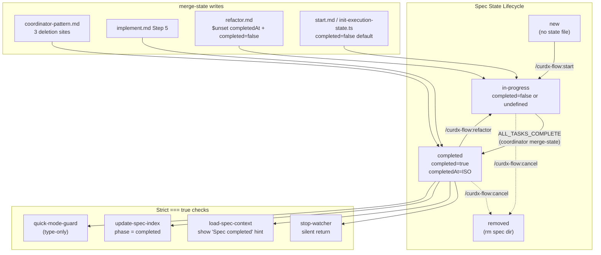
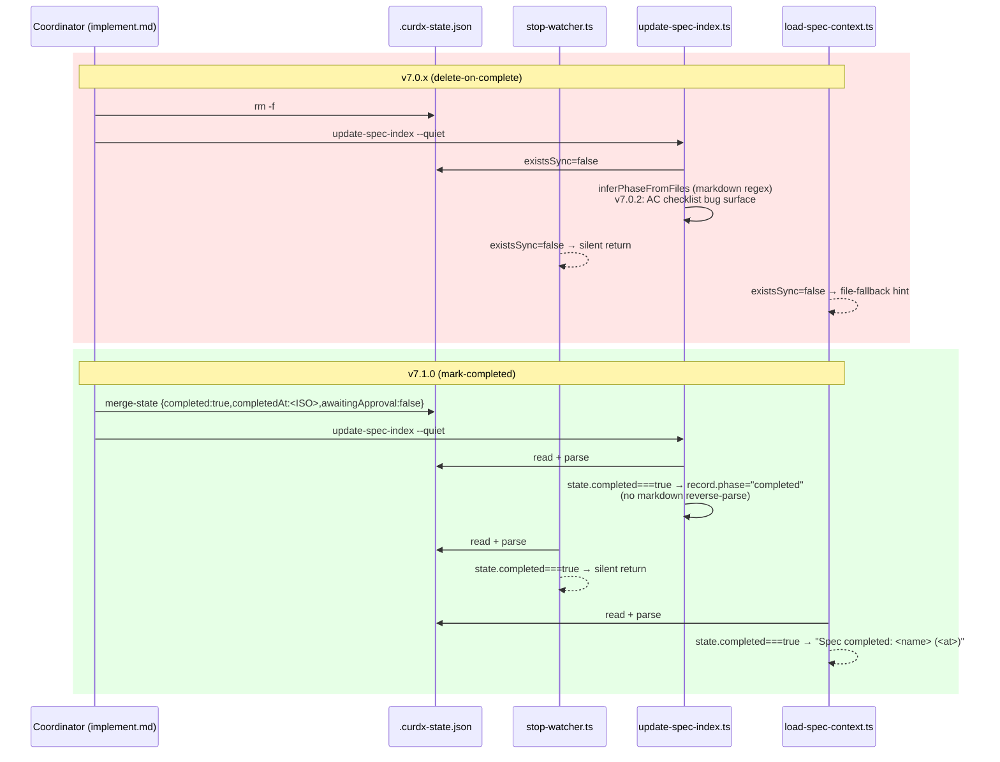

# Design: state-completion-marker

## Overview

把 `.curdx-state.json` 在 `ALL_TASKS_COMPLETE` 时的"删除"语义换成"打 `completed: true` 标记 + 保留文件"。两个抓手：

1. **Single source-of-truth**：state 文件是 spec 生命周期的结构化真值，`completed` 字段是 phase 状态机的平行 boolean，所有 5 个 hook 用 `state.completed === true` 严格判等替换"file existence ⇒ in-progress"老语义；`update-spec-index` 不再依赖 `inferPhaseFromFiles` markdown 反推作为主路径。
2. **Backwards-compat**：`completed?: boolean` 全 optional；`undefined` 视为 in-progress；老 v7.0.2 state 文件无需 backfill；半途升级不破坏 in-progress spec；`merge-state.mjs` 扩展 `$unset` 语义对未带 `$unset` key 的 patch payload 完全透明。Single PR / single version v7.1.0 (minor)。

## Architecture



## File Tree

```
src/hooks/
├── _shared/
│   └── types.ts              [Modify] export interface CurdxState (new)
├── lib/
│   ├── merge-state.ts        [Modify] add $unset semantics (~15 LOC)
│   └── init-execution-state.ts [Modify] EMBEDDED_TEMPLATE += completed:false
├── stop-watcher.ts           [Modify] strict === true silent return; drop inline CurdxState
├── load-spec-context.ts      [Modify] completed hint stderr; drop inline CurdxState
├── update-spec-index.ts      [Modify] short-circuit phase=completed; drop inline CurdxState
└── quick-mode-guard.ts       [Modify] drop inline CurdxState (type-only refactor; behavior unchanged)

plugins/curdx-flow/
├── schemas/
│   └── spec.schema.json      [Modify] add completed + completedAt properties (optional)
├── commands/
│   ├── start.md              [Modify] init template += completed:false; ensure-gitignore wire-in
│   ├── implement.md          [Modify] Step 5 Completion: rm → merge-state
│   ├── refactor.md           [Modify] Step 6 Update State: merge-state $unset completedAt + completed:false
│   └── cancel.md             [No change] (US-7: keep rm spec dir behavior)
├── references/
│   ├── coordinator-pattern.md [Modify] 3 deletion sites → merge-state writes
│   ├── commit-discipline.md  [Modify] L70 comment update
│   └── spec-scanner.md       [Modify] Resume Flow: detect completed=true
├── skills/curdx-core/references/
│   └── state-file-schema.md  [Modify] +completed/+completedAt fields, phase transition note
└── commands/
    ├── help.md               [Modify] L110 comment update
    └── status.md             [Modify] show completed marker

tests/hooks/
├── _fixture-setup.ts         [Modify] DEFAULT_STATE += completed:false
├── stop-watcher.test.ts      [Modify] +2 cases (completed=true silent / undefined fall-through)
├── update-spec-index.test.ts [Modify] +1 case (completed=true → phase="completed")
├── load-spec-context.test.ts [Modify] +1 case (completed=true → hint stderr)
├── byte-equal.test.ts        [Modify] "Completed spec" fixture: completed=true, baseline regen
├── lib/
│   └── merge-state.test.ts   [Modify] +N cases for $unset (covered in §10)
└── lib/init-execution-state.test.ts [Modify] assert completed:false written

CHANGELOG.md                  [Modify] v7.1.0 Added/Changed/Migration
docs/MIGRATION-V7.md          [Modify] add v7.1.0 upgrade section
```

## Components

### 1. `src/hooks/_shared/types.ts` (modify — add `CurdxState`)

**Purpose**：4 个 hook 的 `CurdxState` inline 副本统一抽到 shared module；esbuild bundle 后 .mjs 中只存 1 份；FR-12 同名约束自动满足。

**Public API**：

```typescript
/**
 * Per-spec runtime state, persisted at <basePath>/.curdx-state.json.
 * All fields optional — readers must tolerate v7.0.x states that lack
 * `completed`/`completedAt` and treat `completed === undefined` as in-progress.
 *
 * NOTE: this interface is for hook readers. Writers (coordinator/implement
 * via merge-state.mjs) are not type-checked against this — schema lives in
 * plugins/curdx-flow/schemas/spec.schema.json.
 */
export interface CurdxState {
  // identity
  source?: "spec" | "plan" | "direct";
  name?: string;
  basePath?: string;
  phase?: string;
  // ephemeral / loop control
  taskIndex?: number;
  totalTasks?: number;
  taskIteration?: number;
  maxTaskIterations?: number;
  globalIteration?: number;
  maxGlobalIterations?: number;
  awaitingApproval?: boolean;
  recoveryMode?: boolean;
  nativeSyncEnabled?: boolean;
  // mode
  quickMode?: boolean;
  granularity?: "fine" | "coarse";
  epicName?: string;
  // completion marker (v7.1.0)
  completed?: boolean;
  completedAt?: string;
}
```

**Behavior contract**：纯 `export interface`，无 runtime export。所有 4 个 reader 改为 `import type { CurdxState } from "./_shared/types.js";`。

**Failure modes**：N/A (type-only)。esbuild ESM bundling 兼容性见 §6 K-2。

### 2. `src/hooks/lib/merge-state.ts` (modify — add `$unset`)

**Purpose**：扩展 MongoDB 风格 `$unset` 语义，支持 refactor 场景"删 `completedAt` key 而不存 null"（observation #528）。

**Public API**（CLI 不变）：

```bash
# Existing usage
node merge-state.mjs <state-file> '{"completed":true,"completedAt":"2026-05-04T13:00:00.000Z"}'

# New: $unset semantics
node merge-state.mjs <state-file> '{"$unset":["completedAt"]}'
node merge-state.mjs <state-file> '{"completed":false,"$unset":["completedAt"]}'
```

**`$unset` patch shape**：reserved top-level key；value 必须是 `string[]`；列出的 key 在 deepMerge 之后从 root object 中 `delete`；不递归（仅 root level）。

**Implementation pseudo-code**（~15 LOC patch around L98 `const merged = deepMerge(...)`）：

```typescript
function applyUnset(target: JsonValue, patch: JsonValue): JsonValue {
  if (!isPlainObject(target) || !isPlainObject(patch)) return target;
  const unsetVal = patch["$unset"];
  if (unsetVal === undefined) return target;
  if (!Array.isArray(unsetVal) || !unsetVal.every((k) => typeof k === "string")) {
    process.stderr.write(`merge-state: $unset must be string[]\n`);
    process.exit(1);
  }
  const out = { ...target };
  for (const key of unsetVal as string[]) delete out[key];
  return out;
}

function stripUnset(patch: JsonValue): JsonValue {
  if (!isPlainObject(patch)) return patch;
  const { $unset: _drop, ...rest } = patch;
  return rest;
}

// in main():
const cleanPatch = stripUnset(patch);
let merged = deepMerge(base, cleanPatch);
merged = applyUnset(merged, patch);
```

**Behavior contract**：
- 无 `$unset` key 的 patch payload → `stripUnset` 返回原 patch；`applyUnset` 直接返回 target。完全 transparent，0 行为变更（NFR-2/backwards-compat 锁）。
- `$unset` 与普通字段共存：先 deepMerge 普通字段，再 delete `$unset` 列出的 key（顺序保证：同一 patch 中 `{"completed":false,"$unset":["completedAt"]}` 始终先写 `completed=false`，再删 `completedAt`）。
- `$unset` 只在 root level 生效（不递归）；嵌套 unset 不在本 spec scope。
- 非法 shape（不是 string[]）→ exit 1，与现有 patch 解析错误同一 stderr 风格。

**Failure modes**：
- `{"$unset": "completedAt"}`（非数组）→ exit 1。
- `{"$unset": ["completedAt"]}` 但 base 中无该 key → no-op（`delete` 对 missing key 静默通过）。
- `$unset` 与 patch 中同名字段共存（如 `{"completed":true,"$unset":["completed"]}`）→ 后写优先，最终 `completed` 被删除（与 MongoDB 同语义；本 spec 不依赖此 corner，仅记录）。

### 3. `src/hooks/stop-watcher.ts` (modify)

**Purpose**：在 transcript ALL_TASKS_COMPLETE 检测之后、phase 检查之前 silent return completed spec，关闭 observation #514 的 fall-through 风险。

**Diff site**：
- L70-83 inline `interface CurdxState` → 删除，改 `import type { CurdxState } from "./_shared/types.js";`（保留所有现有字段，新 shared 类型是超集）。
- L601-607 `state = JSON.parse(...)` 之后立即插入 guard：

```typescript
} catch {
  return buildCorruptStateBlock(specPath);
}

// v7.1.0 completion marker guard. Strict === true: undefined / false fall through.
if (state.completed === true) {
  return;  // silent allow-stop; do NOT emit continuation block
}

// Read state fields with v6 defaults.
const phase = ...
```

**Behavior contract**：
- `completed === true` → silent return（与 v7.0.x file-missing 语义等价）。
- `completed === undefined` → fall through（NFR-2）。
- `completed === false` → fall through（refactor reset 后的 in-progress 状态）。
- Guard 顺序在 transcript 检测（L591-599）之后：保留"transcript 含 ALL_TASKS_COMPLETE 触发 update-spec-index 的副作用"，确保 fixUpdate 链路即使在 completed 状态下被偶发触发也能 idempotent。

**Failure modes**：corrupt state 已被 L601-607 try/catch 兜底，先于 guard 执行；新 guard 不引入新的 throw 路径。

### 4. `src/hooks/load-spec-context.ts` (modify)

**Purpose**：`SessionStart` 检测 completed spec 时显示已完成提示，避免用户在已完成 spec 上误触发 resume。

**Diff site**：
- L27-32 inline `interface CurdxState` → 删除，改 `import type { CurdxState } from "./_shared/types.js";`。
- L147 `if (state) {` 块顶部插入分支：

```typescript
if (state) {
  // v7.1.0 completion marker.
  if (state.completed === true) {
    const at = typeof state.completedAt === "string" ? state.completedAt : "unknown";
    process.stderr.write(
      `[curdx-flow] Spec completed: ${specName} (${at}). Run /curdx-flow:refactor to reopen or /curdx-flow:new for a new spec.\n`,
    );
    block.phase = "completed";
    block.awaitingApproval = false;
    return block;  // skip the phase/taskIndex/awaiting prompt below
  }

  const phase = state.phase ?? "unknown";
  ...
}
```

**Behavior contract**：
- 精确 stderr 格式：`[curdx-flow] Spec completed: <name> (<completedAt>). Run /curdx-flow:refactor to reopen or /curdx-flow:new for a new spec.\n`（AC-4.1 满足；`<completedAt>` 缺失时 fallback 字面 `"unknown"`，不抛错）。
- stdout context block 的 `active=true / specName / specPath` 仍写出，`phase="completed"`，`awaitingApproval=false`，**不写** `taskIndex`/`totalTasks`（避免下游 UI 当成 in-progress 渲染）。
- `completed === undefined / false` → 走原有 phase / taskIndex / awaitingApproval 输出（NFR-2）。

**Failure modes**：state parse 失败已被 L142 catch 兜底（`state = null`，走 fallback else 分支）。

### 5. `src/hooks/update-spec-index.ts` (modify)

**Purpose**：completed=true 时 `phase="completed"` 短路，不调用 `inferPhaseFromFiles`，根除 v7.0.2 修补的 fallback 反推链路（observation #406）。

**Diff site**：
- L73-78 inline `interface CurdxState` → 删除，改 `import type { CurdxState } from "./_shared/types.js";`。
- L278-294 `buildSpecRecord()` `if (state) {` 块顶部插入：

```typescript
if (state) {
  // v7.1.0 short-circuit: completed===true skips inferPhaseFromFiles entirely.
  if (state.completed === true) {
    const taskIndex = typeof state.taskIndex === "number" ? state.taskIndex : 0;
    const totalTasks = typeof state.totalTasks === "number" ? state.totalTasks : 0;
    record.phase = "completed";
    if (totalTasks > 0) {
      record.taskIndex = taskIndex;
      record.totalTasks = totalTasks;
    }
    return record;
  }
  // existing logic continues...
  const phase = state.phase ?? "unknown";
  ...
}
```

**Behavior contract**：
- `record.phase = "completed"` (string literal，不动 schema phase enum；与 `inferPhaseFromFiles` 同形)。
- `taskIndex`/`totalTasks` 保留显示（AC-3.2 审计渲染）。
- `awaitingApproval` 不输出（completion 时归 false，不进 record）。
- `completed === undefined / false` → 走原 `state.phase` 路径（NFR-2）。
- `inferPhaseFromFiles` 保留为 second-tier fallback：state 文件不存在 OR parse 失败时仍执行（FR-7 / AC-3.4）。

**`computeStatusCell` / `computePhaseCell`**：`record.phase === "completed"` 时显示 status="done" / phase="completed"——已与 `inferPhaseFromFiles` 现有 "completed" 输出兼容，无额外改动（AC-3.3 自动满足）。

**Failure modes**：N/A（短路在 valid state 之后）。

### 6. `src/hooks/quick-mode-guard.ts` (modify — type-only)

**Purpose**：仅 type 同步；行为不变（AC-5.1）。

**Diff site**：L25-27 inline `interface CurdxState` → 删除，改 `import type { CurdxState } from "./_shared/types.js";`。原本 `state.quickMode === true` 路径完全保留。

**Behavior contract**：0 行为变更；现有所有 quick-mode-guard test pass（NFR-4）。

**Failure modes**：N/A。

### 7. `src/hooks/lib/init-execution-state.ts` (modify)

**Diff site**：L22-36 `EMBEDDED_TEMPLATE` += `completed: false`（保 schema 一致性，简化下游 `=== true` 判等的 fixture 默认）：

```typescript
const EMBEDDED_TEMPLATE = {
  phase: "execution",
  taskIndex: 0,
  totalTasks: 0,
  taskIteration: 1,
  maxTaskIterations: 5,
  globalIteration: 1,
  maxGlobalIterations: 100,
  recoveryMode: false,
  fixTaskMap: {},
  modificationMap: {},
  nativeTaskMap: {},
  nativeSyncEnabled: true,
  nativeSyncFailureCount: 0,
  completed: false,  // v7.1.0
};
```

**Behavior contract**：模板缺失场景下 fallback embedded template 多 1 字段；不影响 project-relative template 路径（如未来引入 `templates/.curdx-state.template.json` 文件，需同步加 `completed:false`）。

### 8. `plugins/curdx-flow/schemas/spec.schema.json` (modify)

**Diff site**：`definitions.state.properties` 末尾追加：

```json
"completed": {
  "type": "boolean",
  "default": false,
  "description": "True when ALL_TASKS_COMPLETE path has been reached. Optional for v7.0.x backwards-compat (undefined treated as in-progress)."
},
"completedAt": {
  "type": "string",
  "format": "date-time",
  "description": "ISO-8601 UTC timestamp when completed was set true. Pattern: YYYY-MM-DDTHH:MM:SS(.sss)Z. Removed (key deleted) on /curdx-flow:refactor reset."
}
```

**Behavior contract**：`required` 不变（identity fields only）；`phase` enum 不变（completion 用平行 boolean 表达）。

### 9. `plugins/curdx-flow/commands/implement.md` (modify — Step 5)

**Diff site**：L152-167 整段替换。新写法：

```markdown
## Step 5: Completion

When all tasks complete (taskIndex >= totalTasks):
1. Verify all tasks marked [x] in tasks.md
2. Mark state as completed (replaces the v7.0.x rm pattern):
   ```bash
   COMPLETED_AT=$(node -e "process.stdout.write(new Date().toISOString())")
   node "${CLAUDE_PLUGIN_ROOT}/hooks/scripts/lib/merge-state.mjs" \
     "$SPEC_PATH/.curdx-state.json" \
     "{\"completed\":true,\"completedAt\":\"$COMPLETED_AT\",\"awaitingApproval\":false}"
   ```
3. Keep .progress.md (preserve learnings and history)
4. Cleanup orphaned temp progress files: ...
5. Update spec index: ...
6. Commit remaining spec changes: ...
7. Check for PR link: ...
8. Output: ALL_TASKS_COMPLETE
```

**Behavior contract**：ephemeral 字段（taskIndex/taskIteration/globalIteration/...）不在 patch 中 → deepMerge 保留原值（AC-1.3）；`awaitingApproval:false` 显式归零（AC-1.2 / FR-4）。

### 10. `plugins/curdx-flow/references/coordinator-pattern.md` (modify — 3 sites)

**Diff site #1 (L75-84 Check Completion)**：

```markdown
## Check Completion

If taskIndex >= totalTasks:
1. Verify all tasks marked [x] in tasks.md
2. Mark state as completed:
   ```bash
   COMPLETED_AT=$(node -e "process.stdout.write(new Date().toISOString())")
   node "${CLAUDE_PLUGIN_ROOT}/hooks/scripts/lib/merge-state.mjs" \
     "$SPEC_PATH/.curdx-state.json" \
     "{\"completed\":true,\"completedAt\":\"$COMPLETED_AT\",\"awaitingApproval\":false}"
   ```
3. Output: ALL_TASKS_COMPLETE
4. STOP - do not delegate any task
```

**Diff site #2 (L540-543 Native Sync Completion)**：与 #1 同 merge-state 写法。注意去重——文档中三处共用同一 idempotent 写法，merge-state 多次调用对 `completed:true` 无副作用。

**Diff site #3 (L758-765 PR Lifecycle Step 5)**：与 #1 同 merge-state 写法。Epic 完成路径同样写 `completed:true`（不区分 spec / epic 子 spec；epic-level 状态由 `markSpecCompletedInEpic` 在 stop-watcher 单独维护）。

### 11. `plugins/curdx-flow/commands/refactor.md` (modify — Step 6 Update State)

**Diff site**：L108-114 整段替换：

```markdown
### Update State

1. Reset completion marker (in case spec was previously completed):
   ```bash
   node "${CLAUDE_PLUGIN_ROOT}/hooks/scripts/lib/merge-state.mjs" \
     "$SPEC_PATH/.curdx-state.json" \
     '{"completed":false,"awaitingApproval":true,"$unset":["completedAt"]}'
   ```
2. If tasks were modified, reset taskIndex to 0:
   ```bash
   node "${CLAUDE_PLUGIN_ROOT}/hooks/scripts/lib/merge-state.mjs" \
     "$SPEC_PATH/.curdx-state.json" \
     '{"taskIndex":0}'
   ```
3. Append refactoring summary to .progress.md
```

**Behavior contract**：`$unset:["completedAt"]` 删 key 而非存 null（AC-6.1 / FR-10）；ephemeral 字段保留（AC-6.2）；不维护 `completedHistory[]`（AC-6.4 / Out of Scope）。

### 12. `plugins/curdx-flow/commands/start.md` (modify)

**Diff site #1 (L131-141 Initialize state template)**：JSON 模板 += `"completed": false`：

```json
{
  "source": "spec", "name": "$name", ...,
  "discoveredSkills": [],
  "completed": false
}
```

**Diff site #2 (Resume Flow ~L88-118)**：在读 state 后增分支：

```markdown
If `.curdx-state.json` exists and `completed === true`:
- Output: "This spec is completed (<completedAt>). Use /curdx-flow:refactor to reopen or /curdx-flow:new for a new spec."
- STOP. Do not resume.
```

**Diff site #3 (L130 ensure-gitignore wire-in, US-10)**：在 `Initialize .curdx-state.json` 段落之前新增 1 行：

```markdown
6. Ensure gitignore for state file (idempotent):
   ```bash
   node "${CLAUDE_PLUGIN_ROOT}/hooks/scripts/lib/ensure-gitignore.mjs" .curdx-state.json
   ```
```

> ASSUMPTION：`ensure-gitignore.mjs` CLI 签名是 `<pattern>`（待 task-planner 阶段对照 lib 签名校准；如需 cwd 参数，相应调整 prompt）。

### 13. `plugins/curdx-flow/references/spec-scanner.md` (modify — Resume Flow)

**Diff site (L206-220)**：与 start.md Resume Flow 同分支（`completed===true` 显示已完成提示）。两处文档内容保持一致避免漂移。

### 14. `plugins/curdx-flow/skills/curdx-core/references/state-file-schema.md` (modify)

**Diff site**：properties 段加 `completed` / `completedAt` 字段说明；Phase 转换图末尾追加：

```
execution → completed (completed: true)
completed → execution (refactor: completed: false, $unset completedAt)
```

### 15. 文档微调

| 文件 | 行 | 变更 |
|---|---|---|
| `plugins/curdx-flow/references/commit-discipline.md` | L70 | `# .curdx-state.json - never committed` → `# .curdx-state.json - never committed (retained on completion with completed:true marker)` |
| `plugins/curdx-flow/commands/help.md` | L110 | `# Loop state (deleted on completion)` → `# Loop state (marked completed:true on completion, retained for audit)` |
| `plugins/curdx-flow/commands/status.md` | L54 | parse state 后展示 `state.completed === true` 时输出 `completed (<completedAt>)` 标记 |

### 16. `tests/hooks/_fixture-setup.ts` (modify)

**Diff site**：L64-81 `DEFAULT_STATE` += `completed: false`。新 fixture state 默认非完成态，旧测试无需改即继续 pass（NFR-7）。

### 17. `CHANGELOG.md` & `docs/MIGRATION-V7.md`

`CHANGELOG.md` 顶部追加：

```markdown
## 7.1.0 — 2026-05-04

### Added
- `.curdx-state.json` `completed` / `completedAt` fields (schema + 5 hook readers).
- `merge-state.mjs` `$unset` operator (MongoDB-style key deletion semantics).
- `_shared/types.ts` `CurdxState` interface — single source of truth across 4 hooks.
- `start.md` ensure-gitignore wire-in (observation #513).

### Changed
- ALL_TASKS_COMPLETE no longer deletes `.curdx-state.json`; coordinator/implement now `merge-state` write `completed:true / completedAt:<ISO> / awaitingApproval:false`. Working tree stays clean; index no longer relies on markdown reverse-parse fallback (root cause of v7.0.2 AC-checklist bug).
- `refactor.md` resets state with `{"completed":false,"$unset":["completedAt"]}`.

### Migration
- `completed` is optional with strict `=== true` checks. v7.0.x state files (no `completed` field) continue to work as in-progress. No backfill required for already-deleted historical specs (`inferPhaseFromFiles` still serves as second-tier fallback).
- See `docs/MIGRATION-V7.md` for the optional jq snippet to reconstruct deleted state files.
```

`docs/MIGRATION-V7.md` 新增 v7.1.0 section（含 AC-8.3 jq snippet）：

```bash
# Optional: backfill a completed=true marker on a historical spec whose
# state file was deleted under v7.0.x semantics.
git checkout HEAD -- specs/<name>/.curdx-state.json 2>/dev/null && \
  node "${CLAUDE_PLUGIN_ROOT}/hooks/scripts/lib/merge-state.mjs" \
    specs/<name>/.curdx-state.json \
    "{\"completed\":true,\"completedAt\":\"$(node -e 'process.stdout.write(new Date().toISOString())')\"}"
```

## Sequence Diagram (ALL_TASKS_COMPLETE old vs new)



## Key Technical Decisions

| Decision | Options Considered | Choice | Rationale |
|---|---|---|---|
| K-1: completedAt unset path | (a) merge-state `$unset`; (b) new `unset-state-key.mjs` lib; (c) refactor.md inline raw write; (d) keep `null` | (a) **`$unset` extension** | 复用现有 lib + atomic-write；MongoDB 风格语义可读；未来所有 unset 场景共享 ~15 LOC。新 lib 增加表面积；inline raw write 绕过 atomic 保证；null 污染 schema |
| K-2: Shared CurdxState | (a) `_shared/types.ts`; (b) inline + lint rule; (c) per-hook copy + comment | (a) **`_shared/types.ts`** | esbuild bundle .mjs 中 type-only import 编译期 erase 不进 runtime（见 §6 K-2 实施约束）；FR-12 一致性自动保证；4 处副本 → 1 处真值 |
| K-3: completed strict equality | (a) `=== true`; (b) truthy `if (state.completed)` | (a) **`=== true`** | undefined/null/0/"false" 全部 fall through 进 in-progress（NFR-2）；半途升级 + 第三方 fork + corrupt JSON 全部安全 |
| K-4: NFR-11 fallback rate | (a) keep as NFR with target; (b) downgrade to design observation | (b) **observation** | 没 telemetry 量化；fallback 仅服务"已删 state 历史 spec / 第三方 fork / 老版本残留"3 种边缘场景，不设阈值；spy/mock 单元测试已足够定性验证 |
| K-5: Single PR / single version | (a) split schema + writer + readers + refactor 多 PR；(b) single PR v7.1.0 | (b) **single PR / v7.1.0** | 写读端必须 atomic 升级避免 fall-through 风险（observation #514）；内部用户 + npm 单一发行单元（CLAUDE.md），不存在 staged rollout 需求 |
| K-6: completedAt format | (a) `new Date().toISOString()` (含 ms); (b) v6 风格 `replace(/\.\d{3}Z$/,"Z")` (无 ms) | (a) **含 ms** | NFR-3 正则 `(\.\d+)?Z$` 二者皆收；`isoNow()` 在 update-spec-index 用的是无 ms 版本（v6 兼容），但 completion 时间戳是 v7.1.0 新字段无历史包袱；含 ms 更精确，零额外依赖 |
| K-7: Rollout sequence | — | **types → merge-state → init → schema → readers → writers → refactor → fixtures → docs** | 见 §11 实施步骤；types 优先确保后续所有 reader 改动编译 OK；merge-state `$unset` 在 refactor.md 调用之前必须先 ship；readers 在 writers 之前确保新写法被读端识别 |
| K-8: Ephemeral retention | (a) 全保留；(b) 全归零；(c) awaitingApproval 归零，其余保留 | (c) | audit 价值（jq `.taskIteration` 知道哪 task 难收敛）；`awaitingApproval=false` 避免 SessionStart 误判 |
| K-9: refactor history | (a) 留 `completedHistory[]`; (b) reset 不留痕 | (b) **不留痕** | MVP 颗粒度；历史在 git log 可查；schema 干净 |
| K-10: ensure-gitignore wiring | (a) defer 到独立 spec; (b) 顺手 wire 进本 spec US-10 | (b) **顺手 wire** | lib 已有 + 测试齐全；与"工作树永久脏"问题端到端互补；single PR 一并发可减少用户一次升级 |

## Error Handling

| 场景 | 处理策略 | 用户影响 |
|---|---|---|
| 老 hook (v7.0.x) + 新 state (`completed=true`，文件还在) | npm 包是单一发行单元；同 install 一起升级；第三方 fork 走 K-3 K-5 K-7 一致性兜底 | 已识别风险；CHANGELOG 明示；老 hook 看 existsSync=true 会 fall through，但本场景仅在用户手动改文件时出现 |
| 新 hook + 老 state (`completed=undefined`) | strict `=== true` → fall through 走 in-progress（NFR-2 / AC-8.1） | 用户无感知；与 v7.0.2 行为一致 |
| Corrupt JSON state | 已有 try/catch 兜底（`buildCorruptStateBlock` / `state=null` / fallback to inferPhaseFromFiles） | 无回归；新 guard 不引入新 throw 路径 |
| 半途中断升级（taskIndex=3/10 时升级） | state 文件存在、`completed` 缺失 → 全部 hook 按 in-progress 处理 | continuation prompt 正常出；用户继续 implement 流 |
| `merge-state` 写入 `$unset:["completedAt"]` 但 base 中无该 key | `delete` 静默 no-op；exit 0 | 无影响 |
| `merge-state` 收到非法 `$unset` (非 string[]) | `applyUnset` exit 1 with stderr | 写入失败；coordinator 调用方应将 merge-state 失败视为 fatal（与现有 patch 解析失败同等） |
| ALL_TASKS_COMPLETE 后 update-spec-index 跑前用户手动删了 state | `readState()` 返回 null → 走 `inferPhaseFromFiles`（FR-7 / AC-3.4） | second-tier fallback 兜底，phase 仍正确推为 "completed" |
| Race condition：coordinator 写 completed:true 后 stop-watcher 同时读 | `merge-state` 用 `writeFileAtomic`（`tempfile + rename`）保证原子性；reader 看到 pre/post 完整 JSON 二选一 | 无 partial-read 风险 |

## Test Strategy

### NFR-5 强制新增 4 case

```typescript
// tests/hooks/stop-watcher.test.ts (NFR-5 case a + b)
it("completed=true → silent return (no continuation block)", async () => {
  const spec = createFixtureSpec({ state: { completed: true, completedAt: "2026-05-04T13:00:00.000Z" } });
  const { stdout, exitCode } = await runHook("stop-watcher", { cwd: spec.cwd });
  expect(stdout).toBe("");
  expect(exitCode).toBe(0);
});
it("completed=undefined → fall through to in-progress logic (backwards-compat)", async () => {
  // omit completed; legacy v7.0.x state shape
  const spec = createFixtureSpec({ state: { phase: "execution", taskIndex: 1, totalTasks: 3 } });
  // assert continuation block emitted (existing fall-through logic)
});

// tests/hooks/update-spec-index.test.ts (NFR-5 case c)
it("completed=true → record.phase='completed' without inferPhaseFromFiles", async () => {
  const spec = createFixtureSpec({ state: { completed: true, completedAt: "2026-05-04T13:00:00.000Z", phase: "execution", taskIndex: 3, totalTasks: 3 } });
  // spy on inferPhaseFromFiles via vi.spyOn or by deleting tasks.md and asserting phase still resolves to "completed"
  const idx = readIndex(spec);
  expect(idx.specs[0].phase).toBe("completed");
});

// tests/hooks/load-spec-context.test.ts (NFR-5 case d)
it("completed=true → stderr 'Spec completed' hint, no resume prompt", async () => {
  const spec = createFixtureSpec({ state: { completed: true, completedAt: "2026-05-04T13:00:00.000Z" } });
  const { stderr } = await runHook("load-spec-context", { cwd: spec.cwd });
  expect(stderr).toContain("Spec completed:");
  expect(stderr).toContain("2026-05-04T13:00:00.000Z");
  expect(stderr).not.toMatch(/Phase: execution/);
});
```

### merge-state `$unset` 单元测试覆盖矩阵

| Case | Patch | Base | Expected |
|---|---|---|---|
| U-1 | `{"$unset":["completedAt"]}` | `{completedAt:"X",completed:true}` | `{completed:true}` |
| U-2 | `{"completed":false,"$unset":["completedAt"]}` | `{completedAt:"X",completed:true}` | `{completed:false}` |
| U-3 | `{"$unset":["missing"]}` | `{a:1}` | `{a:1}` (no-op) |
| U-4 | `{"$unset":"completedAt"}` (非数组) | any | exit 1, stderr |
| U-5 | `{"a":1}` (无 $unset) | `{b:2}` | `{a:1,b:2}` (transparent) |
| U-6 | `{"$unset":[]}` | `{a:1}` | `{a:1}` (空数组 no-op) |

### Fixture 改动清单

- `tests/hooks/_fixture-setup.ts:64-81` `DEFAULT_STATE` += `completed:false`（NFR-7：旧测试 0 改动 pass）
- `tests/hooks/byte-equal.test.ts:155-180` "Completed spec" fixture：state 改为 `{phase:"execution",taskIndex:2,totalTasks:2,completed:true,completedAt:"2026-01-01T00:00:00.000Z"}`；baseline JSON 重生（NFR-6：仅此一处 baseline diff）
- `tests/hooks/lib/init-execution-state.test.ts:7,35,52`：assert 写出 JSON 含 `"completed":false`

### 质量门

- `npm run verify` 全绿（typecheck + check-versions + check:hooks-fresh + test:hooks）
- `npm run test:hooks` 包含 vitest 全部新增 case + 现有 byte-equal / fixture / phase/AC fallback 100% pass
- `npm run check:hooks-fresh` 验证 `hooks/scripts/*.mjs` 与 `src/hooks/**/*.ts` 同步——本 spec 必走 `npm run build:hooks` 重 bundle
- 5-field version sync (`npm run check-versions`) pass for v7.1.0

## Implementation Skeleton

### `src/hooks/_shared/types.ts` (≤30 行 patch — 已展示在 §1)

完整内容见 Component #1 Public API 段（约 26 行含 JSDoc）。esbuild ESM bundling 后 .mjs 中无残留（type-only export）。

### `src/hooks/lib/merge-state.ts` ($unset patch — 关键 ~15 行)

```typescript
function applyUnset(target: JsonValue, patch: JsonValue): JsonValue {
  if (!isPlainObject(target) || !isPlainObject(patch)) return target;
  const unsetVal = patch["$unset"];
  if (unsetVal === undefined) return target;
  if (!Array.isArray(unsetVal) || !unsetVal.every((k) => typeof k === "string")) {
    process.stderr.write(`merge-state: $unset must be string[]\n`);
    process.exit(1);
  }
  const out = { ...target } as { [k: string]: JsonValue };
  for (const key of unsetVal as string[]) delete out[key];
  return out;
}
function stripUnset(patch: JsonValue): JsonValue {
  if (!isPlainObject(patch)) return patch;
  const { $unset: _drop, ...rest } = patch as { [k: string]: JsonValue };
  return rest as JsonValue;
}
// in main(), replacing line 98 `const merged = deepMerge(base, patch);`:
const cleanPatch = stripUnset(patch);
let merged = deepMerge(base, cleanPatch);
merged = applyUnset(merged, patch);
```

## File Mapping (FR/NFR/AC ↔ File ↔ Granularity)

| FR/NFR/AC | File | Granularity |
|---|---|---|
| FR-1, AC-9.4 | `plugins/curdx-flow/schemas/spec.schema.json` | trivial |
| FR-2, AC-1.1, AC-1.2, AC-1.4, AC-1.5 | `plugins/curdx-flow/references/coordinator-pattern.md` (3 sites) + `plugins/curdx-flow/commands/implement.md` (1 site) | medium |
| FR-3, AC-1.3, AC-9.2 | implement.md / coordinator-pattern.md merge-state JSON shape (ephemeral 字段不 patch) | trivial |
| FR-4, AC-1.2 | merge-state JSON shape (`awaitingApproval:false`) | trivial |
| FR-5, AC-2.1, AC-2.2, AC-2.3, AC-2.4 | `src/hooks/stop-watcher.ts` + `_shared/types.ts` | medium |
| FR-6, AC-3.1, AC-3.2, AC-3.3 | `src/hooks/update-spec-index.ts` | medium |
| FR-7, AC-3.4 | 保留 `inferPhaseFromFiles` 现状 | none |
| FR-8, AC-4.1, AC-4.2, AC-4.3 | `src/hooks/load-spec-context.ts` | medium |
| FR-9, AC-5.1, AC-5.3 | `src/hooks/quick-mode-guard.ts` (type-only) | trivial |
| FR-10, AC-6.1, AC-6.3, AC-6.4 | `src/hooks/lib/merge-state.ts` ($unset) + `commands/refactor.md` | large (lib + prompt) |
| FR-11, AC-7.1, AC-7.2 | `commands/cancel.md` (no change) | none |
| FR-12, AC-2.4, AC-4.3, AC-5.3, AC-8.1 | `_shared/types.ts` + 4 hook reader 改 import | medium |
| FR-13, AC-1.2 | `commands/start.md` template + `init-execution-state.ts` EMBEDDED_TEMPLATE | trivial |
| FR-14, AC-10.1 to AC-10.5 | `commands/start.md` ensure-gitignore call | trivial |
| FR-15, AC-1.4, AC-1.5, AC-9.5 | `state-file-schema.md` / `commit-discipline.md` / `help.md` / `status.md` / `spec-scanner.md` | trivial |
| FR-16, AC-4.1 | `commands/start.md` Resume Flow + `references/spec-scanner.md` Resume Flow | trivial |
| NFR-1 | 5-field version sync to v7.1.0 | trivial |
| NFR-2 | strict `=== true` 全 hook 实施 | medium (cross-cutting) |
| NFR-3 | `new Date().toISOString()` 写入 + schema `format:"date-time"` | trivial |
| NFR-4 | 现有测试 100% pass | none (regression-only) |
| NFR-5 | 4 个新 vitest case (§Test Strategy) | medium |
| NFR-6 | byte-equal "Completed spec" fixture baseline 重生 | medium |
| NFR-7 | `_fixture-setup.ts` DEFAULT_STATE += completed:false | trivial |
| NFR-8 | CHANGELOG.md v7.1.0 entry | trivial |
| NFR-9 | docs/MIGRATION-V7.md v7.1.0 section | trivial |
| NFR-10 | `npm run verify` exit 0 | none (gate) |
| NFR-11 | downgraded → observation (§Notes) | none |

## Notes

**NFR-11 降级为 observation**：`inferPhaseFromFiles` 调用率 < 5% 不再作 NFR 量化阈值。fallback 仅服务以下 3 种场景：
1. v7.1.0 之前已删 state 的历史 spec（如 `test008/specs/helloworld`、`curdx-flow/specs/cross-platform-support`）
2. 第三方 fork / 自定义工作流删除了 state 文件
3. 用户手工 `rm .curdx-state.json` 后跑 update-spec-index

不设量化阈值；定性验证靠 NFR-5 case (c) "completed=true 不调用 inferPhaseFromFiles" 单元测试断言（vi.spyOn 即可）。

## Implementation Steps (rollout 时序)

1. **Step 1：抽 shared types** — 创建 `src/hooks/_shared/types.ts` 加 `CurdxState` interface（§1）。4 处 reader 改 `import type`。`npm run typecheck` pass。
2. **Step 2：扩 merge-state** — 实现 `$unset`（§2）+ unit test 6 个 case（§Test Strategy U-1..U-6）。`npm run test:hooks -- merge-state` pass。
3. **Step 3：模板默认 completed:false** — `init-execution-state.ts` EMBEDDED_TEMPLATE += `completed:false`（§7）+ test assert（§16 fixture clean-up）。
4. **Step 4：schema 扩字段** — `spec.schema.json` 加 `completed` / `completedAt` properties（§8）。
5. **Step 5：5 个 reader 加 guard**
   - 5a `stop-watcher.ts` (§3) + 2 vitest case
   - 5b `update-spec-index.ts` (§5) + 1 vitest case
   - 5c `load-spec-context.ts` (§4) + 1 vitest case
   - 5d `quick-mode-guard.ts` (§6) (type-only, 现有 test 应 pass)
6. **Step 6：writer 改 prompt** — coordinator-pattern.md 3 处（§10） + implement.md 1 处（§9）改 merge-state 写法。
7. **Step 7：refactor reset** — `commands/refactor.md` 用 `$unset` 删 `completedAt` + 写 `completed:false`（§11）。
8. **Step 8：start.md 模板 + ensure-gitignore wire** — JSON 模板加 `completed:false` + Resume Flow 加 completed 分支 + ensure-gitignore 1 行（§12）。spec-scanner.md Resume Flow 同步（§13）。
9. **Step 9：fixture 重生** — `_fixture-setup.ts` DEFAULT_STATE += `completed:false`（§16） + byte-equal "Completed spec" baseline 重生。
10. **Step 10：文档同步** — state-file-schema.md / commit-discipline.md / help.md / status.md（§14、§15）。
11. **Step 11：bundle hooks** — `npm run build:hooks` 重生 `plugins/curdx-flow/hooks/scripts/*.mjs`（含新 merge-state.mjs + 5 个 reader hook + init-execution-state.mjs + ensure-gitignore.mjs）。
12. **Step 12：CHANGELOG + MIGRATION** — v7.1.0 entry（§17）。
13. **Step 13：版本号 sync** — `npm run bump-version 7.1.0`（CLAUDE.md：5-field atomic write + check-versions）。
14. **Step 14：verify gate** — `npm run verify` 全绿；commit + tag + push 触发 release.yml。

## Open Issues / Future Work

1. **NFR-11 telemetry**：未来若需量化 `inferPhaseFromFiles` 调用率，可在 update-spec-index 加 stderr 一行 `[update-spec-index] fallback: <count>/<total>`，由用户自审；本 spec MVP 不做。
2. **嵌套 `$unset` 路径语法**：当前 `$unset` 只在 root level 生效；如未来需要 `{"$unset":["parallelGroup.startIndex"]}` 这样的 dot-path，按 MongoDB 语义扩展即可。本 spec 仅 root unset。
3. **`completedHistory[]` 数组**：refactor 不留痕（K-9）；如未来用户报"想知道这个 spec 完成-重开几次"，再加 `completionLog: [{at,tasksAtCompletion}]` 数组字段。
4. **epic-level 完成 marker**：epic 完成态由 `.current-epic` + `markSpecCompletedInEpic` 维护；本 spec 不引入 epic.completed。
5. **cancel 留 marker（cancelledAt）**：US-7 决定 cancel 仍 rm 整个 spec dir；如未来需要"取消可恢复"语义，再单独开 spec。

### 反向自审（隔壁组架构师 review 的 3 个最尖锐问题）

**Q1：`_shared/types.ts` 抽 `CurdxState` 之后，esbuild bundle 时如果开发者忘了用 `import type` 而是 `import { CurdxState }`，会怎样？怎么避免？**

A：TypeScript `verbatimModuleSyntax` / `isolatedModules` 模式下，纯 `interface` 不带 runtime 值；esbuild ESM 输出会把无 runtime body 的 import 自动 elide（即使是 `import { CurdxState }` 不加 `type` 修饰，esbuild 看到 it has no runtime binding 也会移除 import 语句）。但**风险**：如果未来 `_shared/types.ts` 加 `export const SOMETHING = ...` 或 `export class ...`，普通 `import` 会把整个 module 作为运行时依赖打包。**避免措施**：(a) `_shared/types.ts` 文件级注释明示"types-only module, no runtime exports"；(b) `tsconfig.json` 启用 `verbatimModuleSyntax: true`（如未启用则在 task-planner 的子任务中加），强制非 type 的 `import { X }` 在 X 是 type 时编译失败；(c) check:hooks-fresh 间接检测——如果普通 import 把 types.ts 拖进 .mjs，bundle 体积会涨，diff 显眼。

**Q2：`merge-state $unset` 扩展是 backwards-compat 的吗？已有调用方（hooks/scripts/lib 各处 + agents/*.md merge-state 调用）的 patch payload 不会有 `$unset` key，但 deepMerge 时会不会被当作普通 key 误处理？**

A：`stripUnset` 在 deepMerge 之前从 patch 中剔除 `$unset` key（解构 `{ $unset: _drop, ...rest }`）。已有 patch payload 无 `$unset` → `stripUnset` 等同 identity（`$unset` 解构为 undefined，`rest` 等于原 patch）→ deepMerge 行为完全不变。`applyUnset` 在 patch 无 `$unset` 时直接 return target 早返回。**0 行为变更对老 patch**。剩余风险：用户业务字段恰好叫 `$unset`——schema 中 properties 全是 alphanumeric 字段名（无 `$` 前缀），且 `$unset` 是 MongoDB 保留语义（生态约定俗成），冲突概率为 0。文档（merge-state.ts 顶部 + state-file-schema.md）明示 `$unset` 是 reserved patch key。

**Q3：老 hook（v7.0.x，不识别 `completed` 字段）+ 新 prompt 写出的 state（`completed=true` 但文件还在）混合场景，stop-watcher 会不会触发 loop-restart 回归？npm 包是单一发行单元，但用户手动 patch 文件 / 第三方 fork 怎么兜底？**

A：核心场景**确实会回归**——老 stop-watcher.mjs 看 `existsSync(stateFile)=true`，fall through 进 continuation block，输出 resume prompt。**兜底机制**：
- (a) **同 install 强约束**：CLAUDE.md 明示 npm 包是单一发行单元（plugin manifest + hooks/scripts/*.mjs + commands/*.md 同 zip 一起 install）；用户走 `claude plugin install/update` 路径不会半边新半边旧。`check:hooks-fresh` CI 门保证 src 与 .mjs 一致。
- (b) **第三方 fork 兜底**：MIGRATION-V7.md 明示 v7.1.0 升级须同步 hook + prompt；如果 fork 只升 prompt 不升 hook，自食恶果（不在本 spec scope，列入 Open Issues #5 的方向）。
- (c) **诊断工具**：在 stop-watcher / update-spec-index 加 stderr 一行 `[curdx-flow] state schema v=2 (completed marker)`（可选；列入 Open Issues #1 的 telemetry 方向，本 spec MVP 不做）。
- (d) **Refactor 路径兜底**：用户在已完成 spec 上跑 `/curdx-flow:refactor` 会 reset `completed:false`；即使发生短暂 fall-through，下次 implement 也能正常运行。
- **结论**：单一 npm install 路径 0 风险；第三方 fork 用户自担；本 spec 通过 single PR / single version 把"prompt 写新格式 + hook 读新格式"原子化升级，最大化兼容性。

## Unresolved Questions

_Empty._ 所有 design 决策已锁定（K-1..K-10）；ASSUMPTION 标记 1 处（§12 `ensure-gitignore.mjs` CLI 签名，task-planner 阶段对照 lib 校准）；rollout 时序 14 步直接喂 task-planner。
