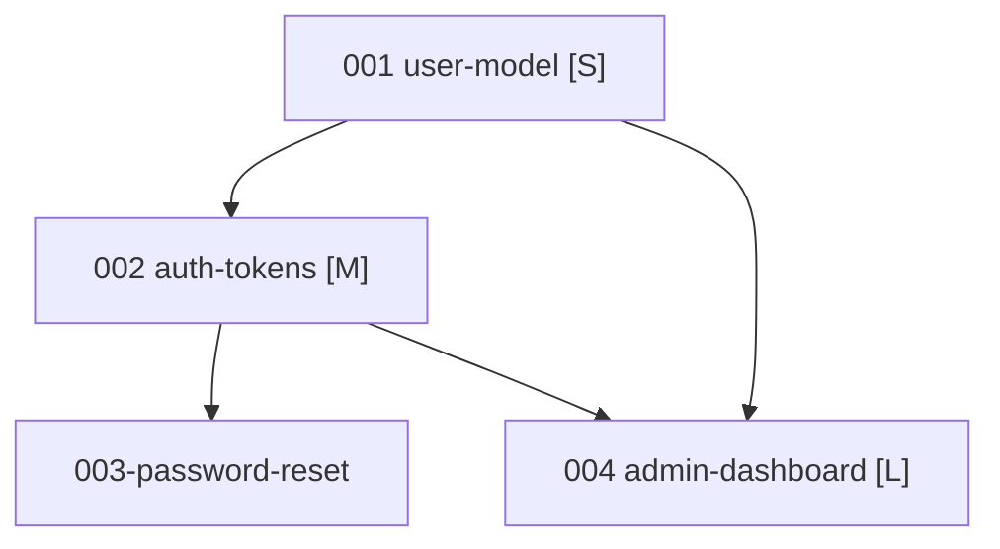

# Epic: {{EPIC_NAME}}

**Goal:** {{one-paragraph user-intent}}
**Created:** {{ISO_DATE}}
**Status:** active | shipped | abandoned

## Vision

{{What does the world look like when this epic is done? Describe the user-visible change — not the technical architecture.}}

## Success criteria (epic-level)

These are EPIC-LEVEL outcomes, not feature-level ACs. Each must reference the feature(s) that validate it.

- [ ] {{outcome 1 — validated by features 001, 003}}
- [ ] {{outcome 2 — validated by feature 002}}
- [ ] {{outcome 3 — validated by feature 004 end-to-end}}

## Features

### 001-{{slug}}

- **Goal:** {{user-story format — "As a X, I want to Y, so that Z"}}
- **Acceptance criteria:**
  - AC-1: ...
  - AC-2: ...
- **MVP scope:**
  - **In:** ...
  - **Out:** ...
- **Dependencies:** {{none | list of feature IDs}}
- **Interface contracts:**
  - **Exposes:** ... (what this feature makes available — data shape, event, endpoint)
  - **Consumes:** ... (what this feature requires — data shape from another feature, event it listens for)
- **Size:** S (< 1 day) | M (1-3 days) | L (3-7 days) | XL (refactor scale)
- **Architecture notes (advisory):** {{one paragraph — NOT binding; actual plan happens in `/curdx:plan <001-slug>`}}

### 002-{{slug}}

(same structure)

### ...

## Dependency graph

## Validation findings

_(Filled by the validation phase of `/curdx:triage`. Surfaces issues like cycles, missing features, overlapping scope.)_

## Rejected decompositions

_(Track alternatives we considered and rejected, with the reason. Useful when future work proposes going back to a rejected split.)_

- ~~Decomposing by technical layer~~ — creates horizontal slices that can't ship independently; moved to user-journey-based decomposition
- ~~Single "auth" feature~~ — too large for a single `/curdx:implement` run; split into 001 + 002 + 003

## Notes

{{Anything else — deferred features, risks, coordination concerns.}}
